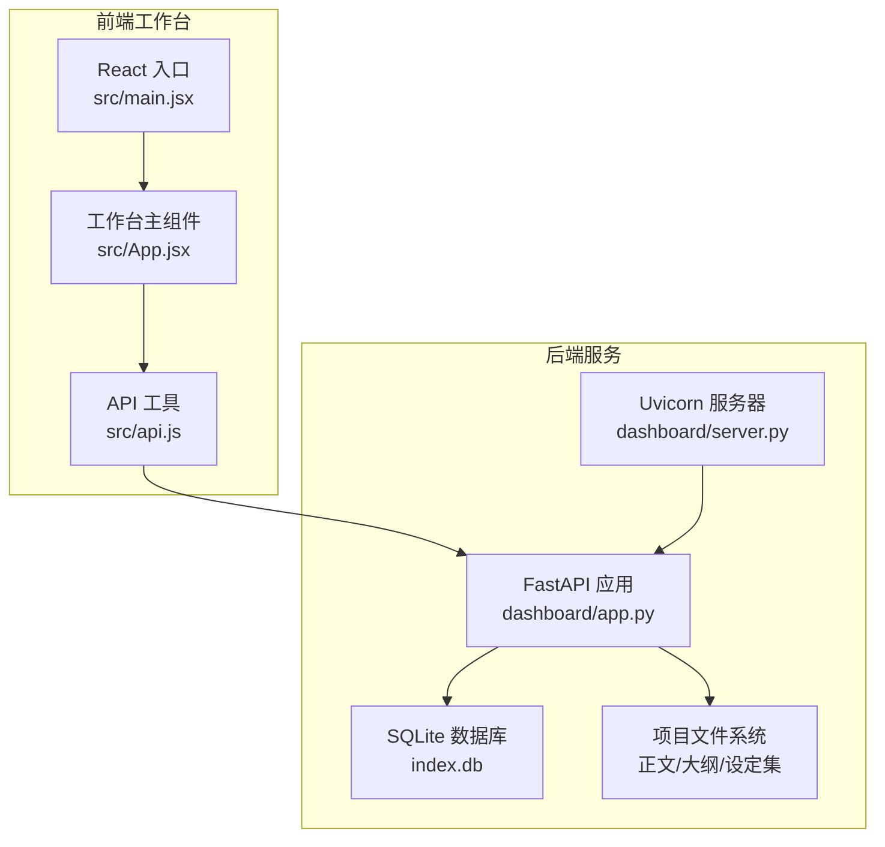
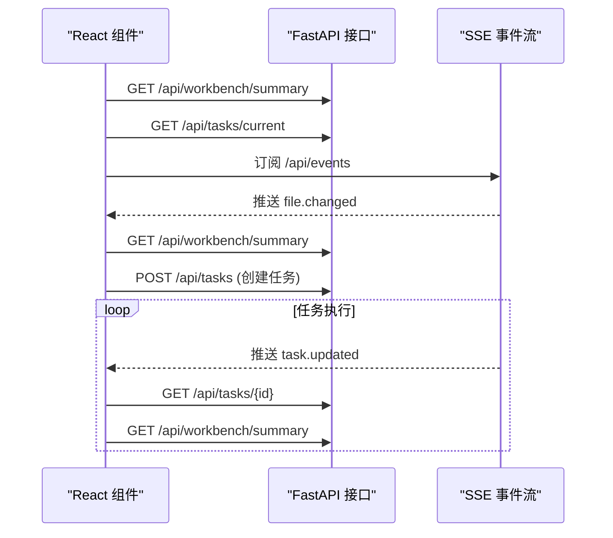
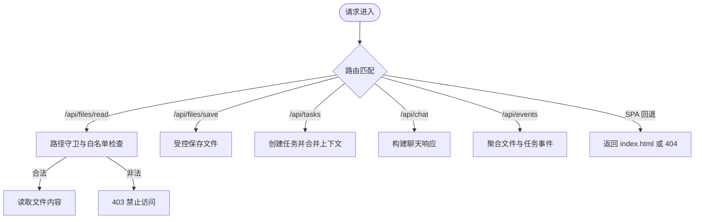
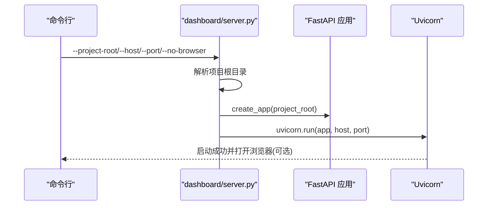
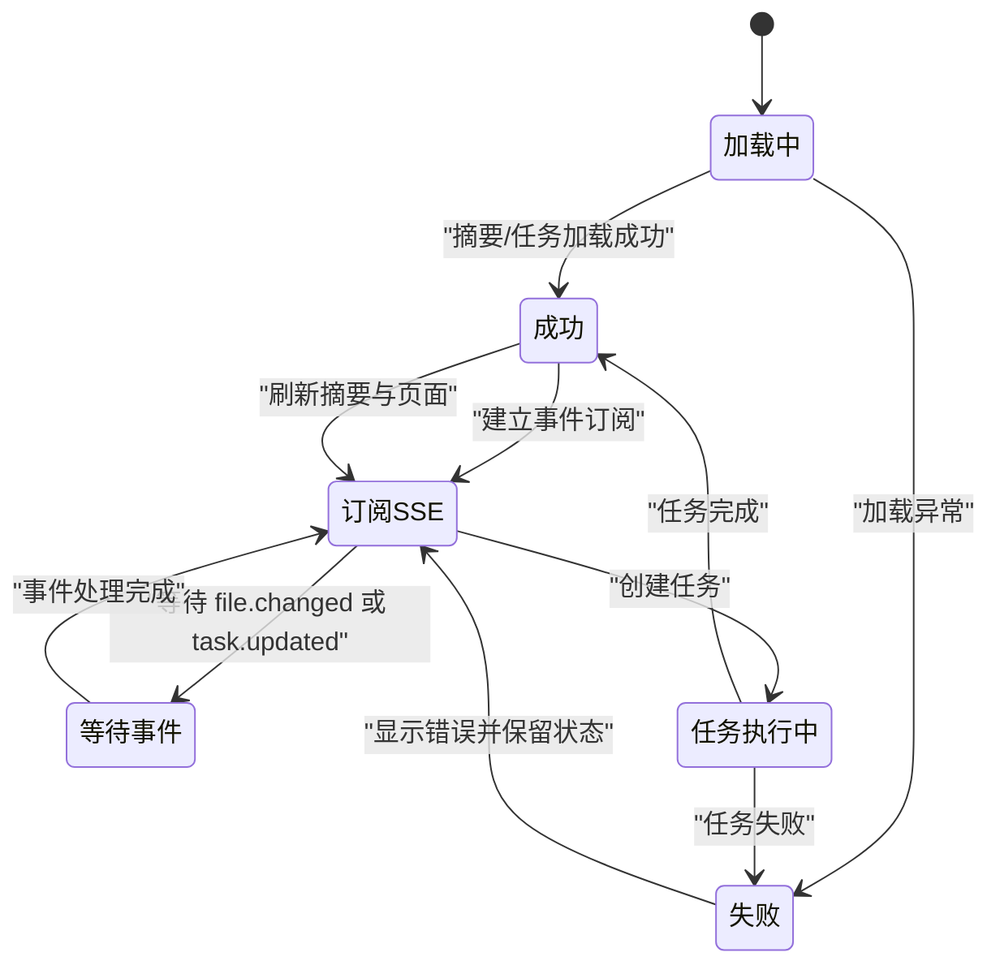
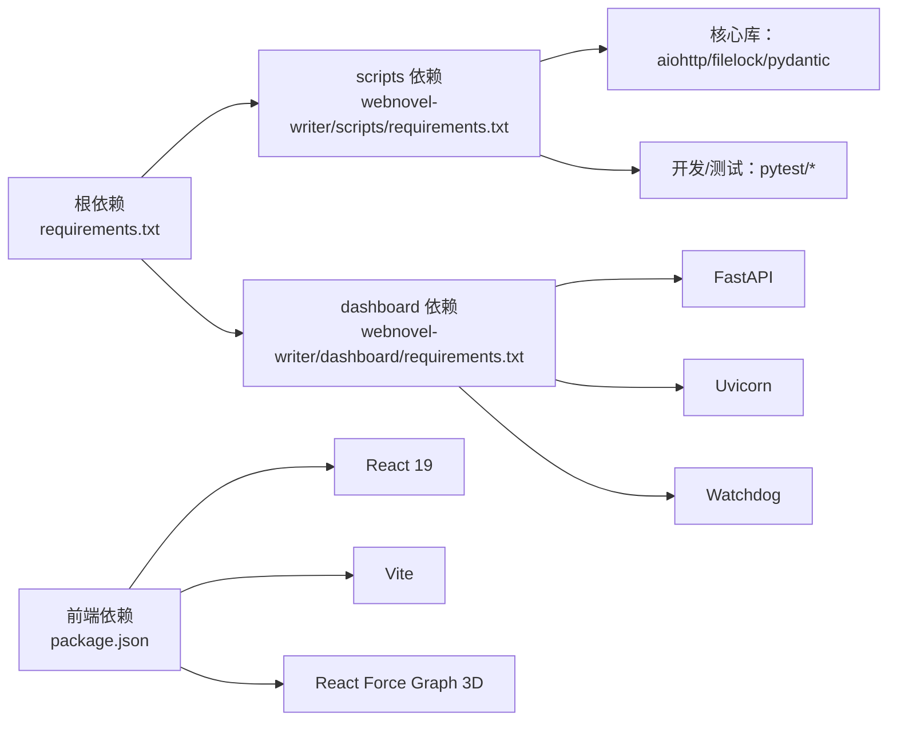

# 技术架构概览

<cite>
**本文档引用的文件**
- [README.md](file://README.md)
- [requirements.txt](file://requirements.txt)
- [webnovel-writer/scripts/requirements.txt](file://webnovel-writer/scripts/requirements.txt)
- [webnovel-writer/dashboard/requirements.txt](file://webnovel-writer/dashboard/requirements.txt)
- [webnovel-writer/dashboard/frontend/package.json](file://webnovel-writer/dashboard/frontend/package.json)
- [webnovel-writer/dashboard/frontend/src/main.jsx](file://webnovel-writer/dashboard/frontend/src/main.jsx)
- [webnovel-writer/dashboard/frontend/src/App.jsx](file://webnovel-writer/dashboard/frontend/src/App.jsx)
- [webnovel-writer/dashboard/frontend/src/api.js](file://webnovel-writer/dashboard/frontend/src/api.js)
- [webnovel-writer/dashboard/app.py](file://webnovel-writer/dashboard/app.py)
- [webnovel-writer/dashboard/server.py](file://webnovel-writer/dashboard/server.py)
</cite>

## 目录
1. [引言](#引言)
2. [项目结构](#项目结构)
3. [核心组件](#核心组件)
4. [架构总览](#架构总览)
5. [详细组件分析](#详细组件分析)
6. [依赖关系分析](#依赖关系分析)
7. [性能考虑](#性能考虑)
8. [故障排除指南](#故障排除指南)
9. [结论](#结论)

## 引言
本项目为基于 Claude Code 的长篇网文创作系统，目标是通过结构化的写作链路与可视化工作台，降低 AI 写作中的“遗忘”和“幻觉”，支撑长周期、高复杂度的网络文学创作。系统采用前后端分离架构，后端以 FastAPI 提供 REST API 与 SSE 实时事件，前端使用 React 构建工作台界面，数据层以 SQLite 存储项目状态与索引，配合文件系统进行正文/大纲/设定集等创作资源的只读/受控读写。

## 项目结构
项目采用按功能域划分的目录组织方式，核心模块包括：
- dashboard：FastAPI 后端与 React 前端工作台
- scripts：写作链路与数据模块（RAG、状态管理、任务编排等）
- genres：题材模板与写作参考
- skills：各阶段技能（计划、写作、审阅、查询等）的参考与提示词
- references：系统数据流与约束规范文档
- templates：模板与黄金句式集合



**图表来源**
- [webnovel-writer/dashboard/frontend/src/main.jsx:1-11](file://webnovel-writer/dashboard/frontend/src/main.jsx#L1-L11)
- [webnovel-writer/dashboard/frontend/src/App.jsx:1-417](file://webnovel-writer/dashboard/frontend/src/App.jsx#L1-L417)
- [webnovel-writer/dashboard/frontend/src/api.js:1-78](file://webnovel-writer/dashboard/frontend/src/api.js#L1-L78)
- [webnovel-writer/dashboard/server.py:1-72](file://webnovel-writer/dashboard/server.py#L1-L72)
- [webnovel-writer/dashboard/app.py:1-513](file://webnovel-writer/dashboard/app.py#L1-L513)

**章节来源**
- [README.md:1-170](file://README.md#L1-L170)
- [webnovel-writer/dashboard/frontend/src/main.jsx:1-11](file://webnovel-writer/dashboard/frontend/src/main.jsx#L1-L11)
- [webnovel-writer/dashboard/frontend/src/App.jsx:1-417](file://webnovel-writer/dashboard/frontend/src/App.jsx#L1-L417)
- [webnovel-writer/dashboard/frontend/src/api.js:1-78](file://webnovel-writer/dashboard/frontend/src/api.js#L1-L78)
- [webnovel-writer/dashboard/server.py:1-72](file://webnovel-writer/dashboard/server.py#L1-L72)
- [webnovel-writer/dashboard/app.py:1-513](file://webnovel-writer/dashboard/app.py#L1-L513)

## 核心组件
- 前端工作台（React）
  - 使用 React 19 与 Vite 构建，提供只读/可编辑的章节浏览、大纲查看、实体关系图谱、追读力指标与设置页。
  - 通过 SSE 实时接收文件变更与任务状态更新，支持聊天交互与动作执行。
- 后端服务（FastAPI）
  - 提供 REST API：项目信息、实体数据库查询、文件树读取/保存、任务创建与查询、聊天接口。
  - 提供 SSE 推送：文件变更事件与任务状态事件。
  - 静态文件托管：SPA 回退至 index.html，资产目录映射。
- 数据存储（SQLite）
  - index.db 存放实体、关系、场景、阅读力、审阅指标、状态变更、覆盖契约、债务与事件、无效事实、RAG 查询日志、工具调用统计等只读表。
- 文件系统
  - 项目根目录下的“正文”“大纲”“设定集”三大目录用于存放创作素材，读取严格校验路径，保存受控。

**章节来源**
- [webnovel-writer/dashboard/frontend/package.json:1-23](file://webnovel-writer/dashboard/frontend/package.json#L1-L23)
- [webnovel-writer/dashboard/app.py:80-489](file://webnovel-writer/dashboard/app.py#L80-L489)

## 架构总览
系统采用前后端分离与事件驱动的设计理念：
- 前后端分离：前端负责视图与交互，后端负责业务逻辑与数据访问。
- 事件驱动：后端通过 SSE 推送文件变更与任务状态，前端订阅并实时更新 UI。
- 受控文件访问：所有文件读写均通过路径守卫与白名单目录限制，确保安全。
- 只读为主：实体数据库与项目摘要等数据以只读查询为主，保证稳定性与一致性。

```mermaid
graph TB
Client["浏览器/工作台"] --> |HTTP(SSE)| API["FastAPI 接口层"]
API --> |只读查询| DB["SQLite 数据库<br/>index.db"]
API --> |受控读写| FS["项目文件系统<br/>正文/大纲/设定集"]
API --> |事件聚合| SSE["SSE 事件流"]
SSE --> Client
subgraph "前端"
FE["React 组件<br/>App.jsx/TopBar/RightSidebar"]
end
FE --> |REST/SSE| API
```

**图表来源**
- [webnovel-writer/dashboard/app.py:434-460](file://webnovel-writer/dashboard/app.py#L434-L460)
- [webnovel-writer/dashboard/frontend/src/api.js:61-77](file://webnovel-writer/dashboard/frontend/src/api.js#L61-L77)
- [webnovel-writer/dashboard/frontend/src/App.jsx:190-273](file://webnovel-writer/dashboard/frontend/src/App.jsx#L190-L273)

## 详细组件分析

### 前端工作台（React）
- 组件职责
  - 状态管理：集中维护工作台状态、当前任务、侧边栏上下文、页面状态与引导步骤。
  - 数据加载：拉取项目摘要、当前任务、文件树与文件内容。
  - 事件订阅：订阅 SSE 事件，响应文件变更与任务状态变化。
  - 用户交互：聊天发送、动作执行、页面切换、保存文件。
- 关键流程
  - 初始化：加载摘要与当前任务，建立 SSE 订阅。
  - 任务执行：创建任务后持续接收任务状态更新，完成后触发工作区刷新。
  - 文件变更：收到文件变更事件后刷新摘要与对应页面缓存令牌。



**图表来源**
- [webnovel-writer/dashboard/frontend/src/App.jsx:64-83](file://webnovel-writer/dashboard/frontend/src/App.jsx#L64-L83)
- [webnovel-writer/dashboard/frontend/src/App.jsx:195-273](file://webnovel-writer/dashboard/frontend/src/App.jsx#L195-L273)
- [webnovel-writer/dashboard/frontend/src/api.js:43-49](file://webnovel-writer/dashboard/frontend/src/api.js#L43-L49)

**章节来源**
- [webnovel-writer/dashboard/frontend/src/App.jsx:1-417](file://webnovel-writer/dashboard/frontend/src/App.jsx#L1-L417)
- [webnovel-writer/dashboard/frontend/src/api.js:1-78](file://webnovel-writer/dashboard/frontend/src/api.js#L1-L78)

### 后端服务（FastAPI）
- 应用工厂与生命周期
  - create_app 支持外部注入项目根目录，启动时初始化任务服务与文件监视器。
  - lifespan 中启动文件监控，应用关闭时停止。
- API 分类
  - 项目与工作台：/api/project/info、/api/workbench/summary
  - 实体数据库（只读）：/api/entities、/api/relationships、/api/chapters、/api/scenes、/api/reading-power、/api/review-metrics、/api/state-changes、/api/aliases
  - 扩展表（v5.3+）：/api/overrides、/api/debts、/api/debt-events、/api/invalid-facts、/api/rag-queries、/api/tool-stats、/api/checklist-scores
  - 文件浏览（只读/受控）：/api/files/tree、/api/files/read、/api/files/save
  - 任务与聊天：/api/tasks、/api/tasks/{id}、/api/chat
  - SSE：/api/events
  - 前端静态托管：SPA 回退与资产目录映射
- 安全与校验
  - CORS 允许跨域请求。
  - 文件读取通过路径守卫与白名单目录限制，防止路径穿越。
  - 任务与聊天参数进行类型校验，异常统一抛出 HTTP 错误。



**图表来源**
- [webnovel-writer/dashboard/app.py:352-428](file://webnovel-writer/dashboard/app.py#L352-L428)
- [webnovel-writer/dashboard/app.py:434-460](file://webnovel-writer/dashboard/app.py#L434-L460)

**章节来源**
- [webnovel-writer/dashboard/app.py:50-489](file://webnovel-writer/dashboard/app.py#L50-L489)

### 服务器启动与部署
- 启动流程
  - 解析项目根目录：支持 CLI 参数、环境变量、.claude 指针与当前目录回退。
  - 延迟导入应用与 Uvicorn 运行。
  - 可选自动打开浏览器并打印 API 文档链接。
- 端口与主机
  - 默认监听 127.0.0.1:8765，可通过参数调整。



**图表来源**
- [webnovel-writer/dashboard/server.py:43-67](file://webnovel-writer/dashboard/server.py#L43-L67)

**章节来源**
- [webnovel-writer/dashboard/server.py:1-72](file://webnovel-writer/dashboard/server.py#L1-L72)

### 数据模型与状态管理
- 前端状态模型
  - 工作台状态：包含摘要、当前任务、建议动作、聊天消息等。
  - 页面状态：章节/大纲/设置页的选择与脏标记。
  - 侧边栏上下文：当前页面、选中路径、脏标记。
- 事件驱动更新
  - SSE 事件触发后，前端更新当前任务状态、聊天消息与页面刷新令牌。
  - 任务完成后自动刷新摘要与对应页面，确保 UI 与后端状态一致。



**图表来源**
- [webnovel-writer/dashboard/frontend/src/App.jsx:195-273](file://webnovel-writer/dashboard/frontend/src/App.jsx#L195-L273)

**章节来源**
- [webnovel-writer/dashboard/frontend/src/App.jsx:21-417](file://webnovel-writer/dashboard/frontend/src/App.jsx#L21-L417)

## 依赖关系分析
- 依赖来源
  - 根依赖：requirements.txt 引入 scripts 与 dashboard 两套依赖清单。
  - scripts 依赖：核心库（异步 HTTP、文件锁、Schema 校验）与可选开发/测试依赖。
  - dashboard 依赖：FastAPI、Uvicorn、Watchdog（文件监控）。
  - 前端依赖：React 19、React DOM、Vite、React Force Graph 3D（实体图谱）。
- 依赖关系图



**图表来源**
- [requirements.txt:1-3](file://requirements.txt#L1-L3)
- [webnovel-writer/scripts/requirements.txt:1-14](file://webnovel-writer/scripts/requirements.txt#L1-L14)
- [webnovel-writer/dashboard/requirements.txt:1-4](file://webnovel-writer/dashboard/requirements.txt#L1-L4)
- [webnovel-writer/dashboard/frontend/package.json:1-23](file://webnovel-writer/dashboard/frontend/package.json#L1-L23)

**章节来源**
- [requirements.txt:1-3](file://requirements.txt#L1-L3)
- [webnovel-writer/scripts/requirements.txt:1-14](file://webnovel-writer/scripts/requirements.txt#L1-L14)
- [webnovel-writer/dashboard/requirements.txt:1-4](file://webnovel-writer/dashboard/requirements.txt#L1-L4)
- [webnovel-writer/dashboard/frontend/package.json:1-23](file://webnovel-writer/dashboard/frontend/package.json#L1-L23)

## 性能考虑
- 异步与并发
  - 后端使用 FastAPI 与 asyncio，SSE 事件聚合通过 asyncio.wait 并发等待文件与任务队列，减少阻塞。
- 数据库只读优化
  - 实体数据库查询统一走只读路径，对不存在的表返回空列表，避免因版本差异导致的中断。
- 文件访问安全与效率
  - 路径守卫与白名单目录限制，避免不必要的 IO 与权限问题。
- 前端渲染与刷新
  - 通过页面级 reloadKey 令牌实现局部刷新，减少不必要的重渲染。
- 部署建议
  - 生产环境建议使用反向代理与静态资源缓存，结合 Uvicorn 多进程模式提升吞吐。

## 故障排除指南
- 项目根目录未配置
  - 现象：访问 /api/project/info 抛出 500。
  - 处理：确保通过 --project-root 或环境变量/指针正确设置项目根目录。
- index.db 不存在
  - 现象：查询实体/关系等接口返回 404。
  - 处理：确认项目已完成初始化且 .webnovel/index.db 存在。
- 前端未构建
  - 现象：访问 / 返回提示前端未构建。
  - 处理：在 dashboard/frontend 目录执行构建命令并重新启动服务。
- 文件读取被拒绝
  - 现象：/api/files/read 返回 403。
  - 处理：确保路径位于“正文/大纲/设定集”目录内，且未越权访问。
- SSE 连接异常
  - 现象：前端连接状态为断开或未收到事件。
  - 处理：检查后端日志与网络连通性，确认 /api/events 可正常访问。

**章节来源**
- [webnovel-writer/dashboard/app.py:36-40](file://webnovel-writer/dashboard/app.py#L36-L40)
- [webnovel-writer/dashboard/app.py:96-102](file://webnovel-writer/dashboard/app.py#L96-L102)
- [webnovel-writer/dashboard/app.py:481-487](file://webnovel-writer/dashboard/app.py#L481-L487)
- [webnovel-writer/dashboard/app.py:366-385](file://webnovel-writer/dashboard/app.py#L366-L385)
- [webnovel-writer/dashboard/frontend/src/api.js:61-77](file://webnovel-writer/dashboard/frontend/src/api.js#L61-L77)

## 结论
本系统通过前后端分离与事件驱动机制，实现了稳定、可扩展的长篇网文创作工作台。后端以 FastAPI 提供 REST 与 SSE，前端以 React 构建交互体验，SQLite 作为只读数据源，文件系统承载创作资源。整体架构强调安全性（路径守卫）、一致性（只读查询）、可观测性（SSE 事件）与易用性（SPA 回退与 API 文档）。未来可在微服务化方面进一步拆分任务编排与 RAG 适配器，以支持更大规模的协作与扩展。