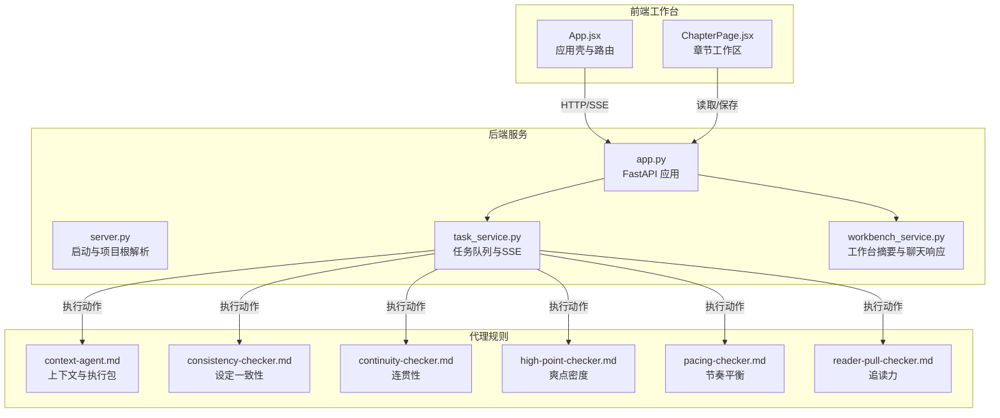
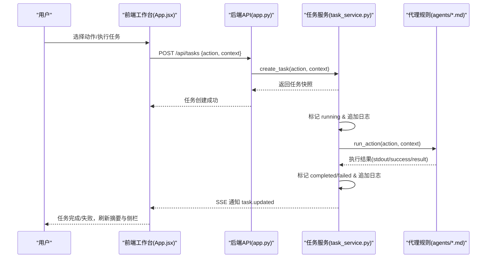
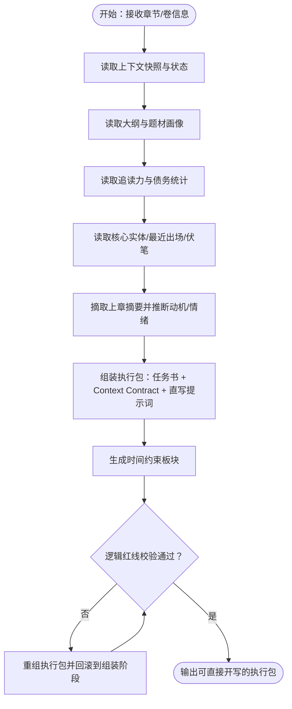
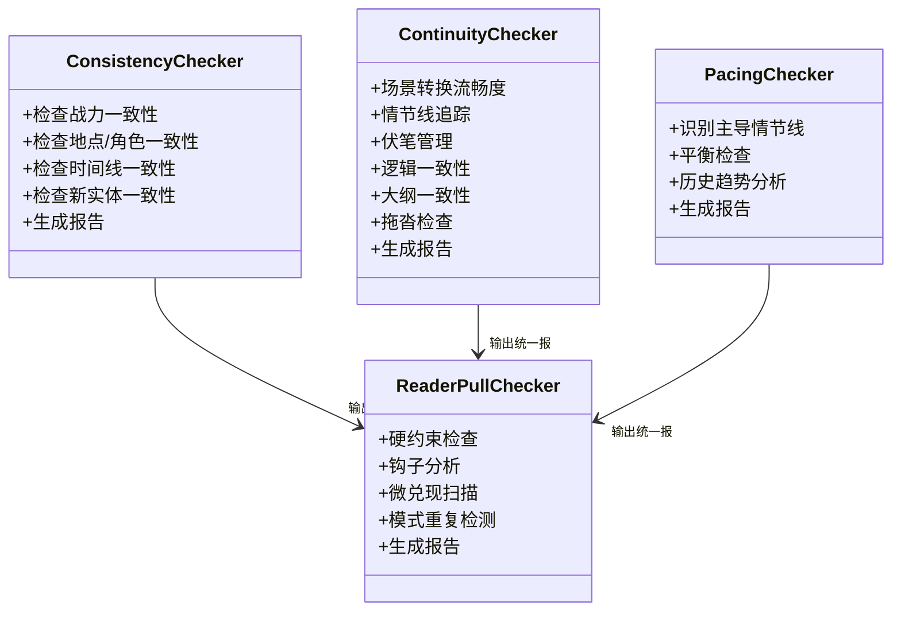
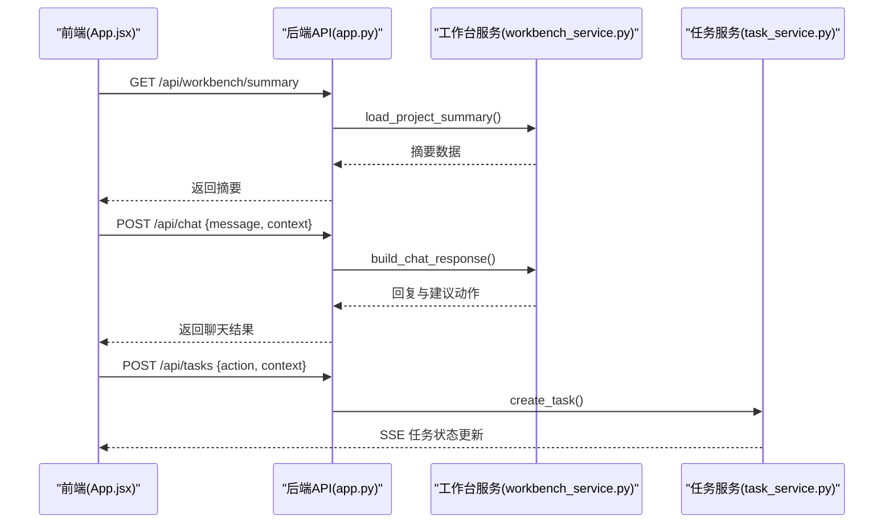
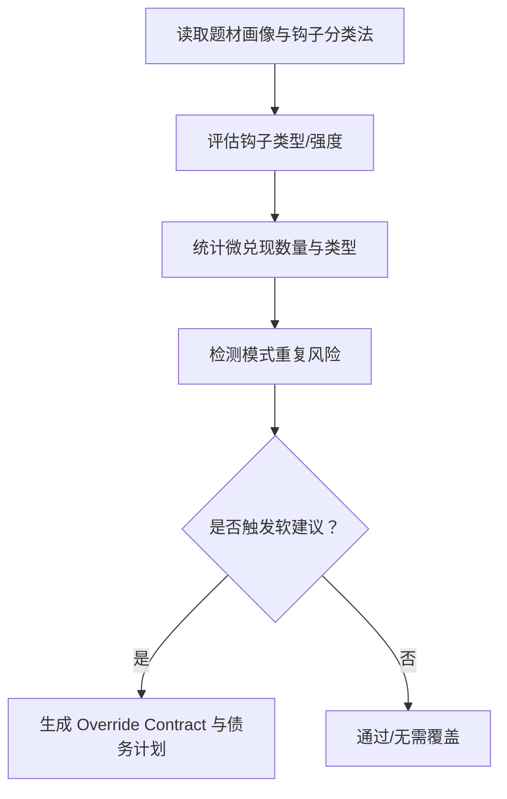
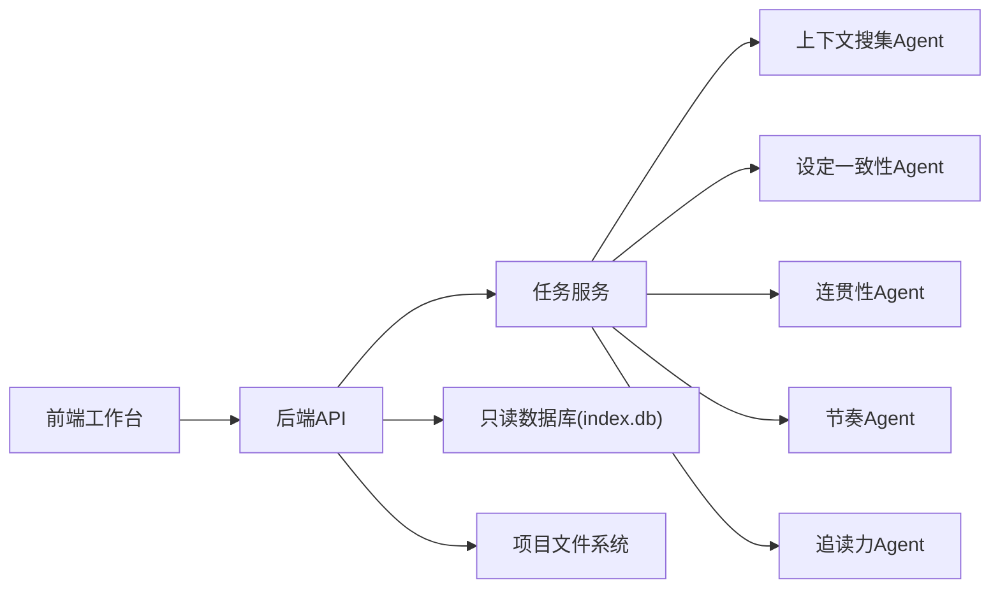

# 核心功能特性

<cite>
**本文引用的文件**
- [README.md](file://README.md)
- [App.jsx](file://webnovel-writer/dashboard/frontend/src/App.jsx)
- [main.jsx](file://webnovel-writer/dashboard/frontend/src/main.jsx)
- [ChapterPage.jsx](file://webnovel-writer/dashboard/frontend/src/workbench/ChapterPage.jsx)
- [app.py](file://webnovel-writer/dashboard/app.py)
- [server.py](file://webnovel-writer/dashboard/server.py)
- [workbench_service.py](file://webnovel-writer/dashboard/workbench_service.py)
- [task_service.py](file://webnovel-writer/dashboard/task_service.py)
- [context-agent.md](file://webnovel-writer/agents/context-agent.md)
- [consistency-checker.md](file://webnovel-writer/agents/consistency-checker.md)
- [continuity-checker.md](file://webnovel-writer/agents/continuity-checker.md)
- [high-point-checker.md](file://webnovel-writer/agents/high-point-checker.md)
- [pacing-checker.md](file://webnovel-writer/agents/pacing-checker.md)
- [reader-pull-checker.md](file://webnovel-writer/agents/reader-pull-checker.md)
</cite>

## 目录
1. [引言](#引言)
2. [项目结构](#项目结构)
3. [核心组件](#核心组件)
4. [架构总览](#架构总览)
5. [详细组件分析](#详细组件分析)
6. [依赖分析](#依赖分析)
7. [性能考虑](#性能考虑)
8. [故障排查指南](#故障排查指南)
9. [结论](#结论)
10. [附录](#附录)

## 引言
本文件面向使用 Webnovel Writer 的创作者，系统化阐述平台的核心功能特性与协同机制，包括：
- 智能写作代理：围绕上下文生成、任务书与直写提示词的创作执行包，支撑“可直接开写”的高质量正文产出。
- 实时协作工作台：基于只读 Dashboard 的可视化工作台，提供章节/大纲/设定集浏览、任务执行与状态反馈、聊天引导动作等功能。
- 数据驱动的质量检查：以统一输出格式的结构化报告为基础，覆盖设定一致性、连贯性、节奏与追读力等维度，形成闭环质量控制。
- 题材模板系统：依托题材画像与钩子分类法，为不同题材提供可执行的追读力与节奏设计建议。

这些能力通过“写作代理 + 工作台 + 质量检查 + 题材模板”的组合，帮助创作者在长周期连载中降低“遗忘”和“幻觉”，稳定提升作品质量与读者粘性。

## 项目结构
Webnovel Writer 采用“后端服务 + 前端工作台 + 代理规则”的分层架构：
- 后端服务（FastAPI）：提供只读查询、文件树与内容读取、任务创建与SSE事件推送、聊天与动作建议等能力。
- 前端工作台（React SPA）：提供章节/大纲/设定集浏览、任务执行面板、聊天助手与引导动作，支持实时刷新。
- 代理规则（Markdown）：定义各类质量检查与写作辅助 Agent 的输入输出规范、执行流程与成功标准，作为“可执行的知识”。

**图表来源**
- [server.py:1-72](file://webnovel-writer/dashboard/server.py#L1-L72)
- [app.py:1-513](file://webnovel-writer/dashboard/app.py#L1-L513)
- [task_service.py:1-166](file://webnovel-writer/dashboard/task_service.py#L1-L166)
- [workbench_service.py:1-171](file://webnovel-writer/dashboard/workbench_service.py#L1-L171)
- [App.jsx:1-417](file://webnovel-writer/dashboard/frontend/src/App.jsx#L1-L417)
- [ChapterPage.jsx:1-199](file://webnovel-writer/dashboard/frontend/src/workbench/ChapterPage.jsx#L1-L199)
- [context-agent.md:1-269](file://webnovel-writer/agents/context-agent.md#L1-L269)
- [consistency-checker.md:1-229](file://webnovel-writer/agents/consistency-checker.md#L1-L229)
- [continuity-checker.md:1-251](file://webnovel-writer/agents/continuity-checker.md#L1-L251)
- [high-point-checker.md:1-218](file://webnovel-writer/agents/high-point-checker.md#L1-L218)
- [pacing-checker.md:1-216](file://webnovel-writer/agents/pacing-checker.md#L1-L216)
- [reader-pull-checker.md:1-318](file://webnovel-writer/agents/reader-pull-checker.md#L1-L318)

**章节来源**
- [README.md:1-170](file://README.md#L1-L170)
- [server.py:1-72](file://webnovel-writer/dashboard/server.py#L1-L72)
- [app.py:1-513](file://webnovel-writer/dashboard/app.py#L1-L513)

## 核心组件
- 智能写作代理
  - 上下文搜集 Agent：生成“创作执行包”，包含任务书、Context Contract 与直写提示词，确保 Step 2A 可直接开写。
  - 质量检查 Agent：设定一致性、连贯性、节奏与追读力检查，输出统一结构化报告，支持 Override Contract 与债务追踪。
- 实时协作工作台
  - 只读 Dashboard：提供章节/大纲/设定集浏览、实体图谱与阅读力数据查询、任务状态与日志查看。
  - 前端工作台：章节编辑、聊天引导动作、任务执行与SSE实时刷新。
- 题材模板系统
  - 钩子分类法与题材画像：为不同题材提供钩子类型、微兑现数量、节奏权重等设计建议，形成可执行的追读力策略。

**章节来源**
- [context-agent.md:1-269](file://webnovel-writer/agents/context-agent.md#L1-L269)
- [consistency-checker.md:1-229](file://webnovel-writer/agents/consistency-checker.md#L1-L229)
- [continuity-checker.md:1-251](file://webnovel-writer/agents/continuity-checker.md#L1-L251)
- [high-point-checker.md:1-218](file://webnovel-writer/agents/high-point-checker.md#L1-L218)
- [pacing-checker.md:1-216](file://webnovel-writer/agents/pacing-checker.md#L1-L216)
- [reader-pull-checker.md:1-318](file://webnovel-writer/agents/reader-pull-checker.md#L1-L318)
- [workbench_service.py:1-171](file://webnovel-writer/dashboard/workbench_service.py#L1-L171)
- [app.py:1-513](file://webnovel-writer/dashboard/app.py#L1-L513)

## 架构总览
系统通过“前端工作台 + 后端服务 + 代理规则”的组合实现：
- 前端工作台负责用户交互与任务调度，后端服务提供只读查询与任务执行通道。
- 任务服务接收动作请求，异步执行并推送状态变更，前端通过 SSE 实时刷新。
- 代理规则作为“知识与流程”，指导质量检查与写作生成，形成可复用、可审计的创作链路。

**图表来源**
- [App.jsx:87-157](file://webnovel-writer/dashboard/frontend/src/App.jsx#L87-L157)
- [app.py:395-428](file://webnovel-writer/dashboard/app.py#L395-L428)
- [task_service.py:36-120](file://webnovel-writer/dashboard/task_service.py#L36-L120)
- [context-agent.md:101-133](file://webnovel-writer/agents/context-agent.md#L101-L133)

**章节来源**
- [App.jsx:190-273](file://webnovel-writer/dashboard/frontend/src/App.jsx#L190-L273)
- [app.py:434-460](file://webnovel-writer/dashboard/app.py#L434-L460)
- [task_service.py:121-143](file://webnovel-writer/dashboard/task_service.py#L121-L143)

## 详细组件分析

### 智能写作代理：上下文搜集与创作执行包
- 设计理念
  - “按需召回 + 推断补全”，确保接住上章、场景清晰、留出钩子。
  - 输出“创作执行包”，三层信息一致，直接驱动 Step 2A 开写。
- 实现原理
  - 读取 state.json、index.db、章节摘要与上下文快照，结合题材画像与钩子分类法，生成任务书、Context Contract 与直写提示词。
  - 引入时间线读取与时间约束板块，强化时间逻辑红线。
- 使用方法
  - 通过工作台聊天或动作面板触发“生成当前章节/卷纲/设定检查”等动作，任务服务异步执行上下文搜集 Agent，完成后前端刷新摘要与侧栏建议。
- 成功标准
  - 执行包可直接驱动 Step 2A；任务书包含 8 个板块（含时间约束）；逻辑红线校验通过；时间逻辑红线通过。

**图表来源**
- [context-agent.md:101-133](file://webnovel-writer/agents/context-agent.md#L101-L133)
- [context-agent.md:171-229](file://webnovel-writer/agents/context-agent.md#L171-L229)
- [context-agent.md:238-269](file://webnovel-writer/agents/context-agent.md#L238-L269)

**章节来源**
- [context-agent.md:1-269](file://webnovel-writer/agents/context-agent.md#L1-L269)

### 数据驱动的质量检查：设定一致性、连贯性、节奏与追读力
- 设定一致性检查
  - 范围：单章或章节区间，覆盖战力、地点/角色、时间线与实体一致性。
  - 输出：统一 JSON Schema 报告，包含严重度分级与修复建议；对严重问题自动标记无效事实。
- 连贯性检查
  - 范围：场景转换、情节线连贯、伏笔管理、逻辑流畅性与大纲一致性。
  - 输出：场景转换评分、情节线追踪、伏笔健康度、逻辑漏洞与节奏拖沓检查。
- 节奏检查（Strand Weave）
  - 分类：主线 Quest、感情 Fire、世界观 Constellation 三条情节线。
  - 输出：平衡检查、历史趋势分析与下一章节奏建议。
- 追读力检查
  - 分层：硬约束（不可申诉）与软建议（可 Override Contract 覆盖并产生债务）。
  - 输出：钩子类型/强度、微兑现数量、模式重复风险与“下章动机”。

**图表来源**
- [consistency-checker.md:14-229](file://webnovel-writer/agents/consistency-checker.md#L14-L229)
- [continuity-checker.md:14-251](file://webnovel-writer/agents/continuity-checker.md#L14-L251)
- [pacing-checker.md:14-216](file://webnovel-writer/agents/pacing-checker.md#L14-L216)
- [reader-pull-checker.md:66-318](file://webnovel-writer/agents/reader-pull-checker.md#L66-L318)

**章节来源**
- [consistency-checker.md:1-229](file://webnovel-writer/agents/consistency-checker.md#L1-L229)
- [continuity-checker.md:1-251](file://webnovel-writer/agents/continuity-checker.md#L1-L251)
- [pacing-checker.md:1-216](file://webnovel-writer/agents/pacing-checker.md#L1-L216)
- [reader-pull-checker.md:1-318](file://webnovel-writer/agents/reader-pull-checker.md#L1-L318)

### 实时协作工作台：只读面板与任务执行
- 只读面板能力
  - 项目摘要、章节/大纲/设定集文件树与内容读取、实体/关系/状态变化/阅读力等只读查询。
  - SSE 推送文件变更与任务状态，前端自动刷新。
- 任务执行与聊天
  - 前端将动作与上下文合并后提交任务，后端任务服务异步执行并回传日志与结果。
  - 聊天接口根据当前页面与脏状态生成建议动作，避免覆盖未保存内容。

**图表来源**
- [App.jsx:64-83](file://webnovel-writer/dashboard/frontend/src/App.jsx#L64-L83)
- [App.jsx:316-359](file://webnovel-writer/dashboard/frontend/src/App.jsx#L316-L359)
- [app.py:88-90](file://webnovel-writer/dashboard/app.py#L88-L90)
- [app.py:420-428](file://webnovel-writer/dashboard/app.py#L420-L428)
- [workbench_service.py:74-162](file://webnovel-writer/dashboard/workbench_service.py#L74-L162)
- [task_service.py:36-71](file://webnovel-writer/dashboard/task_service.py#L36-L71)

**章节来源**
- [App.jsx:1-417](file://webnovel-writer/dashboard/frontend/src/App.jsx#L1-L417)
- [app.py:1-513](file://webnovel-writer/dashboard/app.py#L1-L513)
- [workbench_service.py:1-171](file://webnovel-writer/dashboard/workbench_service.py#L1-L171)
- [task_service.py:1-166](file://webnovel-writer/dashboard/task_service.py#L1-L166)

### 题材模板系统：钩子与节奏设计
- 钩子类型与强度
  - 危机钩、悬念钩、情绪钩、选择钩、渴望钩；强度分为 strong/medium/weak，适配不同章节类型。
- 微兑现与模式重复
  - 微兑现类型覆盖信息、关系、能力、资源、认可、情绪与线索；检测最近 N 章模式重复风险。
- Override Contract 与债务
  - 软建议可覆盖，需填写理由与补偿计划，产生债务并按章计息，超期转为逾期。

**图表来源**
- [reader-pull-checker.md:121-177](file://webnovel-writer/agents/reader-pull-checker.md#L121-L177)
- [reader-pull-checker.md:179-214](file://webnovel-writer/agents/reader-pull-checker.md#L179-L214)
- [reader-pull-checker.md:216-286](file://webnovel-writer/agents/reader-pull-checker.md#L216-L286)

**章节来源**
- [reader-pull-checker.md:1-318](file://webnovel-writer/agents/reader-pull-checker.md#L1-L318)

## 依赖分析
- 组件耦合与内聚
  - 前端工作台与后端 API 通过 REST 与 SSE 解耦，任务执行通过任务服务异步化，降低前端阻塞。
  - 代理规则以 Markdown 为契约，后端仅负责调度与状态管理，保证检查与写作流程可替换与扩展。
- 外部依赖与集成点
  - 项目根解析与路径安全校验，确保文件读写在限定目录内。
  - SSE 事件通道统一推送文件变更与任务状态，前端自动刷新。
- 潜在循环依赖
  - 代理规则之间无直接调用，通过任务服务串联，避免循环依赖。

**图表来源**
- [app.py:352-428](file://webnovel-writer/dashboard/app.py#L352-L428)
- [task_service.py:121-143](file://webnovel-writer/dashboard/task_service.py#L121-L143)
- [context-agent.md:101-133](file://webnovel-writer/agents/context-agent.md#L101-L133)
- [consistency-checker.md:22-41](file://webnovel-writer/agents/consistency-checker.md#L22-L41)
- [continuity-checker.md:22-41](file://webnovel-writer/agents/continuity-checker.md#L22-L41)
- [pacing-checker.md:22-45](file://webnovel-writer/agents/pacing-checker.md#L22-L45)
- [reader-pull-checker.md:19-24](file://webnovel-writer/agents/reader-pull-checker.md#L19-L24)

**章节来源**
- [app.py:1-513](file://webnovel-writer/dashboard/app.py#L1-L513)
- [task_service.py:1-166](file://webnovel-writer/dashboard/task_service.py#L1-L166)

## 性能考虑
- 任务执行异步化：任务服务使用线程池与事件循环，避免阻塞 API 响应。
- SSE 流式推送：文件变更与任务状态通过流式事件推送，减少轮询开销。
- 只读查询优化：数据库查询封装为只读，表不存在时返回空列表，降低异常开销。
- 前端缓存与懒加载：章节列表扁平化与选择状态缓存，减少不必要的渲染。

[本节为通用性能讨论，不直接分析具体文件]

## 故障排查指南
- 项目根解析失败
  - 现象：无法定位 PROJECT_ROOT。
  - 排查：检查 CLI、环境变量、.claude 指针与 CWD，确认 .webnovel/state.json 存在。
- 文件读写权限
  - 现象：写入失败或路径不在允许目录。
  - 排查：确认写入路径在 正文/大纲/设定集 之内，检查路径安全校验。
- 任务执行异常
  - 现象：任务失败或无日志。
  - 排查：查看任务日志末尾，确认代理规则执行是否抛出异常；检查代理输入参数与工具可用性。
- SSE 连接中断
  - 现象：前端未收到文件变更或任务状态更新。
  - 排查：确认后端 SSE 端点可达，检查订阅队列与事件分发。

**章节来源**
- [server.py:16-41](file://webnovel-writer/dashboard/server.py#L16-L41)
- [app.py:371-385](file://webnovel-writer/dashboard/app.py#L371-L385)
- [task_service.py:144-166](file://webnovel-writer/dashboard/task_service.py#L144-L166)
- [workbench_service.py:58-71](file://webnovel-writer/dashboard/workbench_service.py#L58-L71)

## 结论
Webnovel Writer 通过“智能写作代理 + 实时协作工作台 + 数据驱动质量检查 + 题材模板系统”的组合，为长周期网文创作提供了可执行、可审计、可迭代的质量保障与创作体验。代理规则以统一格式输出，配合工作台的实时反馈与任务执行，使创作者能够在稳定的创作链路上持续产出高质量内容。

[本节为总结性内容，不直接分析具体文件]

## 附录
- 快速开始与安装
  - 安装插件、安装依赖、初始化项目、配置 RAG、启动 Dashboard、Agent 模型设置等步骤详见项目说明。
- 使用场景示例
  - 生成当前卷纲/章节：在工作台侧栏选择“生成当前卷纲/生成当前章节”，任务完成后自动刷新摘要与建议。
  - 审查当前章节：在章节页选择“审查当前章节”，任务完成后查看质量检查报告与修复建议。
  - 设定检查：在设定页选择“检查当前设定冲突”，任务完成后查看设定一致性报告。

**章节来源**
- [README.md:21-116](file://README.md#L21-L116)
- [workbench_service.py:96-162](file://webnovel-writer/dashboard/workbench_service.py#L96-L162)
- [ChapterPage.jsx:177-180](file://webnovel-writer/dashboard/frontend/src/workbench/ChapterPage.jsx#L177-L180)