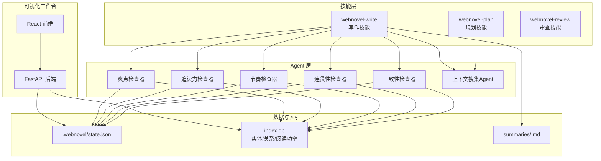
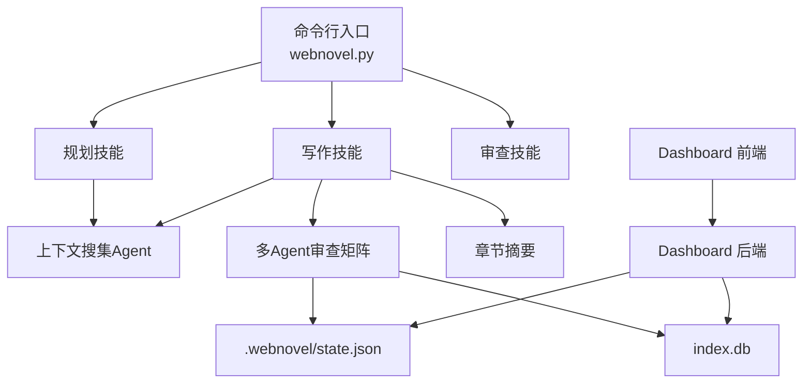
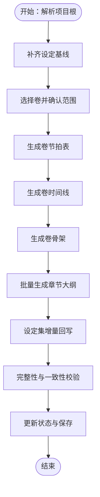
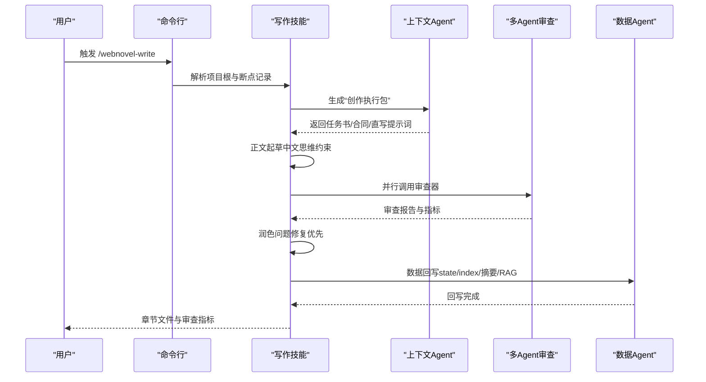
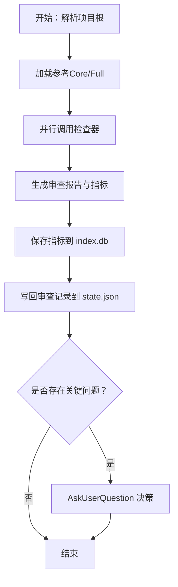
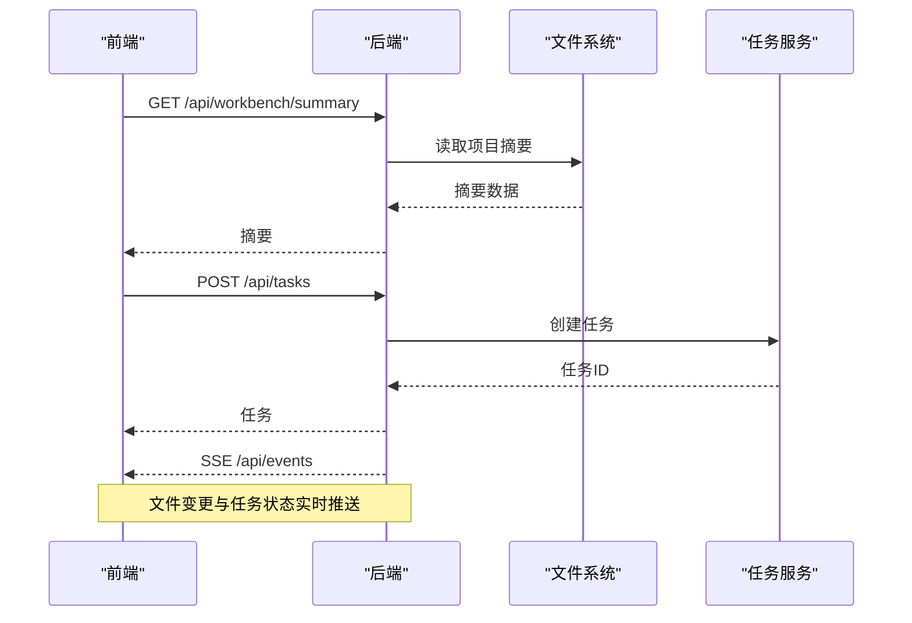
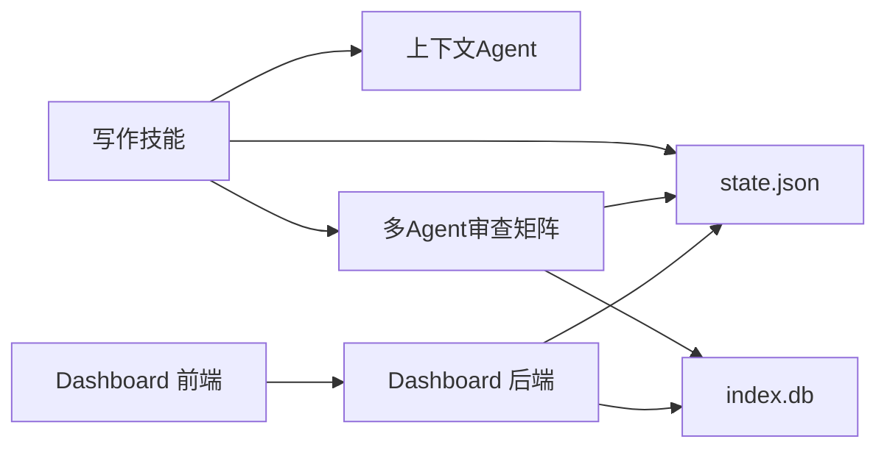

# 系统介绍与定位

<cite>
**本文档引用的文件**
- [README.md](file://README.md)
- [App.jsx](file://webnovel-writer/dashboard/frontend/src/App.jsx)
- [app.py](file://webnovel-writer/dashboard/app.py)
- [webnovel.py](file://webnovel-writer/scripts/webnovel.py)
- [consistency-checker.md](file://webnovel-writer/agents/consistency-checker.md)
- [context-agent.md](file://webnovel-writer/agents/context-agent.md)
- [continuity-checker.md](file://webnovel-writer/agents/continuity-checker.md)
- [high-point-checker.md](file://webnovel-writer/agents/high-point-checker.md)
- [pacing-checker.md](file://webnovel-writer/agents/pacing-checker.md)
- [reader-pull-checker.md](file://webnovel-writer/agents/reader-pull-checker.md)
- [project-memory-schema.md](file://webnovel-writer/references/project-memory-schema.md)
- [webnovel-plan/SKILL.md](file://webnovel-writer/skills/webnovel-plan/SKILL.md)
- [webnovel-write/SKILL.md](file://webnovel-writer/skills/webnovel-write/SKILL.md)
- [webnovel-review/SKILL.md](file://webnovel-writer/skills/webnovel-review/SKILL.md)
- [docs/README.md](file://docs/README.md)
</cite>

## 目录
1. [引言](#引言)
2. [项目结构](#项目结构)
3. [核心组件](#核心组件)
4. [架构总览](#架构总览)
5. [详细组件分析](#详细组件分析)
6. [依赖关系分析](#依赖关系分析)
7. [性能考量](#性能考量)
8. [故障排查指南](#故障排查指南)
9. [结论](#结论)
10. [附录](#附录)

## 引言
Webnovel Writer 是一个基于 Claude Code 的长篇网文创作助手，旨在系统性解决 AI 写作中的“遗忘”和“幻觉”问题，支撑长周期连载创作。其核心使命是通过“设定即物理、大纲即法律”的双重约束，结合多维度 Agent 审查与可视化工作台，帮助创作者在海量信息与复杂情节中保持一致性、连贯性与读者吸引力。

- 价值主张
  - 降低“遗忘”：通过项目级状态、上下文快照、实体图谱与时间线表，确保跨章节信息不丢失。
  - 降低“幻觉”：以设定/大纲为硬约束，配合多 Agent 结构化审查，将事实性错误与逻辑跳跃拒之门外。
  - 提升效率：标准化写作链路与可视化工作台，减少试错成本，加速迭代。
  - 增强体验：以“追读力”“节奏控制”“爽点密度”等指标驱动内容质量，提升读者粘性。

- 目标用户
  - 长篇网文作者（起点/晋江/番茄/纵横等平台作者）
  - 希望系统化管理长文的自由写作者
  - 追求高质量、可持续更新的创作团队

- 使用场景
  - 规划阶段：卷纲/时间线/章节大纲生成与校验
  - 写作阶段：章节起草、风格适配、多维度审查与润色
  - 质量监控：持续的追读力、节奏、爽点与一致性评估
  - 可视化运营：通过 Dashboard 实时查看项目状态、实体关系与阅读功率

- 与传统写作方式的差异
  - 传统写作：依赖作者记忆与经验，易出现前后不一致、节奏失衡、读者期待落空等问题。
  - AI 辅助写作：早期工具常出现“上下文短浅”“生成即遗忘”“事实漂移”等，难以支撑长文。
  - Webnovel Writer：以“项目级状态 + 结构化约束 + 多 Agent 审查 + 可视化工作台”形成闭环，既发挥 AI 的高效生成，又避免“遗忘/幻觉”。

- 使用案例（概念性示例）
  - 案例A：某作者在长卷中频繁更换角色能力上限，导致“战力崩坏”。通过一致性检查器与设定基线对齐，自动识别并要求修正，避免读者困惑。
  - 案例B：章节节奏单调，连续多章均为“主线推进”。通过节奏检查器与 Strand Weave 指南，建议插入“感情线/世界观线”缓解疲劳。
  - 案例C：读者期待未兑现，章节结尾“无钩”。通过追读力检查器与钩子类型库，建议设置“渴望钩/危机钩”，提升点击率。

**章节来源**
- [README.md:1-170](file://README.md#L1-L170)

## 项目结构
系统采用“技能（Skills）+ Agent + 数据与索引 + 可视化工作台”的分层架构：
- 技能层：提供规划、写作、审查等完整工作流（webnovel-plan、webnovel-write、webnovel-review）
- Agent 层：围绕“设定一致性、连贯性、节奏、追读力、爽点”等维度的结构化检查器
- 数据与索引层：项目状态、实体图谱、章节摘要、阅读功率、RAG 索引等
- 可视化工作台：Dashboard 提供只读面板与任务执行通道



**图表来源**
- [webnovel-plan/SKILL.md:1-480](file://webnovel-writer/skills/webnovel-plan/SKILL.md#L1-L480)
- [webnovel-write/SKILL.md:1-381](file://webnovel-writer/skills/webnovel-write/SKILL.md#L1-L381)
- [webnovel-review/SKILL.md:1-195](file://webnovel-writer/skills/webnovel-review/SKILL.md#L1-L195)
- [consistency-checker.md:1-229](file://webnovel-writer/agents/consistency-checker.md#L1-L229)
- [continuity-checker.md:1-251](file://webnovel-writer/agents/continuity-checker.md#L1-L251)
- [pacing-checker.md:1-216](file://webnovel-writer/agents/pacing-checker.md#L1-L216)
- [reader-pull-checker.md:1-318](file://webnovel-writer/agents/reader-pull-checker.md#L1-L318)
- [high-point-checker.md:1-218](file://webnovel-writer/agents/high-point-checker.md#L1-L218)
- [context-agent.md:1-269](file://webnovel-writer/agents/context-agent.md#L1-L269)

**章节来源**
- [docs/README.md:1-36](file://docs/README.md#L1-L36)

## 核心组件
- 规划技能（webnovel-plan）
  - 将总纲转化为卷纲、时间线与章节大纲，确保“承诺→危机递增→中段反转→最低谷→大兑现+新钩子”的节奏锚定。
  - 强制时间线表与节拍表存在性，避免时间跳跃与节奏漂移。
- 写作技能（webnovel-write）
  - 以“上下文搜集Agent + 多维度审查 + 润色 + 数据回写”闭环，确保每章产出可发布、可追踪、可复用。
  - 严格中文思维写作约束，杜绝英文结论话术，强调“动作、反应、代价、情绪、场景、关系位移”的叙事单元。
- 审查技能（webnovel-review）
  - Core（一致性/连贯性/OOC/追读力）与 Full（追加爽点/节奏）两种深度，支持并行调用多个检查器。
- 多 Agent 审查矩阵
  - 一致性检查器：设定即物理，校验战力、地点、时间线等。
  - 连贯性检查器：场景转换、情节线、伏笔管理、逻辑一致性。
  - 节奏检查器：Strand Weave 平衡，防止读者疲劳。
  - 追读力检查器：钩子/微兑现/约束分层，支持 Override Contract。
  - 爽点检查器：密度、类型多样性与执行质量评估。
  - 上下文搜集Agent：生成可直接开写的“创作执行包”。

**章节来源**
- [webnovel-plan/SKILL.md:1-480](file://webnovel-writer/skills/webnovel-plan/SKILL.md#L1-L480)
- [webnovel-write/SKILL.md:1-381](file://webnovel-writer/skills/webnovel-write/SKILL.md#L1-L381)
- [webnovel-review/SKILL.md:1-195](file://webnovel-writer/skills/webnovel-review/SKILL.md#L1-L195)
- [consistency-checker.md:1-229](file://webnovel-writer/agents/consistency-checker.md#L1-L229)
- [continuity-checker.md:1-251](file://webnovel-writer/agents/continuity-checker.md#L1-L251)
- [pacing-checker.md:1-216](file://webnovel-writer/agents/pacing-checker.md#L1-L216)
- [reader-pull-checker.md:1-318](file://webnovel-writer/agents/reader-pull-checker.md#L1-L318)
- [high-point-checker.md:1-218](file://webnovel-writer/agents/high-point-checker.md#L1-L218)
- [context-agent.md:1-269](file://webnovel-writer/agents/context-agent.md#L1-L269)

## 架构总览
系统通过“技能-Agent-数据-工作台”的协同，形成“规划→写作→审查→回写→可视化”的完整闭环。其中：
- 技能层负责流程编排与断点记录，确保可恢复与可观测。
- Agent 层负责结构化质量控制，形成“设定/大纲/节奏/追读力/爽点”的六维审查。
- 数据与索引层提供项目级状态与知识图谱，支撑跨章节一致性与检索增强。
- 可视化工作台提供只读面板与任务执行通道，便于运营与质量监控。



**图表来源**
- [webnovel.py:1-37](file://webnovel-writer/scripts/webnovel.py#L1-L37)
- [webnovel-plan/SKILL.md:1-480](file://webnovel-writer/skills/webnovel-plan/SKILL.md#L1-L480)
- [webnovel-write/SKILL.md:1-381](file://webnovel-writer/skills/webnovel-write/SKILL.md#L1-L381)
- [webnovel-review/SKILL.md:1-195](file://webnovel-writer/skills/webnovel-review/SKILL.md#L1-L195)
- [app.py:1-513](file://webnovel-writer/dashboard/app.py#L1-L513)
- [App.jsx:1-417](file://webnovel-writer/dashboard/frontend/src/App.jsx#L1-L417)

**章节来源**
- [webnovel.py:1-37](file://webnovel-writer/scripts/webnovel.py#L1-L37)
- [app.py:1-513](file://webnovel-writer/dashboard/app.py#L1-L513)
- [App.jsx:1-417](file://webnovel-writer/dashboard/frontend/src/App.jsx#L1-L417)

## 详细组件分析

### 规划技能（webnovel-plan）
- 核心目标：将总纲转化为卷纲、时间线与章节大纲，确保节奏锚定与时间推进自洽。
- 关键流程
  - 项目根解析与参考加载
  - 设定基线补齐（世界观/力量体系/角色卡/反派设计）
  - 卷纲生成（节拍表/时间线）
  - 卷骨架与章节大纲批量生成
  - 设定集增量回写与校验
  - 状态更新与完整性检查
- 成功标准
  - 节拍表/时间线/章节大纲均存在且符合硬约束
  - 设定集增量回写无冲突
  - 时间线单调递增、倒计时推进正确



**图表来源**
- [webnovel-plan/SKILL.md:54-480](file://webnovel-writer/skills/webnovel-plan/SKILL.md#L54-L480)

**章节来源**
- [webnovel-plan/SKILL.md:1-480](file://webnovel-writer/skills/webnovel-plan/SKILL.md#L1-L480)

### 写作技能（webnovel-write）
- 核心目标：以稳定流程产出可发布章节，保证审查、润色、数据回写的完整闭环。
- 关键流程
  - 预检与上下文最小加载
  - 上下文搜集Agent生成“创作执行包”
  - 正文起草（中文思维写作约束）
  - 风格适配（可选）
  - 多维度审查（核心3 + auto 命中条件审查）
  - 润色（问题修复优先，Anti-AI 终检）
  - 数据回写（state/index/摘要/RAG索引/风格样本）
  - Git 备份
- 成功标准
  - 章节文件、摘要、状态、审查指标齐全
  - 润色后未破坏大纲与设定约束
  - Anti-AI 终检通过



**图表来源**
- [webnovel-write/SKILL.md:109-381](file://webnovel-writer/skills/webnovel-write/SKILL.md#L109-L381)

**章节来源**
- [webnovel-write/SKILL.md:1-381](file://webnovel-writer/skills/webnovel-write/SKILL.md#L1-L381)

### 审查技能（webnovel-review）
- 核心目标：以结构化方式评估章节质量，生成可追溯的审查报告与指标。
- 关键流程
  - 项目根解析与参考加载（Core/Full 深度）
  - 并行调用检查器（核心3 + auto 命中条件审查）
  - 生成审查报告与指标 JSON
  - 保存审查指标到 index.db
  - 写回审查记录到 state.json
  - 处理关键问题（AskUserQuestion）



**图表来源**
- [webnovel-review/SKILL.md:58-195](file://webnovel-writer/skills/webnovel-review/SKILL.md#L58-L195)

**章节来源**
- [webnovel-review/SKILL.md:1-195](file://webnovel-writer/skills/webnovel-review/SKILL.md#L1-L195)

### 多 Agent 审查矩阵
- 一致性检查器（设定即物理）
  - 检查战力、地点、时间线等设定一致性，输出结构化报告与修复建议。
- 连贯性检查器（叙事流守卫）
  - 检查场景转换、情节线、伏笔管理与逻辑一致性。
- 节奏检查器（Strand Weave 平衡）
  - 分析主线/感情/世界观线分布，防止读者疲劳。
- 追读力检查器（读者为何点下一章）
  - 评估钩子/微兑现/约束分层，支持 Override Contract。
- 爽点检查器（密度与多样性）
  - 识别八种标准执行模式，评估密度、类型多样性与执行质量。
- 上下文搜集Agent（创作执行包生成器）
  - 生成可直接开写的“创作执行包”，包含任务书、合同与直写提示词。

```mermaid
classDiagram
class ConsistencyChecker {
+检查战力一致性
+检查地点/角色一致性
+检查时间线一致性
+生成报告与修复建议
}
class ContinuityChecker {
+场景转换流畅度
+情节线追踪
+伏笔管理
+逻辑一致性
}
class PacingChecker {
+主线/感情/世界观线分布
+Strand Weave 平衡
+历史趋势分析
}
class ReaderPullChecker {
+钩子强度与类型
+微兑现数量
+Override Contract
}
class HighPointChecker {
+八种执行模式
+密度与多样性
+执行质量评估
}
class ContextAgent {
+生成创作执行包
+时间约束与任务书
}
ConsistencyChecker --> State["state.json"]
ContinuityChecker --> State
PacingChecker --> State
ReaderPullChecker --> State
HighPointChecker --> State
ContextAgent --> State
ConsistencyChecker --> Index["index.db"]
ContinuityChecker --> Index
PacingChecker --> Index
ReaderPullChecker --> Index
HighPointChecker --> Index
```

**图表来源**
- [consistency-checker.md:1-229](file://webnovel-writer/agents/consistency-checker.md#L1-L229)
- [continuity-checker.md:1-251](file://webnovel-writer/agents/continuity-checker.md#L1-L251)
- [pacing-checker.md:1-216](file://webnovel-writer/agents/pacing-checker.md#L1-L216)
- [reader-pull-checker.md:1-318](file://webnovel-writer/agents/reader-pull-checker.md#L1-L318)
- [high-point-checker.md:1-218](file://webnovel-writer/agents/high-point-checker.md#L1-L218)
- [context-agent.md:1-269](file://webnovel-writer/agents/context-agent.md#L1-L269)

**章节来源**
- [consistency-checker.md:1-229](file://webnovel-writer/agents/consistency-checker.md#L1-L229)
- [continuity-checker.md:1-251](file://webnovel-writer/agents/continuity-checker.md#L1-L251)
- [pacing-checker.md:1-216](file://webnovel-writer/agents/pacing-checker.md#L1-L216)
- [reader-pull-checker.md:1-318](file://webnovel-writer/agents/reader-pull-checker.md#L1-L318)
- [high-point-checker.md:1-218](file://webnovel-writer/agents/high-point-checker.md#L1-L218)
- [context-agent.md:1-269](file://webnovel-writer/agents/context-agent.md#L1-L269)

### 可视化工作台（Dashboard）
- 前端（React）
  - 提供概览、章节、大纲、设置与右侧操作栏，支持任务创建、SSE 实时刷新与引导向导。
- 后端（FastAPI）
  - 提供只读 API：项目信息、实体数据库查询、文件树与内容读取、聊天与任务管理、SSE 事件推送。
- 价值
  - 无需本地构建即可使用，只读面板便于运营与质量监控。



**图表来源**
- [App.jsx:1-417](file://webnovel-writer/dashboard/frontend/src/App.jsx#L1-L417)
- [app.py:1-513](file://webnovel-writer/dashboard/app.py#L1-L513)

**章节来源**
- [App.jsx:1-417](file://webnovel-writer/dashboard/frontend/src/App.jsx#L1-L417)
- [app.py:1-513](file://webnovel-writer/dashboard/app.py#L1-L513)

## 依赖关系分析
- 技能与 Agent 的耦合
  - 写作技能强依赖上下文搜集Agent提供的“创作执行包”，以及多 Agent 审查矩阵的结构化输出。
- 数据与索引的耦合
  - 所有 Agent 与技能均依赖 state.json 与 index.db，形成“项目级知识库”。
- 工作台与后端的耦合
  - 前端通过 SSE 订阅后端事件，实现文件变更与任务状态的实时刷新。



**图表来源**
- [webnovel-write/SKILL.md:153-381](file://webnovel-writer/skills/webnovel-write/SKILL.md#L153-L381)
- [consistency-checker.md:1-229](file://webnovel-writer/agents/consistency-checker.md#L1-L229)
- [continuity-checker.md:1-251](file://webnovel-writer/agents/continuity-checker.md#L1-L251)
- [pacing-checker.md:1-216](file://webnovel-writer/agents/pacing-checker.md#L1-L216)
- [reader-pull-checker.md:1-318](file://webnovel-writer/agents/reader-pull-checker.md#L1-L318)
- [high-point-checker.md:1-218](file://webnovel-writer/agents/high-point-checker.md#L1-L218)
- [context-agent.md:1-269](file://webnovel-writer/agents/context-agent.md#L1-L269)
- [app.py:1-513](file://webnovel-writer/dashboard/app.py#L1-L513)
- [App.jsx:1-417](file://webnovel-writer/dashboard/frontend/src/App.jsx#L1-L417)

**章节来源**
- [webnovel-write/SKILL.md:153-381](file://webnovel-writer/skills/webnovel-write/SKILL.md#L153-L381)
- [app.py:1-513](file://webnovel-writer/dashboard/app.py#L1-L513)
- [App.jsx:1-417](file://webnovel-writer/dashboard/frontend/src/App.jsx#L1-L417)

## 性能考量
- 写作链路性能观测
  - Data Agent 内部耗时记录（data_agent_timing.jsonl），便于定位瓶颈。
  - 外层总耗时远大于内层之和时，默认归因为 agent 启动与环境探测开销。
- RAG 与索引
  - 章节场景切片优先来自 index.db 的 scenes 记录，其次按行号切片，最后允许单场景退化。
- 任务与事件
  - SSE 事件推送与任务队列解耦，避免阻塞主线程。

**章节来源**
- [webnovel-write/SKILL.md:314-322](file://webnovel-writer/skills/webnovel-write/SKILL.md#L314-L322)

## 故障排查指南
- 常见问题
  - 项目根未解析：确认 CLAUDE_PLUGIN_ROOT 与 PROJECT_ROOT 解析正确。
  - 缺失必要参考：检查 state.json、大纲、设定集是否齐全。
  - 审查未落库：确认 review_metrics 已保存，Anti-AI 终检通过。
  - 数据回写失败：优先重跑 Step 5，不回滚已通过步骤。
- 建议流程
  - 使用统一预检命令排查环境与路径问题。
  - 通过 Dashboard 查看任务状态与文件变更事件。
  - 针对关键问题使用 AskUserQuestion 决策，必要时最小回滚重试。

**章节来源**
- [webnovel-write/SKILL.md:366-381](file://webnovel-writer/skills/webnovel-write/SKILL.md#L366-L381)
- [webnovel-review/SKILL.md:175-195](file://webnovel-writer/skills/webnovel-review/SKILL.md#L175-L195)
- [README.md:78-82](file://README.md#L78-L82)

## 结论
Webnovel Writer 通过“设定即物理、大纲即法律”的双重约束与多 Agent 结构化审查，系统性解决了长篇网文创作中的“遗忘”和“幻觉”问题。其标准化的规划、写作、审查与回写流程，辅以可视化工作台与可观测的数据索引，使长周期连载创作具备了可管理、可复用、可持续的工程化能力。对于追求质量与效率的网文作者与团队，这是一个值得信赖的创作助手。

## 附录
- 术语
  - 设定即物理：设定规则优先于情节需要，不可随意突破。
  - 大纲即法律：章节内容不得偏离卷纲与节拍表的承诺。
  - 追读力：驱动读者“点下一章”的核心指标。
  - Strand Weave：主线/感情/世界观线的平衡编织。
- 参考
  - 项目根解析与预检
  - 项目内存模式（project_memory.json）
  - 文档中心导航

**章节来源**
- [README.md:78-82](file://README.md#L78-L82)
- [project-memory-schema.md:1-26](file://webnovel-writer/references/project-memory-schema.md#L1-L26)
- [docs/README.md:1-36](file://docs/README.md#L1-L36)