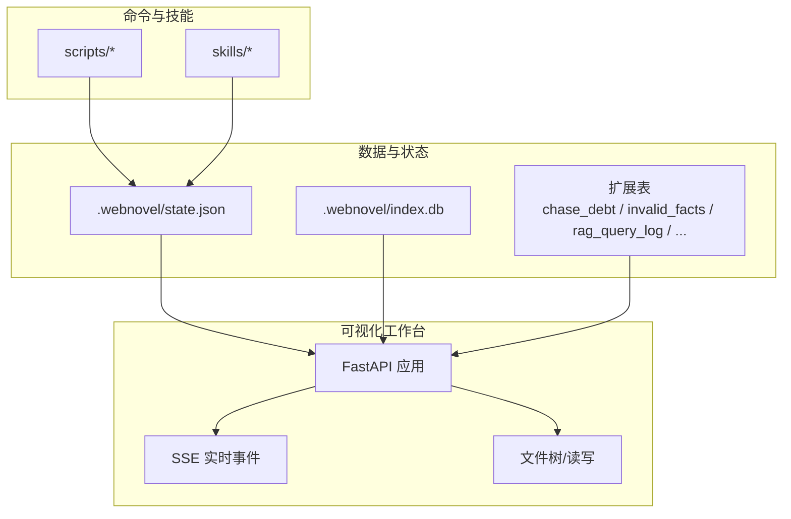
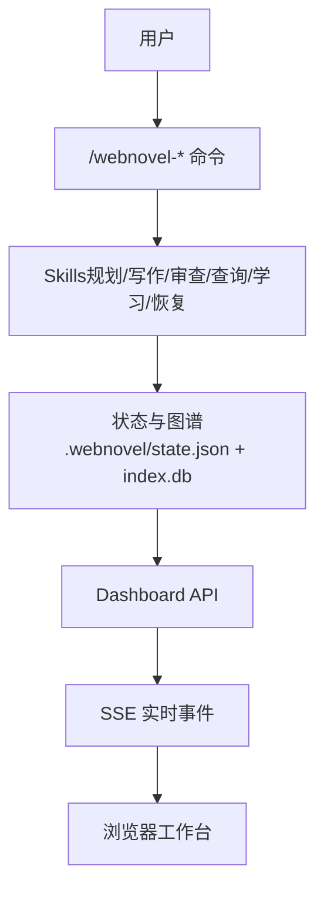
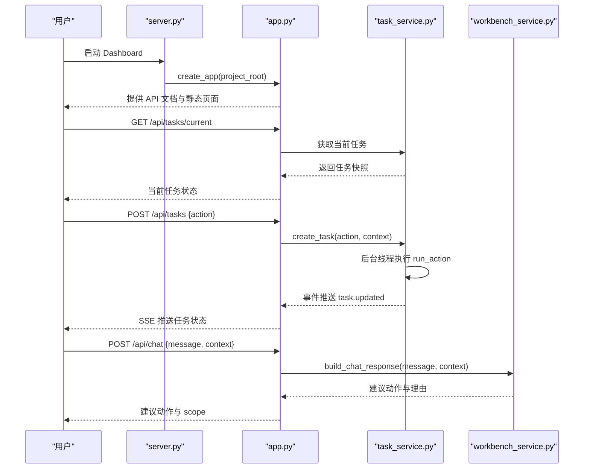
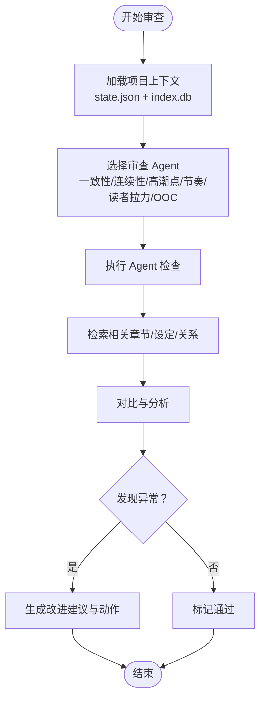
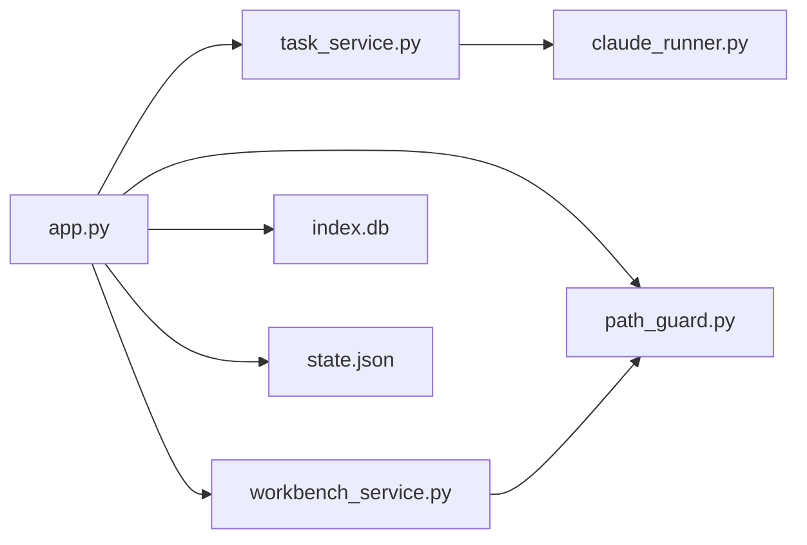

# 项目概述

<cite>
**本文引用的文件**
- [README.md](file://README.md)
- [docs/README.md](file://docs/README.md)
- [docs/architecture.md](file://docs/architecture.md)
- [docs/rag-and-config.md](file://docs/rag-and-config.md)
- [docs/genres.md](file://docs/genres.md)
- [docs/operations.md](file://docs/operations.md)
- [webnovel-writer/dashboard/server.py](file://webnovel-writer/dashboard/server.py)
- [webnovel-writer/dashboard/app.py](file://webnovel-writer/dashboard/app.py)
- [webnovel-writer/dashboard/models.py](file://webnovel-writer/dashboard/models.py)
- [webnovel-writer/dashboard/task_service.py](file://webnovel-writer/dashboard/task_service.py)
- [webnovel-writer/dashboard/workbench_service.py](file://webnovel-writer/dashboard/workbench_service.py)
- [webnovel-writer/agents/consistency-checker.md](file://webnovel-writer/agents/consistency-checker.md)
- [webnovel-writer/agents/continuity-checker.md](file://webnovel-writer/agents/continuity-checker.md)
- [webnovel-writer/agents/high-point-checker.md](file://webnovel-writer/agents/high-point-checker.md)
- [webnovel-writer/agents/pacing-checker.md](file://webnovel-writer/agents/pacing-checker.md)
- [webnovel-writer/agents/reader-pull-checker.md](file://webnovel-writer/agents/reader-pull-checker.md)
</cite>

## 目录
1. [引言](#引言)
2. [项目结构](#项目结构)
3. [核心组件](#核心组件)
4. [架构总览](#架构总览)
5. [详细组件分析](#详细组件分析)
6. [依赖分析](#依赖分析)
7. [性能考虑](#性能考虑)
8. [故障排除指南](#故障排除指南)
9. [结论](#结论)
10. [附录](#附录)

## 引言
Webnovel Writer 是一个基于 Claude Code 的长篇网文创作系统，旨在解决 AI 写作中的“遗忘”和“幻觉”问题，支撑长周期、可持续的连载创作。项目通过工程化的状态管理、检索增强（RAG）、实体与关系图谱、以及多维度质量检查（六维审查）等手段，确保故事在长时间跨度内保持一致性、连贯性和读者吸引力。

- 使命与价值
  - 降低“遗忘”：通过持久化状态、章节/卷级进度、实体与关系图谱，确保长文本创作中的上下文稳定。
  - 减少“幻觉”：通过多 Agent 审查（一致性、连续性、高潮点、节奏、读者拉力等）与 RAG 上下文对齐，提升事实与逻辑可信度。
  - 支持长周期连载：提供工作台（Dashboard）、任务编排、SSE 实时事件、以及可扩展的技能与命令体系，形成稳定的创作流水线。

- 技术特色
  - 双 Agent 架构：主写作者 Agent + 多个专项检查 Agent，分别负责生成与校验。
  - 六维审查：一致性、连续性、高潮点、节奏、读者拉力、以及额外的 OOC 检查，覆盖故事骨架与细节。
  - RAG 与检索：支持嵌入、重排序与混合检索策略，结合项目内知识图谱，提供高质量上下文。
  - 可视化工作台：只读 Dashboard 提供项目状态、实体图谱、章节/大纲浏览与追读力指标，支持实时事件推送。

- 使用场景
  - 初学者：通过初始化命令快速建立项目，配合工作台与聊天助手进行大纲规划、章节写作与审查。
  - 高级用户：自定义 Agent 模型、配置 RAG 环境、扩展技能与模板，实现规模化、高质量的长篇产出。

**章节来源**
- [README.md:1-170](file://README.md#L1-L170)

## 项目结构
项目采用“技能/命令 + 数据与状态 + 可视化工作台”的分层组织方式：
- 核心命令与技能：位于 webnovel-writer/scripts 与各 skill 目录，提供初始化、计划、写作、审查、查询等能力。
- 数据与状态：.webnovel 目录下的 state.json、index.db、以及各类扩展表（债务、无效事实、RAG 查询日志等）。
- 可视化工作台：dashboard 子系统，提供只读 API、文件浏览、聊天建议、任务编排与 SSE 实时事件。

**图表来源**
- [webnovel-writer/dashboard/app.py:50-490](file://webnovel-writer/dashboard/app.py#L50-L490)
- [webnovel-writer/dashboard/server.py:43-72](file://webnovel-writer/dashboard/server.py#L43-L72)

**章节来源**
- [docs/README.md:1-36](file://docs/README.md#L1-L36)
- [README.md:12-19](file://README.md#L12-L19)

## 核心组件
- Dashboard 服务（只读工作台）
  - 提供项目信息、实体/关系/场景/章节/追读力等只读查询接口。
  - 支持文件树浏览与安全的文件读写（正文/大纲/设定集）。
  - 提供聊天建议与任务创建，支持 SSE 实时事件推送。
- 任务服务（TaskService）
  - 负责任务生命周期管理（创建、运行、完成、失败），并异步执行 Claude 动作。
  - 通过队列订阅者向客户端推送任务状态变化。
- 工作台服务（WorkbenchService）
  - 负责项目摘要加载、文件保存、以及基于聊天内容的建议动作构建。
- Agent 审查体系
  - 包含一致性、连续性、高潮点、节奏、读者拉力等专项检查 Agent，保障长文本质量。
- RAG 与检索
  - 支持嵌入、重排序与混合检索策略，结合项目内知识图谱与上下文权重，提升生成稳定性。

**章节来源**
- [webnovel-writer/dashboard/app.py:80-429](file://webnovel-writer/dashboard/app.py#L80-L429)
- [webnovel-writer/dashboard/task_service.py:14-166](file://webnovel-writer/dashboard/task_service.py#L14-L166)
- [webnovel-writer/dashboard/workbench_service.py:18-171](file://webnovel-writer/dashboard/workbench_service.py#L18-L171)
- [webnovel-writer/agents/consistency-checker.md](file://webnovel-writer/agents/consistency-checker.md)
- [webnovel-writer/agents/continuity-checker.md](file://webnovel-writer/agents/continuity-checker.md)
- [webnovel-writer/agents/high-point-checker.md](file://webnovel-writer/agents/high-point-checker.md)
- [webnovel-writer/agents/pacing-checker.md](file://webnovel-writer/agents/pacing-checker.md)
- [webnovel-writer/agents/reader-pull-checker.md](file://webnovel-writer/agents/reader-pull-checker.md)

## 架构总览
系统采用“命令/技能驱动 + 状态/知识图谱 + 可视化工作台”的整体架构理念：
- 命令/技能层：提供初始化、规划、写作、审查、查询等能力，面向 Claude Code 的插件生态。
- 状态/知识层：.webnovel 目录集中存储项目状态与 SQLite 图谱，支持只读查询与扩展表。
- 可视化层：Dashboard 提供只读面板与实时事件，便于创作者掌握全局进展与质量指标。

**图表来源**
- [docs/architecture.md](file://docs/architecture.md)
- [webnovel-writer/dashboard/app.py:50-490](file://webnovel-writer/dashboard/app.py#L50-L490)

**章节来源**
- [docs/architecture.md](file://docs/architecture.md)
- [docs/README.md:11-29](file://docs/README.md#L11-L29)

## 详细组件分析

### Dashboard 应用与工作流
- 应用工厂与生命周期
  - 通过 create_app 注册路由、中间件与 SPA 回退，支持静态资源与 API 文档。
  - 生命周期内启动文件监控与任务服务事件循环。
- API 能力
  - 项目信息与工作台摘要：读取 state.json 并汇总项目进度与工作区统计。
  - 实体与关系：entities、relationships、relationship_events、scenes、chapters 等只读查询。
  - 追读力与审查指标：reading-power、review-metrics、writing-checklist-scores。
  - 扩展表：overrides、debts、debt-events、invalid-facts、rag-queries、tool-stats。
  - 文件浏览与保存：安全路径解析与三大目录限制，支持 UTF-8 读写。
  - 任务与聊天：创建任务、查询任务、构建聊天建议动作。
  - SSE：文件变更与任务事件的实时推送。
- 启动与部署
  - server.py 提供命令行参数解析与默认项目根解析策略，支持自动打开浏览器与 Uvicorn 运行。

**图表来源**
- [webnovel-writer/dashboard/server.py:43-72](file://webnovel-writer/dashboard/server.py#L43-L72)
- [webnovel-writer/dashboard/app.py:50-490](file://webnovel-writer/dashboard/app.py#L50-L490)
- [webnovel-writer/dashboard/task_service.py:36-143](file://webnovel-writer/dashboard/task_service.py#L36-L143)
- [webnovel-writer/dashboard/workbench_service.py:74-162](file://webnovel-writer/dashboard/workbench_service.py#L74-L162)

**章节来源**
- [webnovel-writer/dashboard/server.py:16-72](file://webnovel-writer/dashboard/server.py#L16-L72)
- [webnovel-writer/dashboard/app.py:50-490](file://webnovel-writer/dashboard/app.py#L50-L490)
- [webnovel-writer/dashboard/models.py:1-23](file://webnovel-writer/dashboard/models.py#L1-L23)
- [webnovel-writer/dashboard/task_service.py:14-166](file://webnovel-writer/dashboard/task_service.py#L14-L166)
- [webnovel-writer/dashboard/workbench_service.py:18-171](file://webnovel-writer/dashboard/workbench_service.py#L18-L171)

### 六维审查 Agent 与质量控制
- Agent 设计
  - 每个 Agent 以 Markdown frontmatter 形式声明名称、描述、工具与模型继承策略。
  - 默认 model: inherit 表示继承当前会话模型；也可为特定 Agent 指定模型。
- 覆盖范围
  - 一致性检查：核对设定、角色、情节的一致性，减少前后矛盾。
  - 连续性检查：评估章节间逻辑衔接与因果链条。
  - 高潮点检查：识别关键节点与转折，避免节奏断裂。
  - 节奏检查：把控段落密度与情绪起伏，维持读者粘性。
  - 读者拉力检查：衡量钩子、爽点、微兑现与债务追踪，提升追读力。
  - OOC 检查：识别出戏、逻辑漏洞与不合理设定。
- 与工作流集成
  - 通过 /webnovel-review 等命令触发，结合 RAG 上下文与图谱，输出可操作的改进建议。

**图表来源**
- [webnovel-writer/agents/consistency-checker.md](file://webnovel-writer/agents/consistency-checker.md)
- [webnovel-writer/agents/continuity-checker.md](file://webnovel-writer/agents/continuity-checker.md)
- [webnovel-writer/agents/high-point-checker.md](file://webnovel-writer/agents/high-point-checker.md)
- [webnovel-writer/agents/pacing-checker.md](file://webnovel-writer/agents/pacing-checker.md)
- [webnovel-writer/agents/reader-pull-checker.md](file://webnovel-writer/agents/reader-pull-checker.md)

**章节来源**
- [README.md:96-116](file://README.md#L96-L116)
- [webnovel-writer/agents/consistency-checker.md](file://webnovel-writer/agents/consistency-checker.md)
- [webnovel-writer/agents/continuity-checker.md](file://webnovel-writer/agents/continuity-checker.md)
- [webnovel-writer/agents/high-point-checker.md](file://webnovel-writer/agents/high-point-checker.md)
- [webnovel-writer/agents/pacing-checker.md](file://webnovel-writer/agents/pacing-checker.md)
- [webnovel-writer/agents/reader-pull-checker.md](file://webnovel-writer/agents/reader-pull-checker.md)

### RAG 与检索配置
- 配置要点
  - 最小化配置包括嵌入与重排序服务的 BaseURL、模型名与 API Key。
  - 支持 auto/graph_hybrid 回退策略，兼顾检索效率与准确性。
- 使用建议
  - 在项目根目录创建 .env 并填入必要参数，确保检索与生成的上下文质量。
  - 结合项目内的实体、关系与场景数据，提升检索相关性。

**章节来源**
- [README.md:50-68](file://README.md#L50-L68)
- [docs/rag-and-config.md](file://docs/rag-and-config.md)

### 题材模板与风格规范
- 题材模板
  - 提供多种题材（如 Xuanhuan、Period Drama、Dog Blood Romance、Rules Mystery 等）的模板与规则，帮助创作者快速建立风格基线。
- 风格采样与写作指导
  - 通过风格变体与写作指导构建，结合项目状态与上下文，生成符合题材特征的内容。

**章节来源**
- [docs/genres.md](file://docs/genres.md)

## 依赖分析
- 组件耦合
  - Dashboard 应用与任务服务、工作台服务松耦合，通过事件与状态共享实现协作。
  - 任务服务依赖 Claude Runner 执行动作，Runner 与具体命令解耦，便于扩展。
- 外部依赖
  - FastAPI、SQLite、Uvicorn、CORS、SSE 等基础设施。
  - RAG 服务（嵌入、重排序）与 Claude Code 生态集成。
- 潜在风险
  - 文件路径安全：通过 path_guard 与白名单目录限制，防止越权访问。
  - 任务并发：任务队列与事件分发采用线程与异步队列，注意内存与队列积压。

**图表来源**
- [webnovel-writer/dashboard/app.py:20-24](file://webnovel-writer/dashboard/app.py#L20-L24)
- [webnovel-writer/dashboard/task_service.py:10-11](file://webnovel-writer/dashboard/task_service.py#L10-L11)
- [webnovel-writer/dashboard/workbench_service.py:12-13](file://webnovel-writer/dashboard/workbench_service.py#L12-L13)

**章节来源**
- [webnovel-writer/dashboard/app.py:20-24](file://webnovel-writer/dashboard/app.py#L20-L24)
- [webnovel-writer/dashboard/task_service.py:10-11](file://webnovel-writer/dashboard/task_service.py#L10-L11)
- [webnovel-writer/dashboard/workbench_service.py:12-13](file://webnovel-writer/dashboard/workbench_service.py#L12-L13)

## 性能考虑
- 事件驱动与异步
  - SSE 与任务事件采用异步队列分发，避免阻塞主线程；注意队列容量与订阅者清理。
- 数据库只读优化
  - 实体/关系/场景等查询封装为只读，对不存在表进行容错处理，保证稳定性。
- 文件访问安全
  - 严格路径解析与目录白名单，避免越权读写；二进制文件预览降级处理。
- RAG 效率
  - 混合检索回退策略与重排序服务配合，平衡召回与排序成本。

[本节为通用性能讨论，无需引用具体文件]

## 故障排除指南
- 项目根解析失败
  - 现象：无法定位 PROJECT_ROOT（缺少 .webnovel/state.json）。
  - 处理：通过 CLI 参数、环境变量或 .claude 指针指定项目根，或在当前目录满足条件。
- 前端未构建
  - 现象：访问 / 无 SPA 页面。
  - 处理：在 dashboard/frontend 目录执行构建，或使用已发布的预构建产物。
- 任务执行异常
  - 现象：任务失败或无响应。
  - 处理：查看任务日志与错误信息，确认 Claude Runner 与命令可用性。
- 文件读写被拒绝
  - 现象：写入路径不在允许的三大目录。
  - 处理：确保相对路径位于 正文/大纲/设定集 下，或修正路径。

**章节来源**
- [webnovel-writer/dashboard/server.py:16-41](file://webnovel-writer/dashboard/server.py#L16-L41)
- [webnovel-writer/dashboard/app.py:471-487](file://webnovel-writer/dashboard/app.py#L471-L487)
- [webnovel-writer/dashboard/task_service.py:130-142](file://webnovel-writer/dashboard/task_service.py#L130-L142)
- [webnovel-writer/dashboard/workbench_service.py:58-71](file://webnovel-writer/dashboard/workbench_service.py#L58-L71)

## 结论
Webnovel Writer 通过工程化的方法应对 AI 写作的长期挑战：以状态与图谱稳定上下文、以多 Agent 审查降低“幻觉”、以 RAG 提升上下文质量、以 Dashboard 实时反馈创作进展。对于初学者，它提供了清晰的命令与工作台；对于高级用户，它提供了可扩展的技能、可定制的 Agent 与可观测的流水线。随着版本迭代（如 v5.5.x 的统一预检、只读 Dashboard、追读力系统等），项目正逐步完善其在长篇网文创作领域的实践闭环。

[本节为总结性内容，无需引用具体文件]

## 附录
- 发展历程与版本演进
  - v5.5.4：补齐写作链提示词强约束与文案统一。
  - v5.5.3：新增统一 preflight 预检命令，统一 UTF-8 运行方式。
  - v5.5.2：支持将详细大纲章节名同步到正文文件名。
  - v5.5.1：修复卷级单文件大纲在上下文快照中的章节提取问题。
  - v5.5.0：新增只读可视化 Dashboard Skill 与实时刷新能力。
  - v5.4.4：引入官方 Plugin Marketplace 安装机制。
  - v5.4.3：增强智能 RAG 上下文辅助（auto/graph_hybrid 回退 BM25）。
  - v5.3：引入追读力系统（Hook / Cool-point / 微兑现 / 债务追踪）。
- 插件发版流程
  - 使用 GitHub Actions 的 Plugin Release 工作流统一发版，包含版本校验、Tag 创建与 Release 发布。

**章节来源**
- [README.md:117-148](file://README.md#L117-L148)