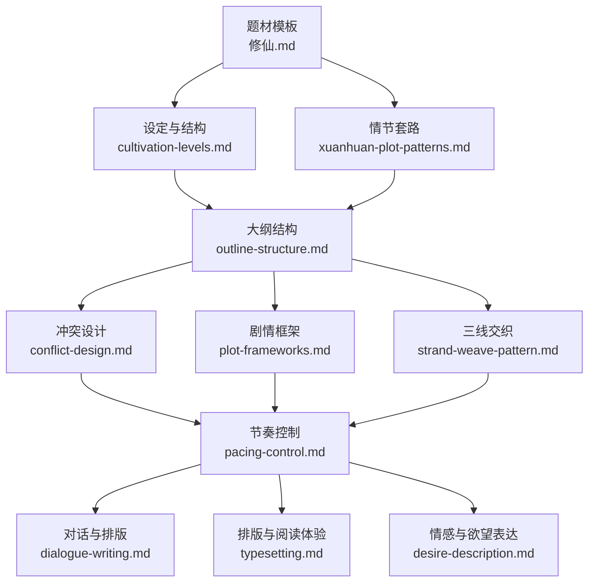
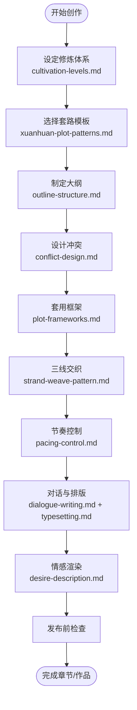
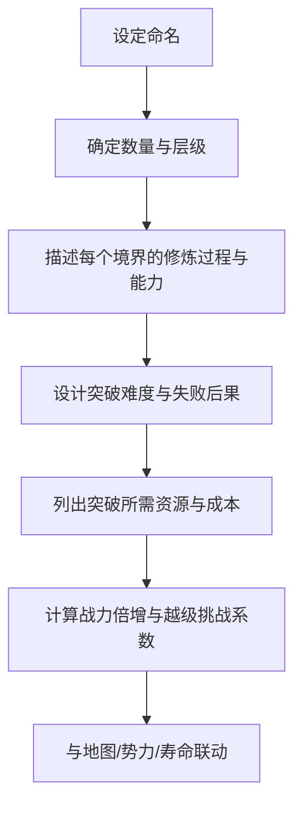
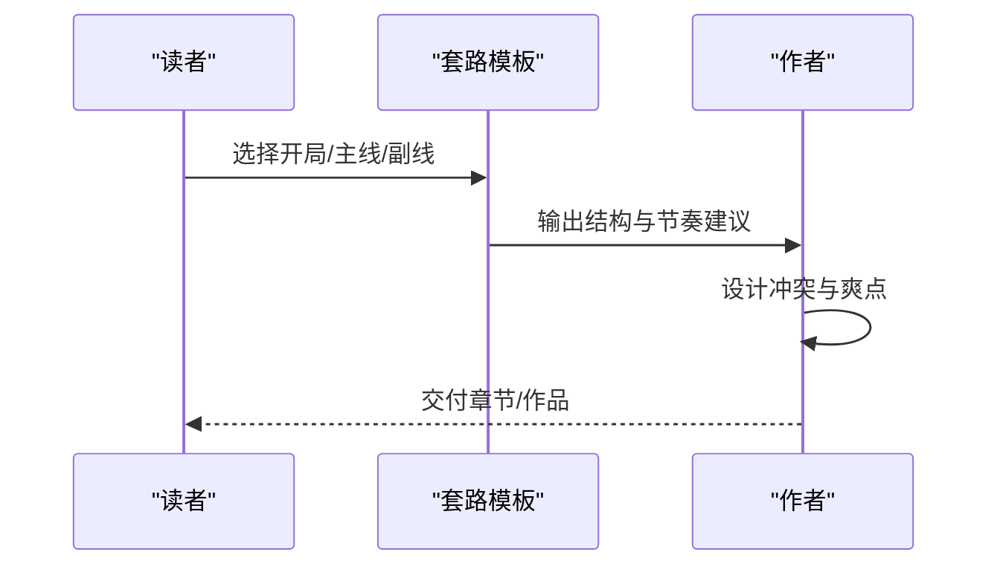
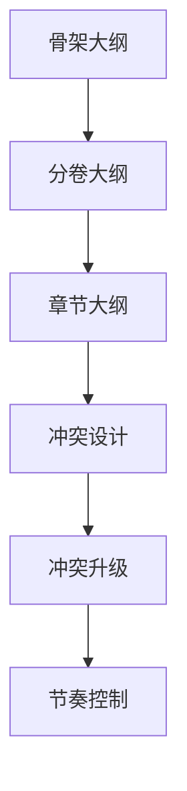
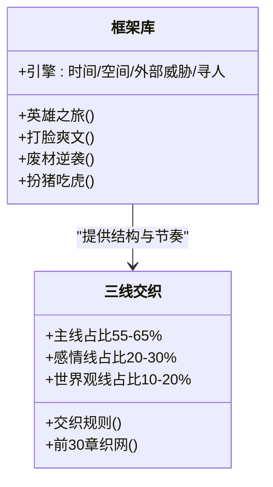
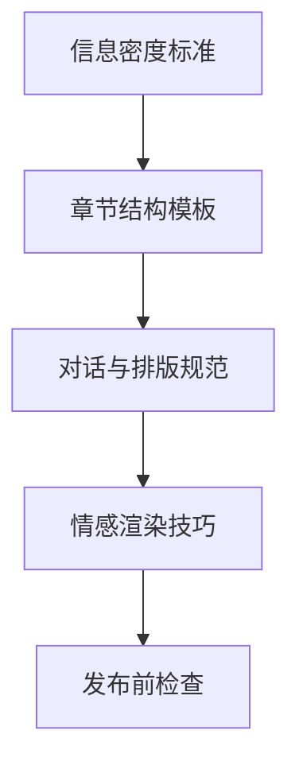
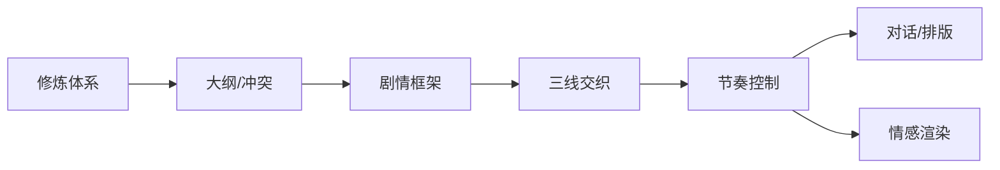

# 修仙玄幻模板

<cite>
**本文引用的文件**
- [cultivation-levels.md](file://webnovel-writer/genres/xuanhuan/cultivation-levels.md)
- [xuanhuan-plot-patterns.md](file://webnovel-writer/genres/xuanhuan/xuanhuan-plot-patterns.md)
- [修仙.md](file://webnovel-writer/templates/genres/修仙.md)
- [genres.md](file://docs/genres.md)
- [outline-structure.md](file://webnovel-writer/skills/webnovel-plan/references/outlining/outline-structure.md)
- [conflict-design.md](file://webnovel-writer/skills/webnovel-plan/references/outlining/conflict-design.md)
- [plot-frameworks.md](file://webnovel-writer/skills/webnovel-plan/references/outlining/plot-frameworks.md)
- [strand-weave-pattern.md](file://webnovel-writer/references/shared/strand-weave-pattern.md)
- [pacing-control.md](file://webnovel-writer/skills/webnovel-review/references/pacing-control.md)
- [desire-description.md](file://webnovel-writer/skills/webnovel-write/references/writing/desire-description.md)
- [dialogue-writing.md](file://webnovel-writer/skills/webnovel-write/references/writing/dialogue-writing.md)
- [typesetting.md](file://webnovel-writer/skills/webnovel-write/references/writing/typesetting.md)
</cite>

## 目录
1. [简介](#简介)
2. [项目结构](#项目结构)
3. [核心组件](#核心组件)
4. [架构总览](#架构总览)
5. [详细组件分析](#详细组件分析)
6. [依赖分析](#依赖分析)
7. [性能考虑](#性能考虑)
8. [故障排除指南](#故障排除指南)
9. [结论](#结论)
10. [附录](#附录)

## 简介
本模板面向修仙玄幻题材创作，系统化梳理修炼等级体系、经典情节模式、世界构建要素与写作技巧，提供从设定到落地的全流程指导。通过严谨的境界设定、可复用的套路模板、节奏控制与三线交织的章节规划，帮助创作者构建宏大而有张力的修仙世界，产出引人入胜的长线网文。

## 项目结构
该仓库围绕“题材模板 + 大纲与冲突设计 + 写作技巧 + 发布排版”四个维度组织内容，形成“设定—结构—节奏—表达”的完整创作闭环。

**图表来源**
- [修仙.md:1-108](file://webnovel-writer/templates/genres/修仙.md#L1-L108)
- [cultivation-levels.md:1-477](file://webnovel-writer/genres/xuanhuan/cultivation-levels.md#L1-L477)
- [xuanhuan-plot-patterns.md:1-548](file://webnovel-writer/genres/xuanhuan/xuanhuan-plot-patterns.md#L1-L548)
- [outline-structure.md:1-214](file://webnovel-writer/skills/webnovel-plan/references/outlining/outline-structure.md#L1-L214)
- [conflict-design.md:1-278](file://webnovel-writer/skills/webnovel-plan/references/outlining/conflict-design.md#L1-L278)
- [plot-frameworks.md:1-244](file://webnovel-writer/skills/webnovel-plan/references/outlining/plot-frameworks.md#L1-L244)
- [strand-weave-pattern.md:1-112](file://webnovel-writer/references/shared/strand-weave-pattern.md#L1-L112)
- [pacing-control.md:1-130](file://webnovel-writer/skills/webnovel-review/references/pacing-control.md#L1-L130)
- [dialogue-writing.md:1-232](file://webnovel-writer/skills/webnovel-write/references/writing/dialogue-writing.md#L1-L232)
- [typesetting.md:1-61](file://webnovel-writer/skills/webnovel-write/references/writing/typesetting.md#L1-L61)
- [desire-description.md:1-312](file://webnovel-writer/skills/webnovel-write/references/writing/desire-description.md#L1-L312)

**章节来源**
- [genres.md:1-48](file://docs/genres.md#L1-L48)
- [修仙.md:1-108](file://webnovel-writer/templates/genres/修仙.md#L1-L108)

## 核心组件
- 修炼境界设定：提供命名、数量、描述、突破难度、资源需求、战力倍增与世界观融合的系统化设计。
- 经典套路模板：覆盖十大开局、五大主线、六大副线、节奏控制与组合创新。
- 大纲与冲突设计：骨架大纲、分卷大纲、章节大纲、冲突强度分级与升级机制。
- 剧情框架与三线交织：英雄之旅、打脸爽文、废材逆袭、扮猪吃虎等框架，以及主线、感情线、世界观线的平衡。
- 节奏与表达：信息密度标准、快节奏写法、对话与排版规范、情感渲染技巧。

**章节来源**
- [cultivation-levels.md:1-477](file://webnovel-writer/genres/xuanhuan/cultivation-levels.md#L1-L477)
- [xuanhuan-plot-patterns.md:1-548](file://webnovel-writer/genres/xuanhuan/xuanhuan-plot-patterns.md#L1-L548)
- [outline-structure.md:1-214](file://webnovel-writer/skills/webnovel-plan/references/outlining/outline-structure.md#L1-L214)
- [conflict-design.md:1-278](file://webnovel-writer/skills/webnovel-plan/references/outlining/conflict-design.md#L1-L278)
- [plot-frameworks.md:1-244](file://webnovel-writer/skills/webnovel-plan/references/outlining/plot-frameworks.md#L1-L244)
- [strand-weave-pattern.md:1-112](file://webnovel-writer/references/shared/strand-weave-pattern.md#L1-L112)
- [pacing-control.md:1-130](file://webnovel-writer/skills/webnovel-review/references/pacing-control.md#L1-L130)
- [dialogue-writing.md:1-232](file://webnovel-writer/skills/webnovel-write/references/writing/dialogue-writing.md#L1-L232)
- [typesetting.md:1-61](file://webnovel-writer/skills/webnovel-write/references/writing/typesetting.md#L1-L61)
- [desire-description.md:1-312](file://webnovel-writer/skills/webnovel-write/references/writing/desire-description.md#L1-L312)

## 架构总览
本模板采用“设定—结构—节奏—表达”的分层架构，确保设定严谨、结构清晰、节奏可控、表达有力。

**图表来源**
- [cultivation-levels.md:1-477](file://webnovel-writer/genres/xuanhuan/cultivation-levels.md#L1-L477)
- [xuanhuan-plot-patterns.md:1-548](file://webnovel-writer/genres/xuanhuan/xuanhuan-plot-patterns.md#L1-L548)
- [outline-structure.md:1-214](file://webnovel-writer/skills/webnovel-plan/references/outlining/outline-structure.md#L1-L214)
- [conflict-design.md:1-278](file://webnovel-writer/skills/webnovel-plan/references/outlining/conflict-design.md#L1-L278)
- [plot-frameworks.md:1-244](file://webnovel-writer/skills/webnovel-plan/references/outlining/plot-frameworks.md#L1-L244)
- [strand-weave-pattern.md:1-112](file://webnovel-writer/references/shared/strand-weave-pattern.md#L1-L112)
- [pacing-control.md:1-130](file://webnovel-writer/skills/webnovel-review/references/pacing-control.md#L1-L130)
- [dialogue-writing.md:1-232](file://webnovel-writer/skills/webnovel-write/references/writing/dialogue-writing.md#L1-L232)
- [typesetting.md:1-61](file://webnovel-writer/skills/webnovel-write/references/writing/typesetting.md#L1-L61)
- [desire-description.md:1-312](file://webnovel-writer/skills/webnovel-write/references/writing/desire-description.md#L1-L312)

## 详细组件分析

### 修炼境界体系（cultivation-levels.md）
- 境界五大要素：命名、数量、描述、突破难度、资源需求。
- 战力与成长：基础战力倍增、小境界差距、越级挑战公式。
- 突破流程与创新：常规突破与战斗中突破、奇遇突破、压抑爆发、群体突破。
- 与世界观融合：地图分层、寿命与时间线、势力门槛。

**图表来源**
- [cultivation-levels.md:7-144](file://webnovel-writer/genres/xuanhuan/cultivation-levels.md#L7-L144)
- [cultivation-levels.md:147-205](file://webnovel-writer/genres/xuanhuan/cultivation-levels.md#L147-L205)
- [cultivation-levels.md:208-271](file://webnovel-writer/genres/xuanhuan/cultivation-levels.md#L208-L271)
- [cultivation-levels.md:273-354](file://webnovel-writer/genres/xuanhuan/cultivation-levels.md#L273-L354)

**章节来源**
- [cultivation-levels.md:1-477](file://webnovel-writer/genres/xuanhuan/cultivation-levels.md#L1-L477)

### 经典套路模板（xuanhuan-plot-patterns.md）
- 十大开局：废柴流、穿越流、重生流、退婚流、系统流、夺舍流、天选之子流、捡宝流、被陷害流、双修流。
- 五大主线：复仇线、争霸线、寻宝线、守护线、成神线。
- 六大副线：红颜线、兄弟线、师徒线、势力线、寻宝线、宠物线。
- 节奏控制与组合创新：节奏密度、套路组合、避免陈旧技巧。

**图表来源**
- [xuanhuan-plot-patterns.md:7-548](file://webnovel-writer/genres/xuanhuan/xuanhuan-plot-patterns.md#L7-L548)

**章节来源**
- [xuanhuan-plot-patterns.md:1-548](file://webnovel-writer/genres/xuanhuan/xuanhuan-plot-patterns.md#L1-L548)

### 大纲与冲突设计（outline-structure.md + conflict-design.md）
- 大纲三层架构：骨架大纲、分卷大纲、章节大纲；动态调整与工具推荐。
- 冲突三大层次：外部冲突、内部冲突、理念冲突；强度分级与升级机制。
- 冲突设计模板：对立冲突、三方冲突、内部冲突；节奏控制与多线交织。

**图表来源**
- [outline-structure.md:10-84](file://webnovel-writer/skills/webnovel-plan/references/outlining/outline-structure.md#L10-L84)
- [conflict-design.md:7-110](file://webnovel-writer/skills/webnovel-plan/references/outlining/conflict-design.md#L7-L110)
- [conflict-design.md:112-178](file://webnovel-writer/skills/webnovel-plan/references/outlining/conflict-design.md#L112-L178)

**章节来源**
- [outline-structure.md:1-214](file://webnovel-writer/skills/webnovel-plan/references/outlining/outline-structure.md#L1-L214)
- [conflict-design.md:1-278](file://webnovel-writer/skills/webnovel-plan/references/outlining/conflict-design.md#L1-L278)

### 剧情框架与三线交织（plot-frameworks.md + strand-weave-pattern.md）
- 剧情框架：英雄之旅、打脸爽文、废材逆袭、扮猪吃虎；修仙类框架与引擎（时间限制、空间转移、外部威胁、寻人/寻物）。
- 三线交织：主线（55-65%）、感情线（20-30%）、世界观线（10-20%）；交织规则与前30章织网模板。

**图表来源**
- [plot-frameworks.md:10-160](file://webnovel-writer/skills/webnovel-plan/references/outlining/plot-frameworks.md#L10-L160)
- [strand-weave-pattern.md:13-62](file://webnovel-writer/references/shared/strand-weave-pattern.md#L13-L62)

**章节来源**
- [plot-frameworks.md:1-244](file://webnovel-writer/skills/webnovel-plan/references/outlining/plot-frameworks.md#L1-L244)
- [strand-weave-pattern.md:1-112](file://webnovel-writer/references/shared/strand-weave-pattern.md#L1-L112)

### 节奏控制与表达技巧（pacing-control.md + dialogue-writing.md + typesetting.md + desire-description.md）
- 信息密度与快节奏：每1000字推进1个实质性剧情点；章节结构模板；分题材节奏标准。
- 对话写作：潜台词五层、对话设计原则、对话语气、节奏控制与与动作/心理/环境结合。
- 排版与阅读体验：段落规则、对话排版、标点与可读性、场景切换与章节结构。
- 情感渲染：五感基础、感官交织、欲念层次、氛围营造与节奏曲线。

**图表来源**
- [pacing-control.md:12-72](file://webnovel-writer/skills/webnovel-review/references/pacing-control.md#L12-L72)
- [dialogue-writing.md:10-125](file://webnovel-writer/skills/webnovel-write/references/writing/dialogue-writing.md#L10-L125)
- [typesetting.md:7-46](file://webnovel-writer/skills/webnovel-write/references/writing/typesetting.md#L7-L46)
- [desire-description.md:10-96](file://webnovel-writer/skills/webnovel-write/references/writing/desire-description.md#L10-L96)

**章节来源**
- [pacing-control.md:1-130](file://webnovel-writer/skills/webnovel-review/references/pacing-control.md#L1-L130)
- [dialogue-writing.md:1-232](file://webnovel-writer/skills/webnovel-write/references/writing/dialogue-writing.md#L1-L232)
- [typesetting.md:1-61](file://webnovel-writer/skills/webnovel-write/references/writing/typesetting.md#L1-L61)
- [desire-description.md:1-312](file://webnovel-writer/skills/webnovel-write/references/writing/desire-description.md#L1-L312)

## 依赖分析
- 设定依赖：修炼体系为所有套路与冲突提供战力与成长基础。
- 结构依赖：大纲与冲突设计相互支撑，框架与三线交织保障节奏稳定。
- 表达依赖：节奏控制贯穿全文，对话与排版提升阅读体验，情感渲染增强代入感。

**图表来源**
- [cultivation-levels.md:1-477](file://webnovel-writer/genres/xuanhuan/cultivation-levels.md#L1-L477)
- [outline-structure.md:1-214](file://webnovel-writer/skills/webnovel-plan/references/outlining/outline-structure.md#L1-L214)
- [conflict-design.md:1-278](file://webnovel-writer/skills/webnovel-plan/references/outlining/conflict-design.md#L1-L278)
- [plot-frameworks.md:1-244](file://webnovel-writer/skills/webnovel-plan/references/outlining/plot-frameworks.md#L1-L244)
- [strand-weave-pattern.md:1-112](file://webnovel-writer/references/shared/strand-weave-pattern.md#L1-L112)
- [pacing-control.md:1-130](file://webnovel-writer/skills/webnovel-review/references/pacing-control.md#L1-L130)
- [dialogue-writing.md:1-232](file://webnovel-writer/skills/webnovel-write/references/writing/dialogue-writing.md#L1-L232)
- [typesetting.md:1-61](file://webnovel-writer/skills/webnovel-write/references/writing/typesetting.md#L1-L61)
- [desire-description.md:1-312](file://webnovel-writer/skills/webnovel-write/references/writing/desire-description.md#L1-L312)

**章节来源**
- [修仙.md:1-108](file://webnovel-writer/templates/genres/修仙.md#L1-L108)
- [genres.md:1-48](file://docs/genres.md#L1-L48)

## 性能考虑
- 设定一致性：避免跳过关键境界、命名不规范、突破过于简单等问题，确保设定自检清单逐项落实。
- 节奏稳定性：严格控制信息密度与冲突密度，避免连续拖沓或过度灌水。
- 结构可维护性：大纲与设定集联动，大纲变更需遵循“红线”，保证力量体系与核心主线不变。

[本节为通用指导，无需特定文件来源]

## 故障排除指南
- 常见问题与解决：
  - 境界名称复杂：简化命名、统一前缀。
  - 境界过多导致后期崩盘：横向发展、多元目标。
  - 突破过于顺利：设置失败、提高代价。
  - 境界描述枯燥：具体化描写、能力展示。
- 自检清单：名称易记、数量合理、描述清晰、难度递增、资源明确、战力倍增、世界观融合、前后一致。

**章节来源**
- [cultivation-levels.md:356-423](file://webnovel-writer/genres/xuanhuan/cultivation-levels.md#L356-L423)

## 结论
本模板以“设定—结构—节奏—表达”为主线，将修炼体系、经典套路、冲突设计与写作技巧有机融合，既保证设定的严谨性，又确保创作的可操作性。遵循模板可显著降低创作门槛，提升作品的可读性与商业价值。

[本节为总结，无需特定文件来源]

## 附录

### 创作实例路径
- 境界设定实例：参见“经典境界设定案例分析”章节。
- 套路组合实例：参见“常见套路组合（爆款公式）”章节。
- 大纲结构实例：参见“经典大纲案例分析”章节。

**章节来源**
- [cultivation-levels.md:438-477](file://webnovel-writer/genres/xuanhuan/cultivation-levels.md#L438-L477)
- [xuanhuan-plot-patterns.md:429-469](file://webnovel-writer/genres/xuanhuan/xuanhuan-plot-patterns.md#L429-L469)
- [outline-structure.md:203-214](file://webnovel-writer/skills/webnovel-plan/references/outlining/outline-structure.md#L203-L214)