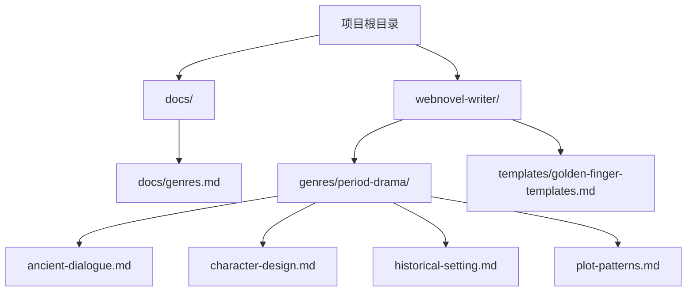
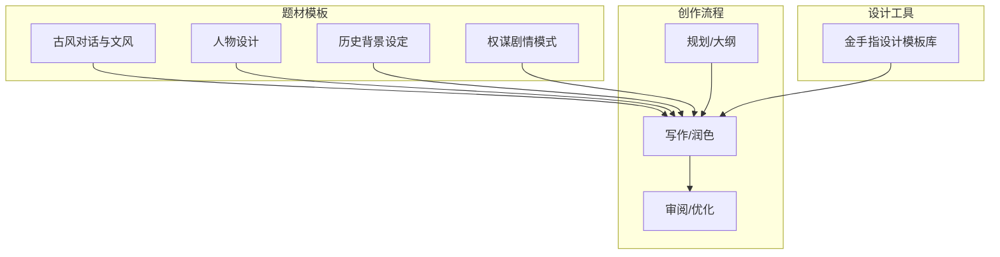
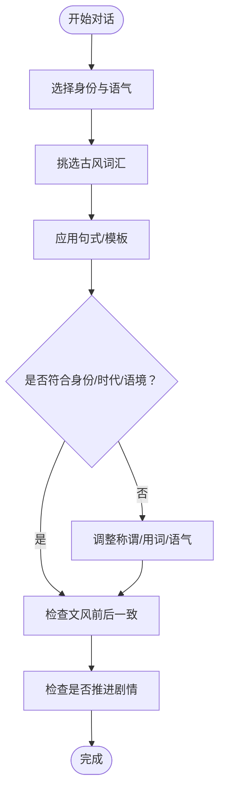
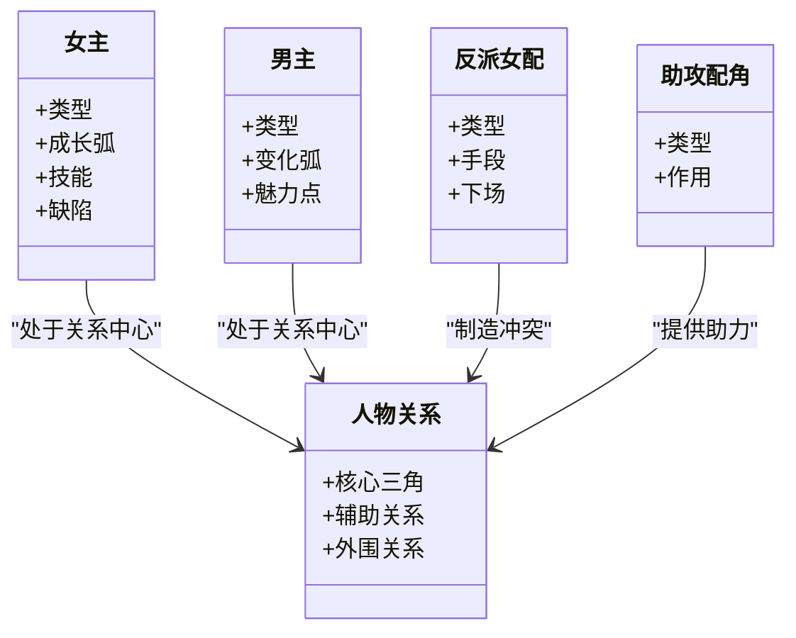
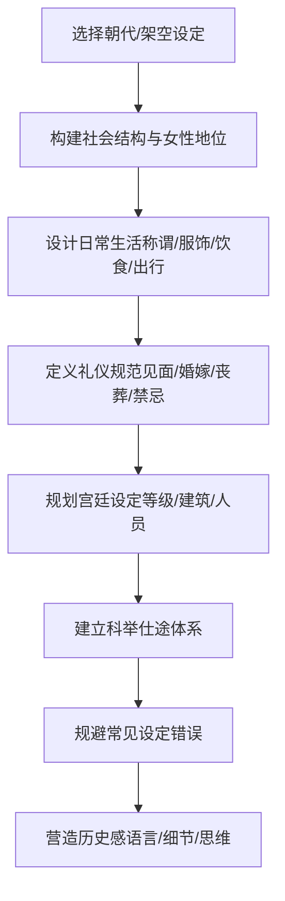
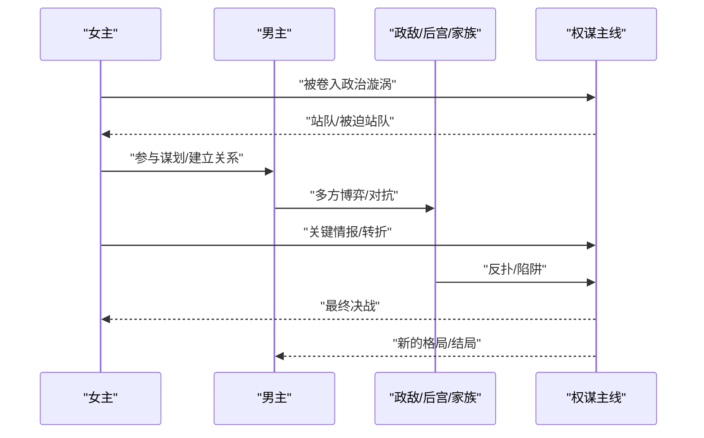
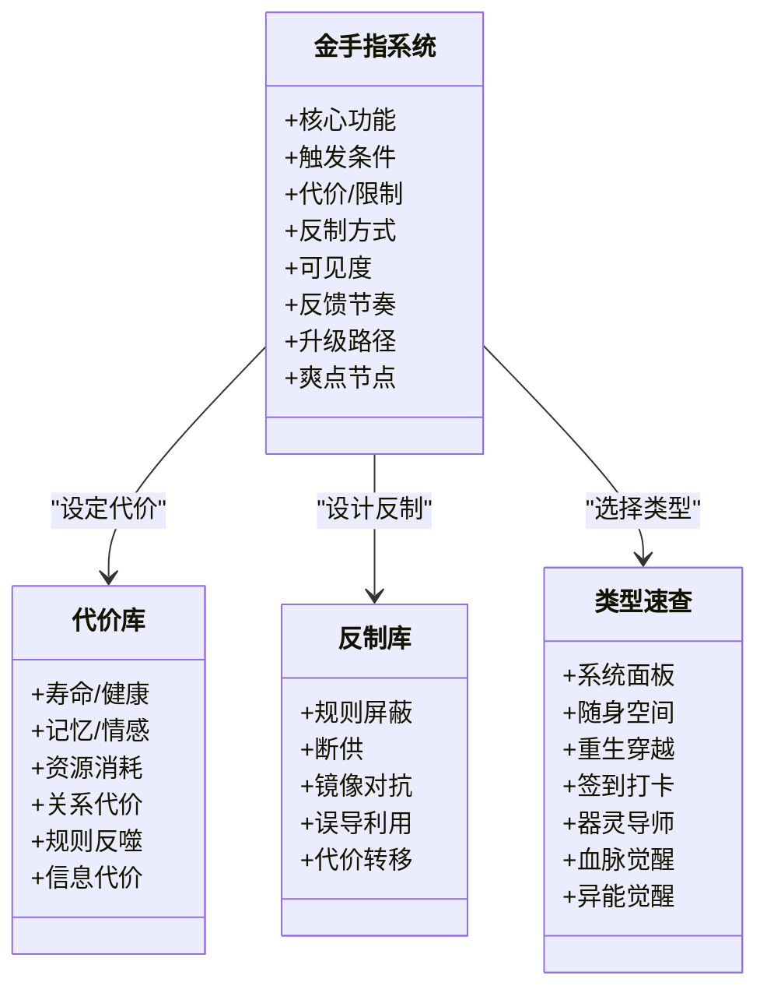
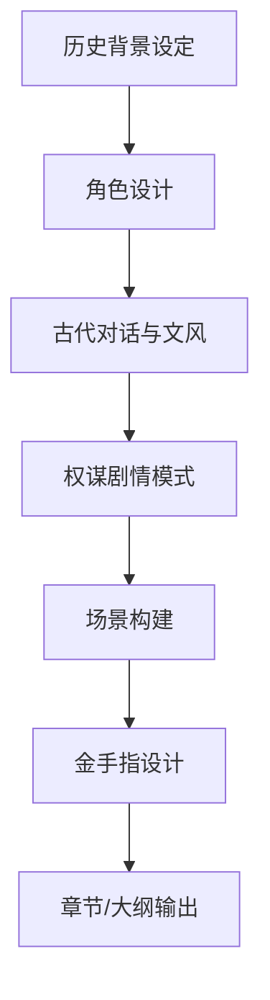

# 古风权谋模板

<cite>
**本文引用的文件**
- [README.md](file://README.md)
- [docs/genres.md](file://docs/genres.md)
- [webnovel-writer/genres/period-drama/ancient-dialogue.md](file://webnovel-writer/genres/period-drama/ancient-dialogue.md)
- [webnovel-writer/genres/period-drama/character-design.md](file://webnovel-writer/genres/period-drama/character-design.md)
- [webnovel-writer/genres/period-drama/historical-setting.md](file://webnovel-writer/genres/period-drama/historical-setting.md)
- [webnovel-writer/genres/period-drama/plot-patterns.md](file://webnovel-writer/genres/period-drama/plot-patterns.md)
- [webnovel-writer/templates/golden-finger-templates.md](file://webnovel-writer/templates/golden-finger-templates.md)
</cite>

## 目录
1. [简介](#简介)
2. [项目结构](#项目结构)
3. [核心组件](#核心组件)
4. [架构总览](#架构总览)
5. [详细组件分析](#详细组件分析)
6. [依赖分析](#依赖分析)
7. [性能考虑](#性能考虑)
8. [故障排查指南](#故障排查指南)
9. [结论](#结论)
10. [附录](#附录)

## 简介
本模板面向“古风权谋”题材创作，提供系统化的写作支撑：古代对话技巧（文言表达、称谓礼仪、时代语言）、角色设计原则（身份设定、性格塑造、人物关系与成长弧光）、历史背景设定（朝代选择、社会制度、文化特色与氛围营造）、权谋故事经典情节模式（宫廷斗争、朝堂博弈、江湖恩怨等）、场景构建指南（建筑布局、服饰道具、礼仪仪式）以及案例分析与实践建议。配套“金手指设计模板库”，帮助在权谋文中融入合理且具爽点的系统化外挂要素。

## 项目结构
本项目为“网文创作助手”系统，围绕“题材模板”“写作流程”“可视化面板”“RAG检索增强”等模块组织内容。其中“古风权谋”作为题材模板之一，沉淀于 genres/period-drama 目录，配套模板库位于 templates/golden-finger-templates.md。

图表来源
- [README.md:1-170](file://README.md#L1-L170)
- [docs/genres.md:1-48](file://docs/genres.md#L1-L48)

章节来源
- [README.md:1-170](file://README.md#L1-L170)
- [docs/genres.md:1-48](file://docs/genres.md#L1-L48)

## 核心组件
- 古风对话与文风：提供现代词到古风词的转换表、不同身份的说话方式、省略主语、倒装句式、文言虚词、四字词组、情绪表达模板、经典对话模板、文风把控与常见错误检查清单。
- 人物设计：女主/男主类型与魅力点、配角设计（反派女配、助攻配角）、人物关系设计（宫廷/宅斗/权谋三角关系）、人物弧光（女主成长、男主变化）、人物细节（外貌、技能、性格缺陷）与检查清单。
- 历史背景设定：朝代选择与架空设定、社会结构与女性地位、家族结构、日常生活（称谓、服饰、饮食、出行）、礼仪规范（见面礼、婚嫁礼、丧葬礼、禁忌）、宫廷设定（等级、建筑、人员）、科举仕途与常见设定错误、历史感营造。
- 权谋剧情模式：宫斗/宅斗/权谋/甜宠四大框架、相遇/虐心/甜蜜/打脸桥段库、剧情节奏分配、伏笔/反转/高潮设计技巧、避免的问题与剧情检查清单。
- 金手指设计模板：功能性/可视化/爽点嵌入三大原则、代价/反制/反馈节奏、类型速查与组合规则、系统面板/随身空间/重生穿越/签到打卡/器灵/血脉/异能等模板化设计与检查清单。

章节来源
- [webnovel-writer/genres/period-drama/ancient-dialogue.md:1-289](file://webnovel-writer/genres/period-drama/ancient-dialogue.md#L1-L289)
- [webnovel-writer/genres/period-drama/character-design.md:1-269](file://webnovel-writer/genres/period-drama/character-design.md#L1-L269)
- [webnovel-writer/genres/period-drama/historical-setting.md:1-279](file://webnovel-writer/genres/period-drama/historical-setting.md#L1-L279)
- [webnovel-writer/genres/period-drama/plot-patterns.md:1-277](file://webnovel-writer/genres/period-drama/plot-patterns.md#L1-L277)
- [webnovel-writer/templates/golden-finger-templates.md:1-474](file://webnovel-writer/templates/golden-finger-templates.md#L1-L474)

## 架构总览
本模板体系以“题材模板 + 设计工具 + 流程规范”为核心，形成“输入（背景/设定/人物）—加工（对话/情节/场景）—输出（章节/大纲/审阅）”的创作闭环。金手指模板作为“外挂系统”的标准化设计工具，贯穿主线与爽点设计。

图表来源
- [webnovel-writer/genres/period-drama/ancient-dialogue.md:1-289](file://webnovel-writer/genres/period-drama/ancient-dialogue.md#L1-L289)
- [webnovel-writer/genres/period-drama/character-design.md:1-269](file://webnovel-writer/genres/period-drama/character-design.md#L1-L269)
- [webnovel-writer/genres/period-drama/historical-setting.md:1-279](file://webnovel-writer/genres/period-drama/historical-setting.md#L1-L279)
- [webnovel-writer/genres/period-drama/plot-patterns.md:1-277](file://webnovel-writer/genres/period-drama/plot-patterns.md#L1-L277)
- [webnovel-writer/templates/golden-finger-templates.md:1-474](file://webnovel-writer/templates/golden-finger-templates.md#L1-L474)

## 详细组件分析

### 组件A：古代对话技巧与文风
- 语言基础：提供现代词到古风词的对照表，覆盖“我/你/是/不是/谢谢/对不起/没关系/好的/等一下/快点/走吧”等高频词，强调“身份选择”和“使用场景”。
- 不同身份说话方式：皇帝（威严简洁）、皇后/太后（端庄威仪）、妃嫔（温婉/骄纵/心机）、宫女/太监（恭敬谨慎）、官员（正式谨慎）、世家公子/小姐（有教养知书达理）。
- 对话技巧：省略主语、倒装句式、文言虚词（罢了/便是/竟是/原是/倒是）、四字成语/词组。
- 情绪表达：愤怒（轻/中/重/极重）、悲伤（含蓄/委婉/直接/崩溃）、喜悦（含蓄/明显/激动）、讽刺（轻/中/重）。
- 经典对话模板：初次见面、请安问好、拒绝请求、威胁警告、表白/暗示。
- 文风把控：轻古风（新手）、中古风（主流）、重古风（需要功底）。
- 常见错误：称谓错误、用词错误、语气错误。
- 检查清单：称谓身份、用词古风感、语气性格契合、现代词汇、文风一致、推进剧情。

图表来源
- [webnovel-writer/genres/period-drama/ancient-dialogue.md:9-289](file://webnovel-writer/genres/period-drama/ancient-dialogue.md#L9-L289)

章节来源
- [webnovel-writer/genres/period-drama/ancient-dialogue.md:1-289](file://webnovel-writer/genres/period-drama/ancient-dialogue.md#L1-L289)

### 组件B：角色设计原则
- 女主类型：宅斗型女主（聪慧隐忍、借力打力）、宫斗型女主（心思缜密、关键时刻果断）、权谋型女主（政治头脑、影响朝局）、甜宠型女主（性格讨喜、运气好）。
- 男主类型：帝王型（威严深沉、多疑深情）、王爷型（尊贵自由、亦正亦邪）、世家公子型（温润如玉、默默守护）、将军型（铁血硬汉、保护欲强）。
- 配角设计：反派女配（嫡女/正室、白月光、恶婆婆/恶嫂）、助攻配角（忠心丫鬟、好姐妹、暗卫/侍卫）。
- 人物关系：宫廷/宅斗/权谋核心三角关系与辅助/外围关系。
- 人物弧光：女主成长三阶段（天真/弱小→觉醒/学习→强大/掌控）、男主变化弧（冷到热/误解到理解/成长型）。
- 人物细节：外貌符合时代审美、技能有来源、性格缺陷在可接受范围。
- 检查清单：时代背景契合、行为身份契合、有成长变化、关系清晰、有记忆点、技能来源合理。

图表来源
- [webnovel-writer/genres/period-drama/character-design.md:7-269](file://webnovel-writer/genres/period-drama/character-design.md#L7-L269)

章节来源
- [webnovel-writer/genres/period-drama/character-design.md:1-269](file://webnovel-writer/genres/period-drama/character-design.md#L1-L269)

### 组件C：历史背景设定
- 朝代选择：常用朝代特点（唐/宋/明/清/架空），架空设定的优势与注意事项。
- 社会结构：皇室/宗室/勋贵/官员/平民/贱籍，女性地位与嫡庶之分。
- 家族结构：大家族/小家庭的构成要素。
- 日常生活：称谓系统、服饰（男子/女子）、饮食（主食/菜肴/饮品/点心）、出行（轿子/马车/步行）。
- 礼仪规范：见面礼（跪拜/作揖/万福/请安）、婚嫁礼（六礼）、丧葬礼（守孝/丁忧）、禁忌。
- 宫廷设定：后宫等级（以清朝为例）、宫廷建筑（前朝/后宫/东宫/各宫）、宫廷人员（太监/宫女/嬷嬷/侍卫）。
- 科举仕途：流程（童试→秀才、乡试→举人、会试→贡士、殿试→进士）、官职系统（中央/地方）、仕途发展。
- 常见设定错误：称谓/礼仪/常识错误。
- 历史感营造：语言风格、细节描写、思维方式。

图表来源
- [webnovel-writer/genres/period-drama/historical-setting.md:7-279](file://webnovel-writer/genres/period-drama/historical-setting.md#L7-L279)

章节来源
- [webnovel-writer/genres/period-drama/historical-setting.md:1-279](file://webnovel-writer/genres/period-drama/historical-setting.md#L1-L279)

### 组件D：权谋故事经典情节模式
- 经典框架：宫斗（入宫→站稳→争宠→危机→登顶/退出）、宅斗（嫁入→立足→掌家→危机→当家）、权谋（卷入→站队→博弈→决战→新局）、甜宠（相遇→相知→相爱→小虐→HE）。
- 经典桥段库：相遇桥段（救命之恩/冲撞/替嫁/指腹为婚/意外同处）、虐心桥段（误会/被迫分离/替身/小产/冷暴力）、甜蜜桥段（吃醋/偷偷关心/当众护短/日常宠溺/仪式感）、打脸桥段（身份反转/实力展示/真相揭露/打脸现场）。
- 剧情节奏：宫斗节奏（卷一/卷二/卷三/卷四）、甜宠节奏（相遇/暧昧/热恋/小虐/HE）。
- 剧情设计技巧：伏笔设置、反转设计（身份/关系/真相/结局）、高潮设计（当众对质/证据链/最终审判/分家/休妻/政变/决战/登基）。
- 避免的问题：金手指过多/反派太蠢/节奏拖沓/为虐而虐/结局仓促、时间线混乱/行为不符身份/历史常识错误/权力运作不合理。
- 剧情检查清单：主线清晰/节奏合适/伏笔回收/高潮精彩/结局满意/逻辑通顺。

图表来源
- [webnovel-writer/genres/period-drama/plot-patterns.md:7-277](file://webnovel-writer/genres/period-drama/plot-patterns.md#L7-L277)

章节来源
- [webnovel-writer/genres/period-drama/plot-patterns.md:1-277](file://webnovel-writer/genres/period-drama/plot-patterns.md#L1-L277)

### 组件E：场景构建指南
- 建筑布局：前朝（处理政务）、后宫（妃嫔居住）、东宫（太子居所）、各宫（以宫名命名）。
- 服饰道具：男子常服/官服及配饰、女子常服/礼服及配饰。
- 礼仪仪式：见面礼（跪拜/作揖/万福/请安）、婚嫁礼（六礼）、丧葬礼（守孝/丁忧）、禁忌（女子抛头露面/寡妇再嫁/冲撞长辈/后宫干政）。
- 日常细节：称谓系统、饮食差异、出行方式、宫禁与等级。

章节来源
- [webnovel-writer/genres/period-drama/historical-setting.md:160-279](file://webnovel-writer/genres/period-drama/historical-setting.md#L160-L279)

### 组件F：金手指设计模板（权谋文适配）
- 核心原则：功能性（明确定位/成长性/限制性）、可视化（面板化/进度条/即时反馈）、爽点嵌入（获得/成长/使用）。
- 模板字段：核心功能、触发条件、代价/限制、反制方式、可见度、反馈节奏、升级路径、爽点节点。
- 代价/限制库：寿命/健康、记忆/情感、资源消耗、关系代价、规则反噬、信息代价。
- 反制方式库：规则屏蔽、断供、镜像对抗、误导利用、代价转移。
- 爽点/反馈节奏：小回报（每2-3章）、中回报（每8-10章）、大回报（每20-30章）、代价兑现。
- 类型速查：系统面板、随身空间、重生穿越、签到打卡、器灵导师、血脉觉醒、异能觉醒。
- 组合规则：一主一辅、代价叠加不可失衡。
- 设计工作流：确定核心定位→设定获得方式→设计面板/界面→规划升级路线→嵌入爽点节点。
- 检查清单：核心功能/可视化/限制/升级/爽点节点齐全；避免功能复杂/无敌外挂/随意获得/长期不升级。

图表来源
- [webnovel-writer/templates/golden-finger-templates.md:7-474](file://webnovel-writer/templates/golden-finger-templates.md#L7-L474)

章节来源
- [webnovel-writer/templates/golden-finger-templates.md:1-474](file://webnovel-writer/templates/golden-finger-templates.md#L1-L474)

### 概念性总览
以下为概念性流程图，展示“背景设定—人物关系—对话—情节—场景—金手指”的协同创作过程，帮助作者在构思阶段把握整体节奏与细节一致性。

（本图为概念性示意，不直接映射具体源文件）

## 依赖分析
- 组件耦合与内聚：对话与背景设定高度耦合（称谓/礼仪/语言风格需与时代一致）；人物设计与剧情模式相互促进（角色弧光推动情节转折）；场景构建服务于对话与剧情（建筑/服饰/礼仪体现时代特征）；金手指设计为剧情提供“外挂式爽点”，但需与主线逻辑一致。
- 直接与间接依赖：对话模板依赖历史背景设定（称谓/礼仪）；人物关系依赖社会结构与家族结构；剧情模式依赖人物与场景；金手指依赖剧情节奏与人物弧光。
- 外部依赖与集成：本模板为创作工具，不涉及外部系统调用；通过“写作流程”（规划/写作/审阅）与“可视化面板”（Dashboard）实现项目状态与产出管理。
- 接口契约与实现：各组件以“检查清单/模板/流程”为接口契约，确保输出质量与一致性。

（本节为总体分析，不直接引用具体文件）

## 性能考虑
- 写作效率：使用模板与检查清单减少重复思考成本，提升章节/大纲产出速度。
- 内容一致性：通过“文风/称谓/礼仪/时代背景”检查清单，降低跨章节前后不一致的风险。
- 爽点密度控制：金手指设计的反馈节奏与代价设定，有助于维持读者期待与阅读张力。
- 审阅与优化：利用“剧情检查清单”在阶段性审阅中快速定位主线、节奏、伏笔与逻辑问题。

（本节为通用建议，不直接引用具体文件）

## 故障排查指南
- 对话问题：检查称谓是否符合身份、用词是否具备古风感、语气是否契合人物性格、是否存在现代词汇、文风是否前后一致、对话是否推进剧情。
- 人物问题：检查人物是否符合时代背景、行为是否符合身份、是否有成长变化、人物关系是否清晰、是否有记忆点、技能是否有来源。
- 背景问题：检查称谓/礼仪/常识是否符合所选朝代或架空设定、是否存在历史错误、细节是否贴合时代。
- 剧情问题：检查主线是否清晰、节奏是否合适、伏笔是否回收、高潮是否精彩、结局是否满意、逻辑是否通顺。
- 金手指问题：检查核心功能/可视化/限制/升级/爽点节点是否齐全，避免功能复杂/无敌外挂/随意获得/长期不升级。

章节来源
- [webnovel-writer/genres/period-drama/ancient-dialogue.md:281-289](file://webnovel-writer/genres/period-drama/ancient-dialogue.md#L281-L289)
- [webnovel-writer/genres/period-drama/character-design.md:261-269](file://webnovel-writer/genres/period-drama/character-design.md#L261-L269)
- [webnovel-writer/genres/period-drama/historical-setting.md:224-279](file://webnovel-writer/genres/period-drama/historical-setting.md#L224-L279)
- [webnovel-writer/genres/period-drama/plot-patterns.md:248-277](file://webnovel-writer/genres/period-drama/plot-patterns.md#L248-L277)
- [webnovel-writer/templates/golden-finger-templates.md:422-474](file://webnovel-writer/templates/golden-finger-templates.md#L422-L474)

## 结论
本“古风权谋模板”以“对话—人物—背景—剧情—场景—金手指”为主线，提供系统化、可操作的设计工具与检查清单，既能保证时代感与历史合理性，又能通过人物弧光与权谋模式驱动情节高潮，辅以金手指设计提升爽点密度与可读性。建议在创作初期即明确朝代与背景设定，随后以人物关系为轴心展开对话与情节，再以场景细节强化时代氛围，最后通过金手指适度增强爽点与反转。

## 附录
- 题材模板导航：系统内置37+网文题材模板，支持单题材与复合题材（建议主辅比例7:3，主线遵循主题材逻辑，副题材提供钩子/规则/爽点）。
- 快速开始：安装插件、安装依赖、初始化项目、配置RAG环境、使用写作流程（规划/写作/审阅）、可选启动可视化面板。

章节来源
- [docs/genres.md:1-48](file://docs/genres.md#L1-L48)
- [README.md:21-93](file://README.md#L21-L93)