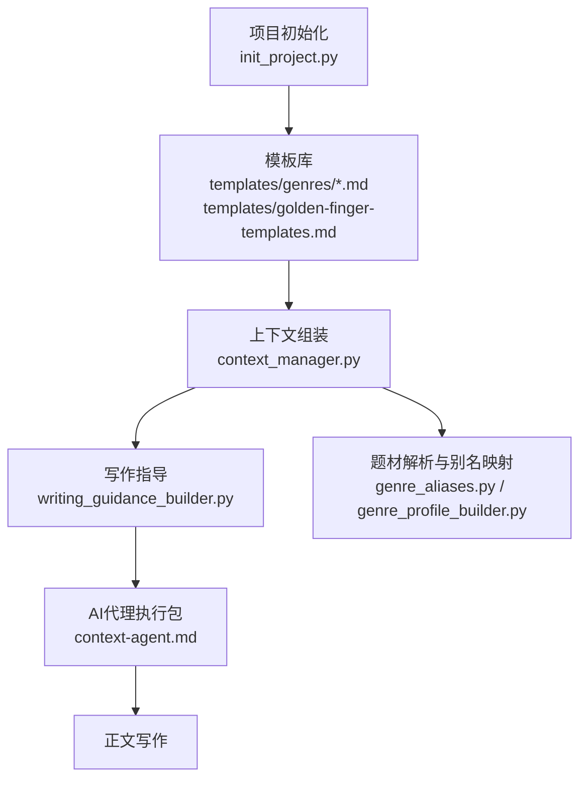
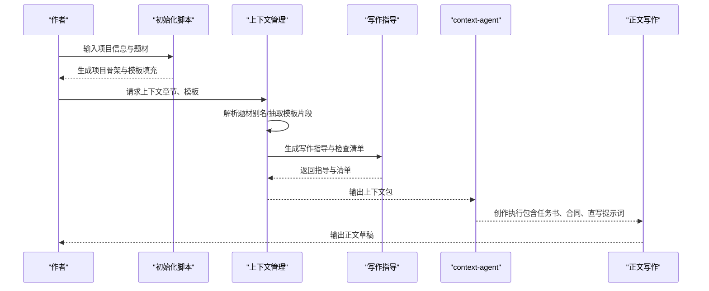
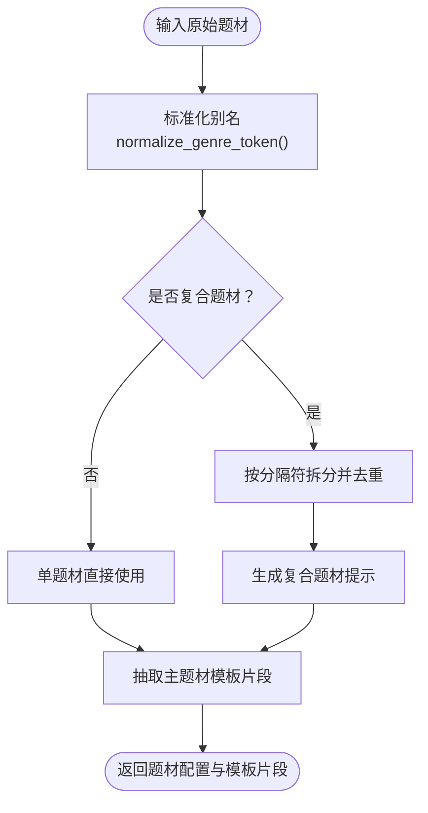
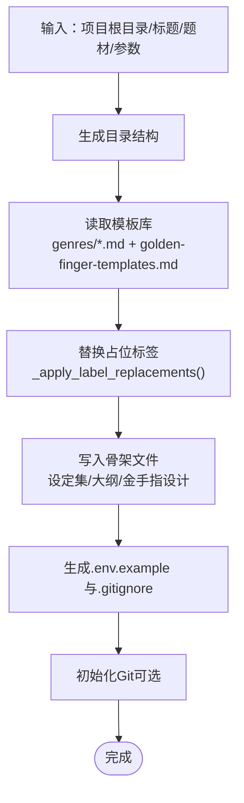
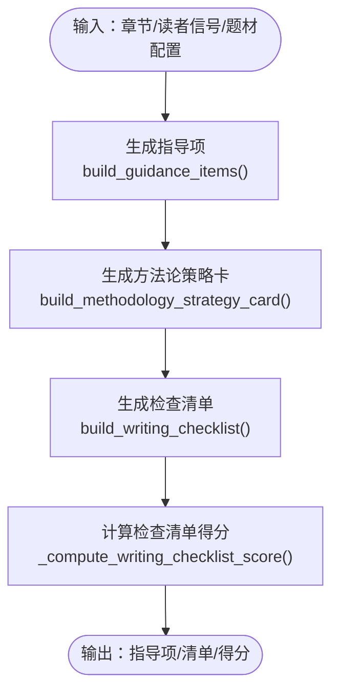
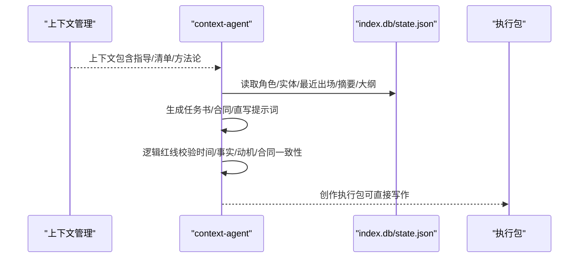
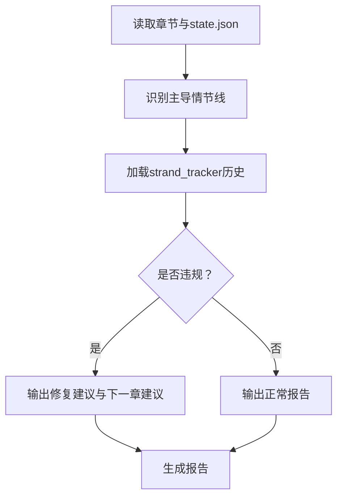
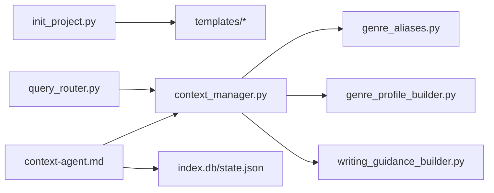

# 模板使用指南

<cite>
**本文引用的文件**
- [README.md](file://README.md)
- [docs/genres.md](file://docs/genres.md)
- [webnovel-writer/templates/golden-finger-templates.md](file://webnovel-writer/templates/golden-finger-templates.md)
- [webnovel-writer/templates/genres/修仙.md](file://webnovel-writer/templates/genres/修仙.md)
- [webnovel-writer/templates/output/设定集-金手指.md](file://webnovel-writer/templates/output/设定集-金手指.md)
- [webnovel-writer/genres/zhihu-short/genre-templates.md](file://webnovel-writer/genres/zhihu-short/genre-templates.md)
- [webnovel-writer/scripts/data_modules/genre_aliases.py](file://webnovel-writer/scripts/data_modules/genre_aliases.py)
- [webnovel-writer/scripts/data_modules/genre_profile_builder.py](file://webnovel-writer/scripts/data_modules/genre_profile_builder.py)
- [webnovel-writer/scripts/data_modules/writing_guidance_builder.py](file://webnovel-writer/scripts/data_modules/writing_guidance_builder.py)
- [webnovel-writer/scripts/init_project.py](file://webnovel-writer/scripts/init_project.py)
- [webnovel-writer/scripts/data_modules/context_manager.py](file://webnovel-writer/scripts/data_modules/context_manager.py)
- [webnovel-writer/agents/context-agent.md](file://webnovel-writer/agents/context-agent.md)
- [webnovel-writer/agents/pacing-checker.md](file://webnovel-writer/agents/pacing-checker.md)
</cite>

## 目录
1. [简介](#简介)
2. [项目结构](#项目结构)
3. [核心组件](#核心组件)
4. [架构总览](#架构总览)
5. [详细组件分析](#详细组件分析)
6. [依赖关系分析](#依赖关系分析)
7. [性能考虑](#性能考虑)
8. [故障排除指南](#故障排除指南)
9. [结论](#结论)
10. [附录](#附录)

## 简介
本指南面向使用“题材模板系统”的网络小说创作者，围绕模板的选择与应用流程、定制方法、最佳实践、与AI代理的结合使用、常见问题与解决方案展开，帮助你高效产出高质量的长篇连载作品。

## 项目结构
模板系统由“内置模板库 + 项目初始化 + 上下文组装 + 写作指导 + AI代理协同”构成，核心文件与职责如下：
- 模板库：内置题材模板与金手指模板，按题材与体裁分类存放
- 初始化脚本：根据题材与参数生成项目骨架文件
- 上下文管理：解析题材、抽取模板片段、生成写作指导与检查清单
- 写作指导：基于题材锚定与读者信号，输出可执行的写作建议
- AI代理：按上下文包生成“创作执行包”，驱动正文写作

图表来源
- [webnovel-writer/scripts/init_project.py](file://webnovel-writer/scripts/init_project.py)
- [webnovel-writer/scripts/data_modules/context_manager.py](file://webnovel-writer/scripts/data_modules/context_manager.py)
- [webnovel-writer/scripts/data_modules/writing_guidance_builder.py](file://webnovel-writer/scripts/data_modules/writing_guidance_builder.py)
- [webnovel-writer/scripts/data_modules/genre_aliases.py](file://webnovel-writer/scripts/data_modules/genre_aliases.py)
- [webnovel-writer/scripts/data_modules/genre_profile_builder.py](file://webnovel-writer/scripts/data_modules/genre_profile_builder.py)
- [webnovel-writer/agents/context-agent.md](file://webnovel-writer/agents/context-agent.md)

章节来源
- [README.md:1-170](file://README.md#L1-L170)
- [docs/genres.md:1-48](file://docs/genres.md#L1-L48)

## 核心组件
- 题材模板与复合题材
  - 系统内置37+题材模板，支持单题材与“题材A+题材B”复合，主辅比例建议7:3，主线遵循主题材逻辑，副题材提供钩子/规则/爽点
- 金手指模板库
  - 提供金手指设计的“功能性/可视化/爽点嵌入”三大原则，包含代价/限制、反制方式、反馈节奏、类型速查与组合规则
- 初始化与模板填充
  - 初始化脚本读取题材与参数，自动注入模板片段到项目骨架文件（设定集、大纲、金手指设计等）
- 上下文组装与写作指导
  - 解析题材别名、抽取模板片段、生成题材锚定与复合题材提示，结合读者信号输出写作指导与检查清单
- AI代理协同
  - context-agent按“创作执行包”要求，整合大纲、状态、节奏与伏笔，输出可直接驱动正文写作的上下文包

章节来源
- [docs/genres.md:38-48](file://docs/genres.md#L38-L48)
- [webnovel-writer/templates/golden-finger-templates.md:1-474](file://webnovel-writer/templates/golden-finger-templates.md#L1-L474)
- [webnovel-writer/scripts/init_project.py:227-756](file://webnovel-writer/scripts/init_project.py#L227-L756)
- [webnovel-writer/scripts/data_modules/context_manager.py:289-421](file://webnovel-writer/scripts/data_modules/context_manager.py#L289-L421)
- [webnovel-writer/agents/context-agent.md:101-269](file://webnovel-writer/agents/context-agent.md#L101-L269)

## 架构总览
模板使用的关键流程：选择题材 → 解析与别名映射 → 抽取模板片段 → 生成写作指导 → 生成AI执行包 → 正文写作与节奏检查。

图表来源
- [webnovel-writer/scripts/init_project.py:227-756](file://webnovel-writer/scripts/init_project.py#L227-L756)
- [webnovel-writer/scripts/data_modules/context_manager.py:99-131](file://webnovel-writer/scripts/data_modules/context_manager.py#L99-L131)
- [webnovel-writer/scripts/data_modules/writing_guidance_builder.py:206-275](file://webnovel-writer/scripts/data_modules/writing_guidance_builder.py#L206-L275)
- [webnovel-writer/agents/context-agent.md:120-269](file://webnovel-writer/agents/context-agent.md#L120-L269)

## 详细组件分析

### 组件A：题材解析与模板筛选
- 功能要点
  - 支持复合题材（A+B），自动去重与规范化
  - 题材别名映射，统一到profile key
  - 从模板库抽取主/辅题材片段，生成复合题材提示
- 关键接口
  - parse_genre_tokens：解析与去重
  - normalize_genre_token / to_profile_key：别名与键映射
  - extract_genre_section：按题材抽取模板片段
  - build_composite_genre_hints：生成复合题材协同提示

图表来源
- [webnovel-writer/scripts/data_modules/genre_aliases.py:53-66](file://webnovel-writer/scripts/data_modules/genre_aliases.py#L53-L66)
- [webnovel-writer/scripts/data_modules/genre_profile_builder.py:15-51](file://webnovel-writer/scripts/data_modules/genre_profile_builder.py#L15-L51)
- [webnovel-writer/scripts/data_modules/genre_profile_builder.py:53-77](file://webnovel-writer/scripts/data_modules/genre_profile_builder.py#L53-L77)
- [webnovel-writer/scripts/data_modules/genre_profile_builder.py:93-107](file://webnovel-writer/scripts/data_modules/genre_profile_builder.py#L93-L107)

章节来源
- [webnovel-writer/scripts/data_modules/genre_aliases.py:10-66](file://webnovel-writer/scripts/data_modules/genre_aliases.py#L10-L66)
- [webnovel-writer/scripts/data_modules/genre_profile_builder.py:15-107](file://webnovel-writer/scripts/data_modules/genre_profile_builder.py#L15-L107)

### 组件B：模板填充与参数配置
- 功能要点
  - 初始化时读取模板库，按题材拼接模板文本
  - 将用户输入的参数（如金手指类型、风格、核心卖点等）注入到模板占位
  - 生成设定集、大纲、金手指设计等骨架文件
- 关键接口
  - init_project：生成目录结构与基础文件
  - _read_text_if_exists/_apply_label_replacements：读取模板并替换占位
  - _split_genre_keys/_normalize_genre_key：解析与归一化题材

图表来源
- [webnovel-writer/scripts/init_project.py:227-756](file://webnovel-writer/scripts/init_project.py#L227-L756)

章节来源
- [webnovel-writer/scripts/init_project.py:227-756](file://webnovel-writer/scripts/init_project.py#L227-L756)

### 组件C：写作指导与检查清单
- 功能要点
  - 基于题材锚定输出“题材加权”建议
  - 结合读者信号（钩子类型、模式使用、审查趋势、低分区间）生成指导与检查清单
  - 生成方法论策略卡（阶段、压力源、释放目标等）
- 关键接口
  - build_guidance_items：生成指导项
  - build_writing_checklist：生成可执行检查清单
  - build_methodology_strategy_card / build_methodology_guidance_items：生成方法论

图表来源
- [webnovel-writer/scripts/data_modules/writing_guidance_builder.py:206-275](file://webnovel-writer/scripts/data_modules/writing_guidance_builder.py#L206-L275)
- [webnovel-writer/scripts/data_modules/writing_guidance_builder.py:278-449](file://webnovel-writer/scripts/data_modules/writing_guidance_builder.py#L278-L449)
- [webnovel-writer/scripts/data_modules/context_manager.py:343-421](file://webnovel-writer/scripts/data_modules/context_manager.py#L343-L421)

章节来源
- [webnovel-writer/scripts/data_modules/writing_guidance_builder.py:14-78](file://webnovel-writer/scripts/data_modules/writing_guidance_builder.py#L14-L78)
- [webnovel-writer/scripts/data_modules/context_manager.py:343-421](file://webnovel-writer/scripts/data_modules/context_manager.py#L343-L421)

### 组件D：AI代理执行包与正文驱动
- 功能要点
  - context-agent按“创作执行包”要求，整合大纲、状态、节奏与伏笔
  - 输出任务书（8板块）、Context Contract、直写提示词
  - 强制逻辑红线校验（不可变事实、时空跳跃、能力来源、角色动机、合同一致性、时间逻辑）
- 关键流程
  - 读取state.json、index.db、summaries、大纲与设定集
  - 生成时间约束、角色动机/情绪、伏笔优先级清单
  - 逻辑红线校验通过后输出可直接驱动正文的执行包

图表来源
- [webnovel-writer/agents/context-agent.md:120-269](file://webnovel-writer/agents/context-agent.md#L120-L269)
- [webnovel-writer/scripts/data_modules/context_manager.py:99-131](file://webnovel-writer/scripts/data_modules/context_manager.py#L99-L131)

章节来源
- [webnovel-writer/agents/context-agent.md:101-269](file://webnovel-writer/agents/context-agent.md#L101-L269)

### 组件E：节奏检查与质量控制
- 功能要点
  - pacing-checker对章节进行情节线分类（Quest/Fire/Constellation）
  - 基于strand_tracker历史进行平衡检查，输出修复建议与下一章节奏建议
- 关键流程
  - 读取章节正文与state.json
  - 识别主导情节线与底色
  - 应用阈值与警告，生成报告

图表来源
- [webnovel-writer/agents/pacing-checker.md:46-216](file://webnovel-writer/agents/pacing-checker.md#L46-L216)

章节来源
- [webnovel-writer/agents/pacing-checker.md:14-216](file://webnovel-writer/agents/pacing-checker.md#L14-L216)

## 依赖关系分析
- 模块耦合
  - 初始化脚本依赖模板库与占位替换逻辑
  - 上下文管理依赖题材解析与写作指导模块
  - AI代理依赖上下文管理与index数据库
- 外部依赖
  - RAG检索（查询路由）用于增强检索策略，支持关系/场景/设定/剧情意图
- 潜在循环依赖
  - 模块间通过函数调用解耦，未发现循环导入

图表来源
- [webnovel-writer/scripts/init_project.py:357-381](file://webnovel-writer/scripts/init_project.py#L357-L381)
- [webnovel-writer/scripts/data_modules/context_manager.py:22-44](file://webnovel-writer/scripts/data_modules/context_manager.py#L22-L44)
- [webnovel-writer/scripts/data_modules/query_router.py:10-145](file://webnovel-writer/scripts/data_modules/query_router.py#L10-L145)

章节来源
- [webnovel-writer/scripts/data_modules/context_manager.py:22-44](file://webnovel-writer/scripts/data_modules/context_manager.py#L22-L44)
- [webnovel-writer/scripts/data_modules/query_router.py:10-145](file://webnovel-writer/scripts/data_modules/query_router.py#L10-L145)

## 性能考虑
- 上下文组装与快照
  - 支持上下文快照复用，避免重复组装
  - 模板权重动态分配，早期/中期/晚期章节采用不同预算
- 指标持久化
  - 写作检查清单得分持久化，支持趋势分析与阈值联动
- 检索策略
  - 查询路由按意图选择检索策略（hybrid/bm25），减少无关召回

章节来源
- [webnovel-writer/scripts/data_modules/context_manager.py:83-131](file://webnovel-writer/scripts/data_modules/context_manager.py#L83-L131)
- [webnovel-writer/scripts/data_modules/context_manager.py:489-516](file://webnovel-writer/scripts/data_modules/context_manager.py#L489-L516)
- [webnovel-writer/scripts/data_modules/query_router.py:86-145](file://webnovel-writer/scripts/data_modules/query_router.py#L86-L145)

## 故障排除指南
- 题材适配问题
  - 症状：题材无法识别或模板未填充
  - 处理：检查别名映射与profile key，确认模板文件是否存在
- 格式兼容问题
  - 症状：复合题材解析异常
  - 处理：确认分隔符（+、/、|、,）与去重逻辑
- 内容优化问题
  - 症状：写作指导与实际不符
  - 处理：核对读者信号与题材配置，必要时调整阈值
- 输出质量控制
  - 症状：节奏单一或读者疲劳
  - 处理：使用pacing-checker生成报告，按建议调整下一章情节线分布

章节来源
- [webnovel-writer/scripts/data_modules/genre_aliases.py:10-66](file://webnovel-writer/scripts/data_modules/genre_aliases.py#L10-L66)
- [webnovel-writer/scripts/data_modules/genre_profile_builder.py:15-51](file://webnovel-writer/scripts/data_modules/genre_profile_builder.py#L15-L51)
- [webnovel-writer/agents/pacing-checker.md:144-216](file://webnovel-writer/agents/pacing-checker.md#L144-L216)

## 结论
通过“题材解析—模板筛选—参数配置—上下文组装—写作指导—AI代理执行包—正文写作—节奏检查”的闭环流程，模板系统能够有效降低创作门槛、提升质量与效率。建议在团队协作中统一题材规范与模板使用，结合AI代理与节奏检查工具，持续优化创作体验。

## 附录

### 模板使用最佳实践
- 创作流程优化
  - 初始化时明确题材与核心卖点，自动填充模板骨架
  - 每章写作前先读取上下文包与写作指导，再生成执行包
- 质量控制
  - 使用写作检查清单逐项核验，确保题材锚定与节奏均衡
  - 定期运行节奏检查器，避免Quest过载与情感线干旱
- 效率提升
  - 复合题材遵循“主辅7:3”，主线稳定、副线增彩
  - 金手指设计遵循“功能性/可视化/爽点嵌入”三原则，避免无敌外挂
- 团队协作
  - 统一题材别名与模板占位，减少沟通成本
  - 使用检查清单与报告作为评审依据，形成可追溯的质量档案

### 常见问题与解决方案
- 题材适配
  - 问题：输入“玄幻修仙”未匹配到模板
  - 解决：确认别名映射与profile key，模板文件名为“修仙.md”
- 格式兼容
  - 问题：复合题材“都市脑洞+规则怪谈”解析失败
  - 解决：确保使用“+”分隔符，系统会自动去重与规范化
- 内容优化
  - 问题：指导项过多导致执行困难
  - 解决：调整最大项数与权重，默认3–6项，必要时降低权重
- 输出质量
  - 问题：连续多章Quest主导导致读者疲劳
  - 解决：参考节奏检查报告，安排情感或世界观扩展章节

### 实际使用案例
- 案例1：知乎短篇体裁
  - 选择模板：追妻火葬场/重生复仇/豪门真假千金等
  - 填充内容：套用人设模板，设计关键场景与金句
  - 调整优化：参考节奏与高潮设计，打磨开篇与结局
- 案例2：复合题材“都市异能+规则怪谈”
  - 主题材：都市异能（社会反馈链）
  - 副题材：规则怪谈（规则先于解释，代价先于胜利）
  - 执行策略：以都市异能推进主线，规则怪谈提供新鲜感与钩子

章节来源
- [webnovel-writer/genres/zhihu-short/genre-templates.md:197-225](file://webnovel-writer/genres/zhihu-short/genre-templates.md#L197-L225)
- [docs/genres.md:38-48](file://docs/genres.md#L38-L48)
- [webnovel-writer/templates/genres/修仙.md:1-108](file://webnovel-writer/templates/genres/修仙.md#L1-L108)
- [webnovel-writer/templates/output/设定集-金手指.md:1-49](file://webnovel-writer/templates/output/设定集-金手指.md#L1-L49)