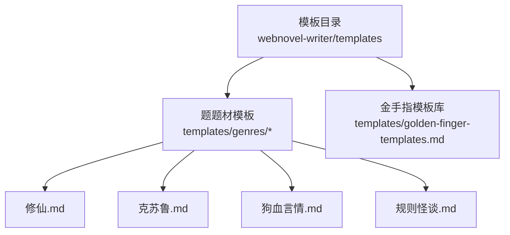
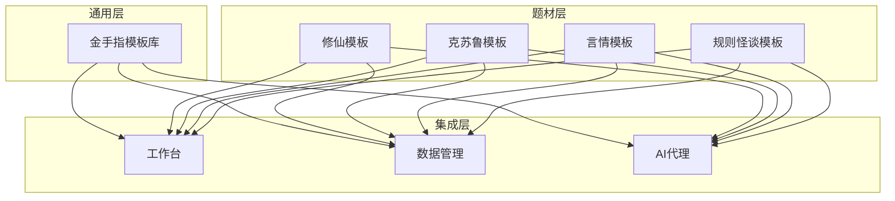
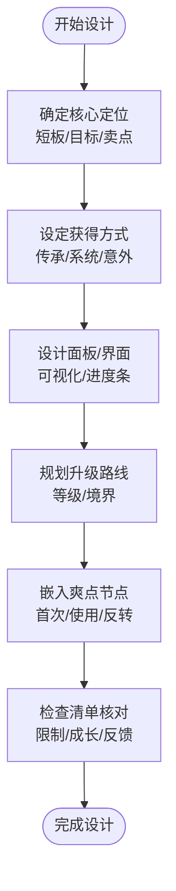
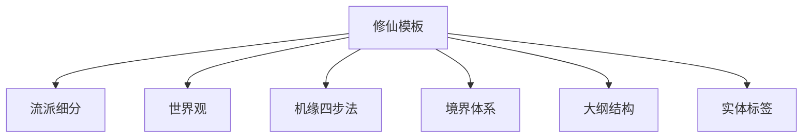
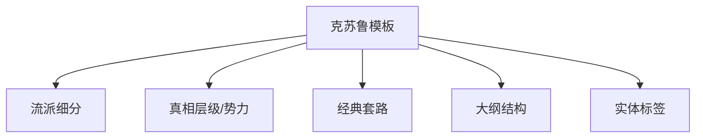
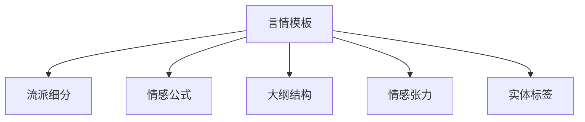
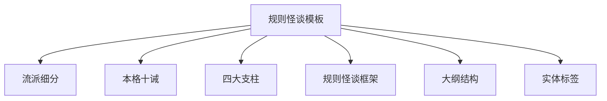
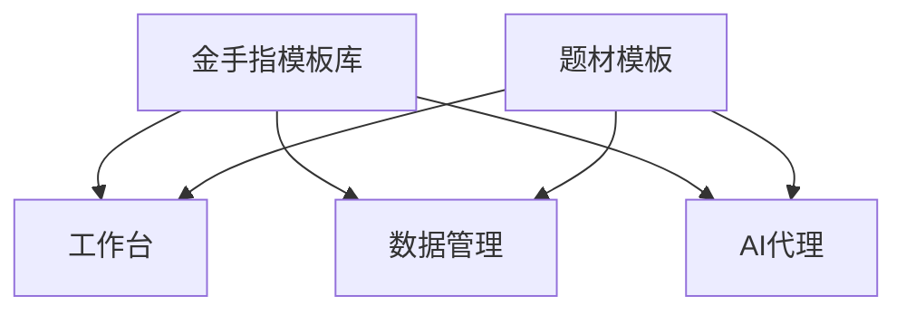

# 模板定制与扩展

<cite>
**本文引用的文件**
- [golden-finger-templates.md](file://webnovel-writer/templates/golden-finger-templates.md)
- [修仙.md](file://webnovel-writer/templates/genres/修仙.md)
- [克苏鲁.md](file://webnovel-writer/templates/genres/克苏鲁.md)
- [狗血言情.md](file://webnovel-writer/templates/genres/狗血言情.md)
- [规则怪谈.md](file://webnovel-writer/templates/genres/规则怪谈.md)
- [README.md](file://README.md)
- [genres.md](file://docs/genres.md)
- [rag-and-config.md](file://docs/rag-and-config.md)
- [web-workbench.md](file://docs/web-workbench.md)
- [operations.md](file://docs/operations.md)
</cite>

## 目录
1. [简介](#简介)
2. [项目结构](#项目结构)
3. [核心组件](#核心组件)
4. [架构总览](#架构总览)
5. [详细组件分析](#详细组件分析)
6. [依赖分析](#依赖分析)
7. [性能考虑](#性能考虑)
8. [故障排查指南](#故障排查指南)
9. [结论](#结论)
10. [附录](#附录)

## 简介
本技术文档面向“题材模板系统”的定制与扩展，聚焦于模板架构设计原理、模块化结构、可扩展性与标准化规范；系统性阐述模板定制的技术方法（字段定义、样式调整、逻辑修改、功能增强）；提供新题材模板的开发指南（设计、内容组织、技术实现与测试验证）；展示模板与系统其他组件（AI代理、数据管理、工作台）的集成方式；并总结模板性能优化技巧与高级扩展实践。

## 项目结构
模板系统位于 webnovel-writer/templates 下，包含两类模板资产：
- 通用金手指设计模板库：提供可复用的设计原则、字段、实体标签与工作流，便于跨题材套用。
- 题材模板：按题材划分，提供该题材的创意约束、流派、大纲结构、实体标签等，支撑具体创作。

图表来源
- [golden-finger-templates.md](file://webnovel-writer/templates/golden-finger-templates.md)
- [修仙.md](file://webnovel-writer/templates/genres/修仙.md)
- [克苏鲁.md](file://webnovel-writer/templates/genres/克苏鲁.md)
- [狗血言情.md](file://webnovel-writer/templates/genres/狗血言情.md)
- [规则怪谈.md](file://webnovel-writer/templates/genres/规则怪谈.md)

章节来源
- [golden-finger-templates.md](file://webnovel-writer/templates/golden-finger-templates.md)
- [修仙.md](file://webnovel-writer/templates/genres/修仙.md)
- [克苏鲁.md](file://webnovel-writer/templates/genres/克苏鲁.md)
- [狗血言情.md](file://webnovel-writer/templates/genres/狗血言情.md)
- [规则怪谈.md](file://webnovel-writer/templates/genres/规则怪谈.md)

## 核心组件
- 通用金手指模板库：定义金手指设计原则、字段、代价/反制库、反馈节奏、类型模板与实体标签，提供标准化设计工作流与检查清单。
- 题材模板：按题材提供创意约束、流派细分、世界设定、机缘/规则框架、大纲结构、实体标签与配置建议，支撑创作流程与数据标注。

章节来源
- [golden-finger-templates.md](file://webnovel-writer/templates/golden-finger-templates.md)
- [修仙.md](file://webnovel-writer/templates/genres/修仙.md)
- [克苏鲁.md](file://webnovel-writer/templates/genres/克苏鲁.md)
- [狗血言情.md](file://webnovel-writer/templates/genres/狗血言情.md)
- [规则怪谈.md](file://webnovel-writer/templates/genres/规则怪谈.md)

## 架构总览
模板系统采用“通用模板 + 题材模板”的分层架构：
- 通用层：金手指模板库，提供跨题材的可复用设计范式与实体标签。
- 题材层：各题材模板，提供该题材特有的创意约束、流派与结构化内容。
- 集成层：与工作台、数据管理、AI代理协作，通过实体标签与配置驱动创作与校验。

图表来源
- [golden-finger-templates.md](file://webnovel-writer/templates/golden-finger-templates.md)
- [修仙.md](file://webnovel-writer/templates/genres/修仙.md)
- [克苏鲁.md](file://webnovel-writer/templates/genres/克苏鲁.md)
- [狗血言情.md](file://webnovel-writer/templates/genres/狗血言情.md)
- [规则怪谈.md](file://webnovel-writer/templates/genres/规则怪谈.md)

## 详细组件分析

### 通用金手指模板库（GFT）
- 设计原则：功能性、可视化、爽点嵌入，确保金手指具备成长性、限制性与反馈节奏。
- 字段与实体标签：提供标准化字段清单与XML实体标签，便于数据抽取与标注。
- 类型模板：系统面板、随身空间、重生穿越、签到打卡、器灵导师、血脉/天赋、异能觉醒等，覆盖主流金手指类型。
- 工作流与检查清单：从定位、获得方式、面板设计、升级路线到爽点节点的全流程设计与质量把控。

图表来源
- [golden-finger-templates.md](file://webnovel-writer/templates/golden-finger-templates.md)

章节来源
- [golden-finger-templates.md](file://webnovel-writer/templates/golden-finger-templates.md)

### 题材模板：修仙（Xianxia/Cultivation）
- 流派细分：凡人流、无敌流、家族流、苟道流，提供不同爽点与叙事节奏。
- 世界观：黑暗森林法则与阶级壁垒，强调资源稀缺与生存竞争。
- 机缘获取四步法：传闻→探索→争夺→收获，形成完整爽点弧。
- 境界与战力体系：标准境界划分与崩坏控制，平衡高低阶差距。
- 大纲结构：四卷式结构，覆盖宗门、秘境、海外/中州、界域战争。
- 实体标签：功法、法宝、势力、妖兽等，支撑创作与数据标注。

图表来源
- [修仙.md](file://webnovel-writer/templates/genres/修仙.md)

章节来源
- [修仙.md](file://webnovel-writer/templates/genres/修仙.md)

### 题材模板：克苏鲁（Cosmic Horror）
- 流派细分：调查档案、仪式失控、旧日入侵、理智边缘，强调真相与代价。
- 世界观：真相层级与势力分层，构建“不可名状”的恐怖规则。
- 经典套路：规则破译、代价取胜、假真相反转、理智守线，保证可读性与爽感。
- 大纲结构：四卷式，从异响到深潜、裂隙再到归零，逐步深入真相。
- 实体标签：污染源、教团、禁忌物、调查者，支撑规则与角色建模。

图表来源
- [克苏鲁.md](file://webnovel-writer/templates/genres/克苏鲁.md)

章节来源
- [克苏鲁.md](file://webnovel-writer/templates/genres/克苏鲁.md)

### 题材模板：狗血言情（Dog-Blood Romance）
- 流派细分：霸总甜宠、追妻火葬场、重生复仇、替身文学，提供明确的情感公式。
- 经典套路：霸道总裁公式、替身文公式、追妻五重奏，强调虐与甜的节奏。
- 大纲结构：五卷式情感弧，覆盖假象、深渊、决裂、追妻、破镜重圆。
- 情感张力：虐心四要素与甜蜜触发器，提升读者代入感。
- 实体标签：情敌、情感事件、情侣状态，支撑情感线建模与追踪。

图表来源
- [狗血言情.md](file://webnovel-writer/templates/genres/狗血言情.md)

章节来源
- [狗血言情.md](file://webnovel-writer/templates/genres/狗血言情.md)

### 题材模板：规则怪谈（Rules Mystery / Honkaku）
- 流派细分：本格推理、规则怪谈、悬疑惊悚、社会派推理，强调公平线索与智力博弈。
- 本格十诫：在网文语境下的适配规则，确保真相可推导、读者可参与。
- 四大支柱：公平性、逻辑性、可解性、意外性，构成高质量推理的基础。
- 规则怪谈框架：遭遇→探索→利用→结局，提供清晰结构与节奏。
- 大纲结构：五卷式，覆盖案发、调查、推理、揭露、收尾。
- 实体标签：嫌疑人、线索、诡计、规则、时间线，支撑推理建模。

图表来源
- [规则怪谈.md](file://webnovel-writer/templates/genres/规则怪谈.md)

章节来源
- [规则怪谈.md](file://webnovel-writer/templates/genres/规则怪谈.md)

## 依赖分析
- 模板与工作台：通过实体标签与配置（如 Strand Weave）驱动工作台的创作与结构化输出。
- 模板与数据管理：实体标签作为统一Schema，便于抽取、存储与检索；支持查询路由与索引管理。
- 模板与AI代理：模板中的规则与实体标签为AI提供上下文与约束，辅助生成与校验。

图表来源
- [golden-finger-templates.md](file://webnovel-writer/templates/golden-finger-templates.md)
- [修仙.md](file://webnovel-writer/templates/genres/修仙.md)
- [克苏鲁.md](file://webnovel-writer/templates/genres/克苏鲁.md)
- [狗血言情.md](file://webnovel-writer/templates/genres/狗血言情.md)
- [规则怪谈.md](file://webnovel-writer/templates/genres/规则怪谈.md)

章节来源
- [rag-and-config.md](file://docs/rag-and-config.md)
- [web-workbench.md](file://docs/web-workbench.md)
- [operations.md](file://docs/operations.md)

## 性能考虑
- 模板加载与渲染
  - 采用Markdown静态模板，减少运行时解析开销；必要时可引入轻量缓存与懒加载。
  - 控制实体标签数量与层级，避免过深的嵌套导致渲染与序列化成本上升。
- 数据管理与查询
  - 使用实体标签作为统一Schema，配合查询路由与索引管理，降低检索复杂度。
  - 对高频访问的模板字段建立索引，优化查询性能。
- AI代理集成
  - 将模板规则与实体标签注入AI上下文，减少重复传输；对长模板进行分段处理。
  - 使用增量更新与变更追踪，避免全量重算。
- 用户体验
  - 模板切换与预览尽量无阻塞；对大型模板提供骨架屏或渐进式渲染。
  - 提供模板压缩与打包策略，缩短首屏加载时间。

## 故障排查指南
- 实体标签不生效
  - 检查标签类型与字段是否符合模板定义；确认XML标签格式正确且与Schema一致。
  - 参考模板中的实体标签示例，逐项核对必填字段与层级。
- 模板字段缺失或不匹配
  - 对照模板字段清单，补齐缺失字段；确保字段命名与取值范围符合模板约束。
- 大纲结构不符合模板建议
  - 按模板建议的卷数与节奏调整章节分布；确保关键节点（首次获得、使用、反转）落在合适位置。
- 与工作台/数据管理/AI代理集成异常
  - 核对配置项（如 Strand Weave）与接口契约；检查实体标签是否正确映射到数据模型。
  - 查阅相关文档与示例，确认调用顺序与参数传递无误。

章节来源
- [golden-finger-templates.md](file://webnovel-writer/templates/golden-finger-templates.md)
- [修仙.md](file://webnovel-writer/templates/genres/修仙.md)
- [克苏鲁.md](file://webnovel-writer/templates/genres/克苏鲁.md)
- [狗血言情.md](file://webnovel-writer/templates/genres/狗血言情.md)
- [规则怪谈.md](file://webnovel-writer/templates/genres/规则怪谈.md)
- [rag-and-config.md](file://docs/rag-and-config.md)
- [web-workbench.md](file://docs/web-workbench.md)
- [operations.md](file://docs/operations.md)

## 结论
模板系统通过“通用模板 + 题材模板”的分层设计，实现了跨题材的可复用性与题材特定的精细化支撑。借助标准化字段、实体标签与工作流，模板能够高效融入工作台、数据管理与AI代理的协作链路。通过遵循设计原则、实体标签与检查清单，开发者可以快速定制与扩展新题材模板，满足多样化创作需求。

## 附录

### 新题材模板开发指南
- 设计阶段
  - 明确题材定位与核心卖点，参考已有模板的流派与结构。
  - 制定创意约束与推荐叠加包，确保可执行性与一致性。
- 内容组织
  - 按“流派/世界设定/机缘/结构/实体标签”组织内容，保持层级清晰。
  - 提供实体标签示例与Schema说明，便于数据抽取与标注。
- 技术实现
  - 采用Markdown静态模板，必要时引入轻量缓存与分段处理。
  - 将实体标签映射到数据模型，确保与工作台/数据管理/AI代理的接口兼容。
- 测试验证
  - 使用典型情节与角色进行场景化测试，验证结构与标签的有效性。
  - 对比检查清单，确保关键元素齐全、逻辑闭环。

章节来源
- [golden-finger-templates.md](file://webnovel-writer/templates/golden-finger-templates.md)
- [修仙.md](file://webnovel-writer/templates/genres/修仙.md)
- [克苏鲁.md](file://webnovel-writer/templates/genres/克苏鲁.md)
- [狗血言情.md](file://webnovel-writer/templates/genres/狗血言情.md)
- [规则怪谈.md](file://webnovel-writer/templates/genres/规则怪谈.md)