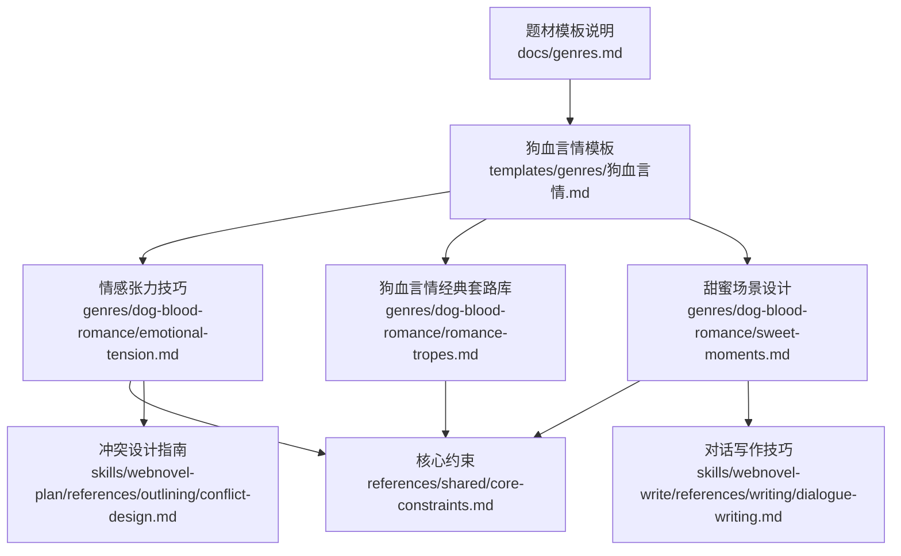
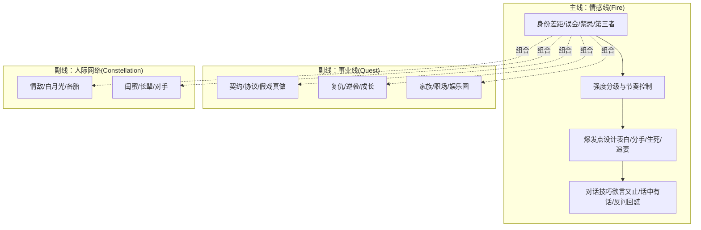
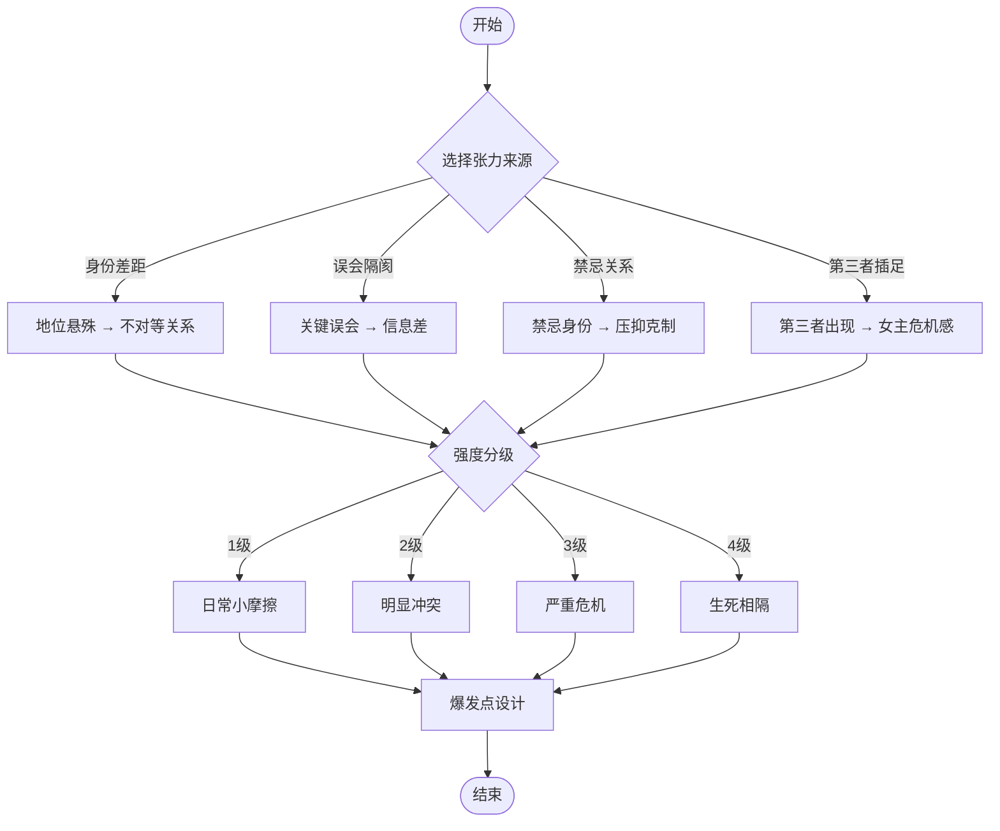
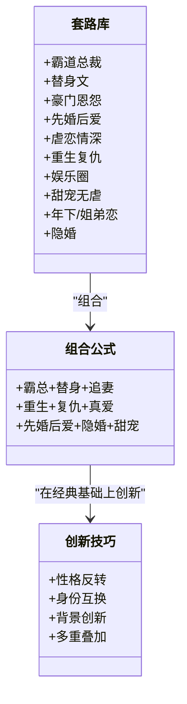
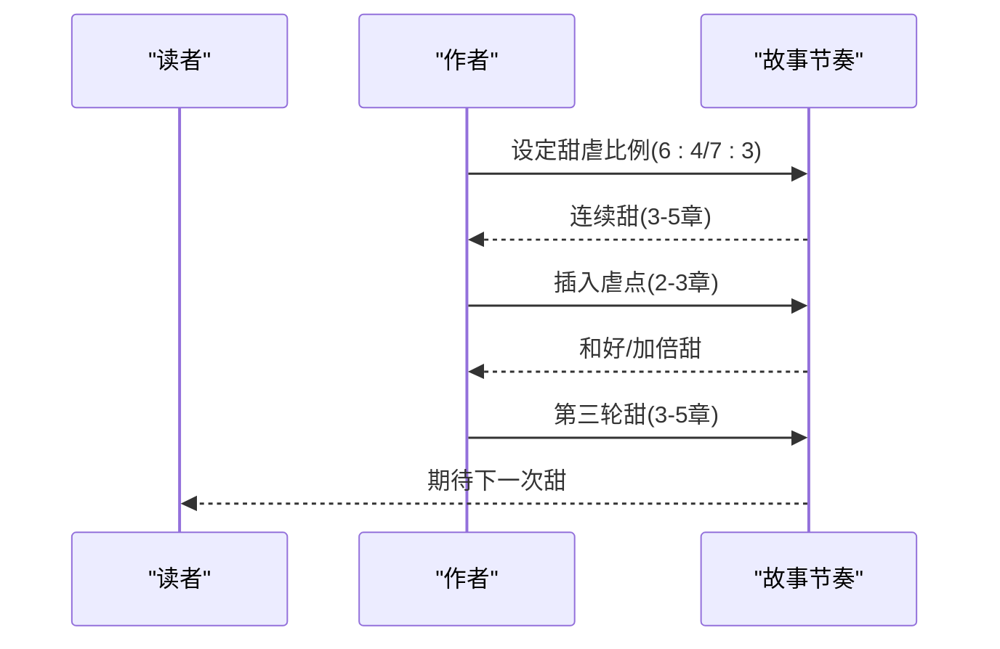
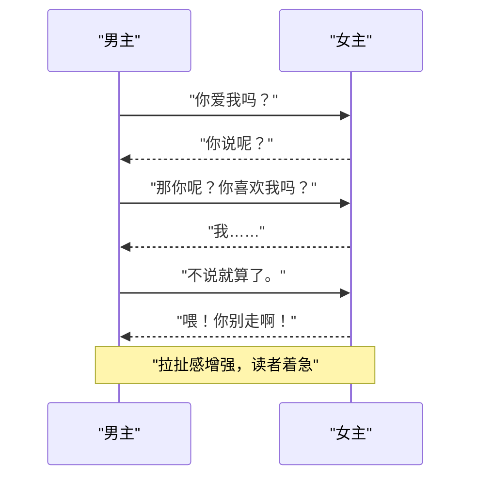
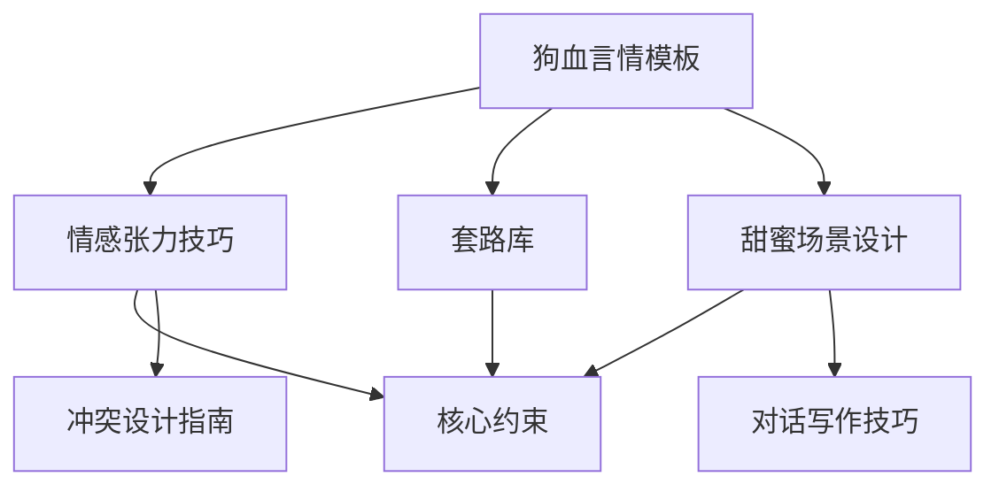

# 狗血言情模板

<cite>
**本文引用的文件列表**
- [情感张力技巧](file://webnovel-writer/genres/dog-blood-romance/emotional-tension.md)
- [狗血言情经典套路库](file://webnovel-writer/genres/dog-blood-romance/romance-tropes.md)
- [甜蜜场景设计](file://webnovel-writer/genres/dog-blood-romance/sweet-moments.md)
- [狗血言情题材模板](file://webnovel-writer/templates/genres/狗血言情.md)
- [题材模板说明](file://docs/genres.md)
- [核心约束](file://webnovel-writer/references/shared/core-constraints.md)
- [冲突设计指南](file://webnovel-writer/skills/webnovel-plan/references/outlining/conflict-design.md)
- [对话写作技巧](file://webnovel-writer/skills/webnovel-write/references/writing/dialogue-writing.md)
</cite>

## 目录
1. [简介](#简介)
2. [项目结构](#项目结构)
3. [核心组件](#核心组件)
4. [架构总览](#架构总览)
5. [详细组件分析](#详细组件分析)
6. [依赖关系分析](#依赖关系分析)
7. [性能与节奏考量](#性能与节奏考量)
8. [故障排查与常见错误](#故障排查与常见错误)
9. [结论](#结论)
10. [附录：速查表与自检清单](#附录速查表与自检清单)

## 简介
本模板面向“狗血言情”题材，系统化梳理情感张力的四大来源（身份差距、误会隔阂、禁忌关系、第三者插足），给出强度分级与节奏控制原则（甜虐交替、虐不过三），并提供对话技巧、爆发点设计、自检清单与速查表。结合模板中的“Strand Weave”配置与“核心约束”，帮助创作者构建高张力、高节奏、易上头的言情故事。

## 项目结构
该仓库围绕“题材模板 + 写作参考 + 核心约束”的结构组织，其中“狗血言情”模板位于 genres 与 templates 两个维度，既提供创作框架，也提供可落地的写作工具。

图表来源
- [题材模板说明:1-48](file://docs/genres.md#L1-L48)
- [狗血言情题材模板:1-192](file://webnovel-writer/templates/genres/狗血言情.md#L1-L192)
- [情感张力技巧:1-579](file://webnovel-writer/genres/dog-blood-romance/emotional-tension.md#L1-L579)
- [狗血言情经典套路库:1-529](file://webnovel-writer/genres/dog-blood-romance/romance-tropes.md#L1-L529)
- [甜蜜场景设计:1-621](file://webnovel-writer/genres/dog-blood-romance/sweet-moments.md#L1-L621)
- [核心约束:1-99](file://webnovel-writer/references/shared/core-constraints.md#L1-L99)
- [冲突设计指南:1-278](file://webnovel-writer/skills/webnovel-plan/references/outlining/conflict-design.md#L1-L278)
- [对话写作技巧:1-232](file://webnovel-writer/skills/webnovel-write/references/writing/dialogue-writing.md#L1-L232)

章节来源
- [题材模板说明:1-48](file://docs/genres.md#L1-L48)
- [狗血言情题材模板:1-192](file://webnovel-writer/templates/genres/狗血言情.md#L1-L192)

## 核心组件
- 情感张力四大来源与强度分级：明确张力来源、节奏控制、爆发点设计与对话技巧。
- 经典套路库：十大套路、组合公式、创新技巧与自检清单。
- 甜蜜场景设计：五大类型、阶段分布、对话模板与节奏控制。
- 模板大纲与Strand Weave配置：卷五阶段划分、甜虐比例与追妻戏份。
- 写作约束与节奏保障：核心约束、冲突设计、对话设计。

章节来源
- [情感张力技巧:1-579](file://webnovel-writer/genres/dog-blood-romance/emotional-tension.md#L1-L579)
- [狗血言情经典套路库:1-529](file://webnovel-writer/genres/dog-blood-romance/romance-tropes.md#L1-L529)
- [甜蜜场景设计:1-621](file://webnovel-writer/genres/dog-blood-romance/sweet-moments.md#L1-L621)
- [狗血言情题材模板:1-192](file://webnovel-writer/templates/genres/狗血言情.md#L1-L192)
- [核心约束:1-99](file://webnovel-writer/references/shared/core-constraints.md#L1-L99)
- [冲突设计指南:1-278](file://webnovel-writer/skills/webnovel-plan/references/outlining/conflict-design.md#L1-L278)
- [对话写作技巧:1-232](file://webnovel-writer/skills/webnovel-write/references/writing/dialogue-writing.md#L1-L232)

## 架构总览
模板将“情感张力”作为主线（Fire），与“事业线/外部冲突（Quest）”“人际网络（Constellation）”协同，形成稳定的叙事结构。模板强调：
- 情感线占比≥50%，甜虐比例依据定位调整；
- 追妻阶段足够长，男主足够惨；
- 通过“基础节奏公式”实现“甜虐交替、虐不过三”。

图表来源
- [狗血言情题材模板:161-182](file://webnovel-writer/templates/genres/狗血言情.md#L161-L182)
- [情感张力技巧:234-270](file://webnovel-writer/genres/dog-blood-romance/emotional-tension.md#L234-L270)
- [狗血言情经典套路库:346-386](file://webnovel-writer/genres/dog-blood-romance/romance-tropes.md#L346-L386)

## 详细组件分析

### 组件A：情感张力的四大来源与强度分级
- 身份差距：地位悬殊 → 不对等关系 → 女主自卑/男主傲慢 → 张力。
- 误会隔阂：关键误会 → 双方都不解释 → 越陷越深 → 爆发冲突 → 真相揭开。
- 禁忌关系：禁忌身份 → 不能在一起 → 压抑克制 → 情难自禁 → 突破禁忌。
- 第三者插足：第三者出现 → 威胁女主地位 → 女主危机感 → 男主表态 → 感情稳固。
- 强度分级：1级（日常小摩擦）、2级（明显冲突）、3级（严重危机）、4级（生死相隔）。
- 节奏控制：基础节奏公式（甜→虐→甜→虐→甜），原则“甜虐交替、虐完必甜、虐不过三”。

图表来源
- [情感张力技巧:7-162](file://webnovel-writer/genres/dog-blood-romance/emotional-tension.md#L7-L162)
- [情感张力技巧:165-270](file://webnovel-writer/genres/dog-blood-romance/emotional-tension.md#L165-L270)

章节来源
- [情感张力技巧:7-270](file://webnovel-writer/genres/dog-blood-romance/emotional-tension.md#L7-L270)

### 组件B：经典套路库与组合公式
- 十大经典套路：霸道总裁、替身文、豪门恩怨、先婚后爱、虐恋情深、重生复仇、娱乐圈、甜宠无虐、年下/姐弟恋、隐婚。
- 套路组合：如“霸总+替身+追妻火葬场”“重生+复仇+真爱”“先婚后爱+隐婚+甜宠”等。
- 创新技巧：性格反转、身份互换、背景创新、多重套路叠加。
- 自检清单：核心公式清晰、必备元素齐全、情感节奏合理、有创新点、爽点足够、避免俗套。

图表来源
- [狗血言情经典套路库:7-440](file://webnovel-writer/genres/dog-blood-romance/romance-tropes.md#L7-L440)

章节来源
- [狗血言情经典套路库:7-440](file://webnovel-writer/genres/dog-blood-romance/romance-tropes.md#L7-L440)

### 组件C：甜蜜场景设计与节奏控制
- 五大类型：宠溺日常、肢体接触、告白表白、吃醋撒娇、英雄救美。
- 阶段分布：初期（小甜饼）、中期（日常甜宠）、后期（细水长流）。
- 节奏控制：甜虐比6:4或7:3，连续甜不超过5章，连续虐不超过3章。
- 甜蜜强度递增：初期⭐⭐⭐、中期⭐⭐⭐⭐、后期⭐⭐⭐⭐⭐、高潮⭐⭐⭐⭐⭐⭐。
- 对话模板：情话攻击、宠溺对话、占有欲对话。
- 身体接触进度：循序渐进，避免过快过猛。

图表来源
- [甜蜜场景设计:397-417](file://webnovel-writer/genres/dog-blood-romance/sweet-moments.md#L397-L417)

章节来源
- [甜蜜场景设计:7-470](file://webnovel-writer/genres/dog-blood-romance/sweet-moments.md#L7-L470)

### 组件D：模板大纲与Strand Weave配置
- 卷一：甜蜜假象（1-50章，15%）——契约/协议、不平等地位、小高潮。
- 卷二：虐心深渊（51-130章，25%）——白月光出现、误会加深、女主心死。
- 卷三：决裂离开（131-180章，15%）——真相部分揭露、女主离开。
- 卷四：追妻之路（181-280章，30%）——男主追悔、女主成长、反复拉扯。
- 卷五：破镜重圆（281-350章，15%）——真相大白、男主赎罪、HE结局。
- Strand Weave配置：情感线占比≥50%，甜虐比例按定位调整，追妻阶段足够长。

图表来源
- [狗血言情题材模板:72-102](file://webnovel-writer/templates/genres/狗血言情.md#L72-L102)

章节来源
- [狗血言情题材模板:72-182](file://webnovel-writer/templates/genres/狗血言情.md#L72-L182)

### 组件E：对话技巧与爆发点设计
- 对话技巧：欲言又止（暧昧）、话中有话（试探）、反问回怼（拉扯）。
- 爆发点设计：表白（甜）、分手（虐）、生死关头（极致虐）、追妻火葬场（反转甜）。
- 潜台词五层：情感潜台词、动机潜台词、关系潜台词、情节潜台词、主题潜台词。
- 对话语气：温柔、冷淡、激动、讽刺；沉默设计与打破时机。

图表来源
- [情感张力技巧:466-479](file://webnovel-writer/genres/dog-blood-romance/emotional-tension.md#L466-L479)
- [对话写作技巧:102-156](file://webnovel-writer/skills/webnovel-write/references/writing/dialogue-writing.md#L102-L156)

章节来源
- [情感张力技巧:435-480](file://webnovel-writer/genres/dog-blood-romance/emotional-tension.md#L435-L480)
- [对话写作技巧:10-168](file://webnovel-writer/skills/webnovel-write/references/writing/dialogue-writing.md#L10-L168)

## 依赖关系分析
- 模板依赖：情感张力技巧提供张力来源与节奏控制；套路库提供可复用的桥段与组合；甜蜜场景设计提供甜度与节奏保障；模板提供结构化大纲与Strand Weave配置。
- 写作约束：核心约束确保章节推进、未闭合问题与爽点密度符合题材要求；冲突设计指南与对话写作技巧为张力与节奏提供底层支撑。

图表来源
- [狗血言情题材模板:1-192](file://webnovel-writer/templates/genres/狗血言情.md#L1-L192)
- [情感张力技巧:1-579](file://webnovel-writer/genres/dog-blood-romance/emotional-tension.md#L1-L579)
- [狗血言情经典套路库:1-529](file://webnovel-writer/genres/dog-blood-romance/romance-tropes.md#L1-L529)
- [甜蜜场景设计:1-621](file://webnovel-writer/genres/dog-blood-romance/sweet-moments.md#L1-L621)
- [核心约束:1-99](file://webnovel-writer/references/shared/core-constraints.md#L1-L99)
- [冲突设计指南:1-278](file://webnovel-writer/skills/webnovel-plan/references/outlining/conflict-design.md#L1-L278)
- [对话写作技巧:1-232](file://webnovel-writer/skills/webnovel-write/references/writing/dialogue-writing.md#L1-L232)

章节来源
- [核心约束:51-64](file://webnovel-writer/references/shared/core-constraints.md#L51-L64)
- [冲突设计指南:158-178](file://webnovel-writer/skills/webnovel-plan/references/outlining/conflict-design.md#L158-L178)
- [对话写作技巧:102-168](file://webnovel-writer/skills/webnovel-write/references/writing/dialogue-writing.md#L102-L168)

## 性能与节奏考量
- 爽点密度与节奏：按题材profile调整，组合爽点与里程碑采用滚动窗口评估，连续同类型爽点达3章需预警。
- 章节推进：每章必须存在清晰推进（问题、目标、代价、关系变化、信息变化至少一项），避免“整章无推进”。
- 甜虐比例：建议6:4或7:3，连续甜不超过5章，连续虐不超过3章，避免“一直甜”或“一直虐”。

章节来源
- [核心约束:51-56](file://webnovel-writer/references/shared/core-constraints.md#L51-L56)
- [核心约束:31-44](file://webnovel-writer/references/shared/core-constraints.md#L31-L44)
- [甜蜜场景设计:397-417](file://webnovel-writer/genres/dog-blood-romance/sweet-moments.md#L397-L417)

## 故障排查与常见错误
- 无病呻吟：没有明确冲突点，读者不知道为什么难过。
- 为虐而虐：重复套路，读者会腻。
- 男主渣而不洗白：一直冷暴力/出轨/家暴，直到最后都不悔改。
- 套路堆砌、逻辑混乱：过多套路导致读者混乱。
- 套路老套、毫无新意：使用陈旧梗，缺乏创新。
- 为了套路而套路：生硬、为凑字数而用套路。

章节来源
- [情感张力技巧:482-529](file://webnovel-writer/genres/dog-blood-romance/emotional-tension.md#L482-L529)
- [狗血言情经典套路库:459-490](file://webnovel-writer/genres/dog-blood-romance/romance-tropes.md#L459-L490)

## 结论
本模板以“情感张力”为核心，结合“经典套路”“甜蜜场景”“节奏控制”与“写作约束”，为创作者提供一套可操作、可落地的言情创作体系。通过明确张力来源、强度分级与节奏公式，配合对话技巧与爆发点设计，既能保证“甜虐交替、虐不过三”，又能避免“为虐而虐”“无病呻吟”等常见问题，帮助创作者打造高张力、高节奏、易上头的狗血言情作品。

## 附录：速查表与自检清单

### 情感张力速查表
- 身份差：长期、男主表态“我不在乎”、霸道宠溺
- 误会：5-15章、真相揭晓、追妻火葬场
- 禁忌：长期、突破禁忌、禁忌之恋
- 第三者：3-10章、男主表态、吃醋撒娇
- 冷战：1-3章、男主主动和好、宠溺哄人
- 分手：10-20章、追妻火葬场、虐后反转

章节来源
- [情感张力技巧:542-552](file://webnovel-writer/genres/dog-blood-romance/emotional-tension.md#L542-L552)

### 甜蜜场景速查表
- 日常宠溺：全阶段、喂食、摸头、抱抱
- 肢体接触：暧昧期+、牵手、拥抱、亲吻
- 告白表白：关键节点、深情眼神、情话
- 吃醋撒娇：恋爱期、占有欲、霸道宣示
- 英雄救美：危机时刻、保护、霸气登场
- 纪念日惊喜：高潮、求婚、生日

章节来源
- [甜蜜场景设计:546-556](file://webnovel-writer/genres/dog-blood-romance/sweet-moments.md#L546-L556)

### 情感张力自检清单
- 有明确的冲突点：身份差/误会/禁忌/第三者？
- 节奏合理：甜虐交替，虐不过三？
- 张力递进：从小摩擦到大危机？
- 有爆发点：表白/分手/生死/追妻？
- 符合人设：角色的反应符合其性格？
- 不重复：每次虐点有新意？

章节来源
- [情感张力技巧:531-539](file://webnovel-writer/genres/dog-blood-romance/emotional-tension.md#L531-L539)

### 甜蜜场景自检清单
- 有铺垫吗：甜蜜场景是否有情绪铺垫？
- 符合人设吗：男主/女主的反应是否符合其性格？
- 节奏合理吗：甜蜜强度是否递增？是否有甜虐交替？
- 够细腻吗：是否描写了心理活动和身体反应？
- 不过度吗：是否避免了连续5章以上的纯甜？
- 有新意吗：这次的甜蜜和上次有什么不同？

章节来源
- [甜蜜场景设计:535-543](file://webnovel-writer/genres/dog-blood-romance/sweet-moments.md#L535-L543)