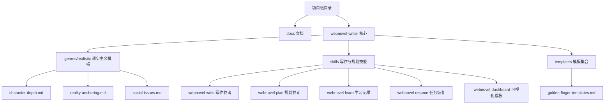
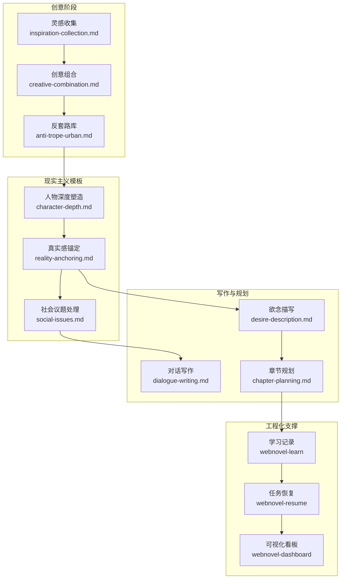
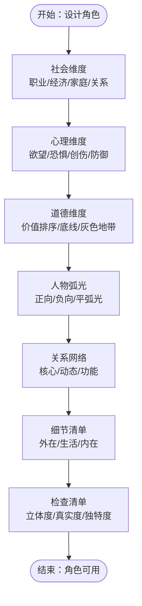
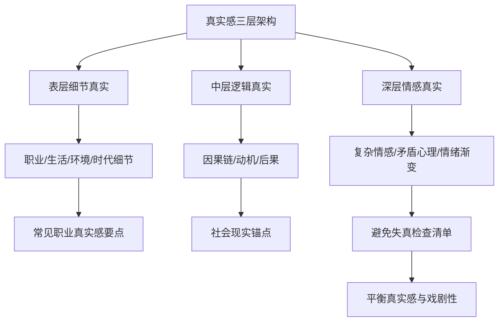
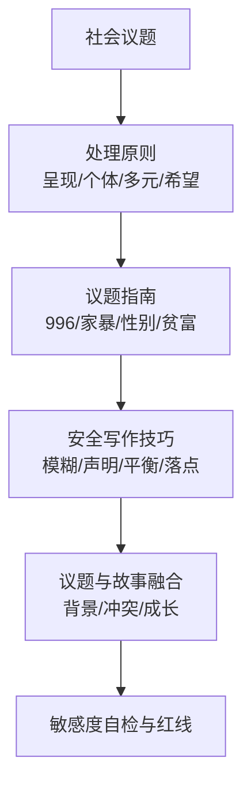
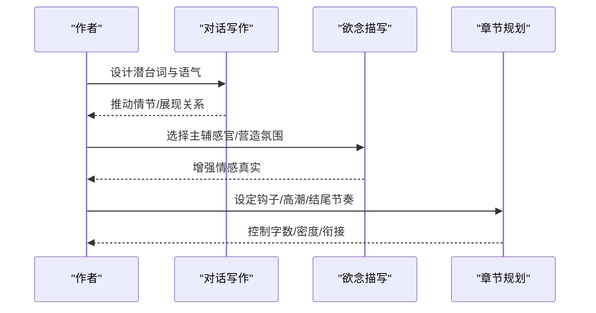
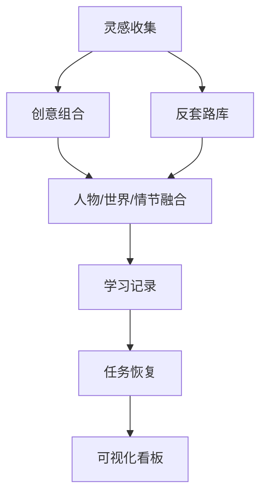
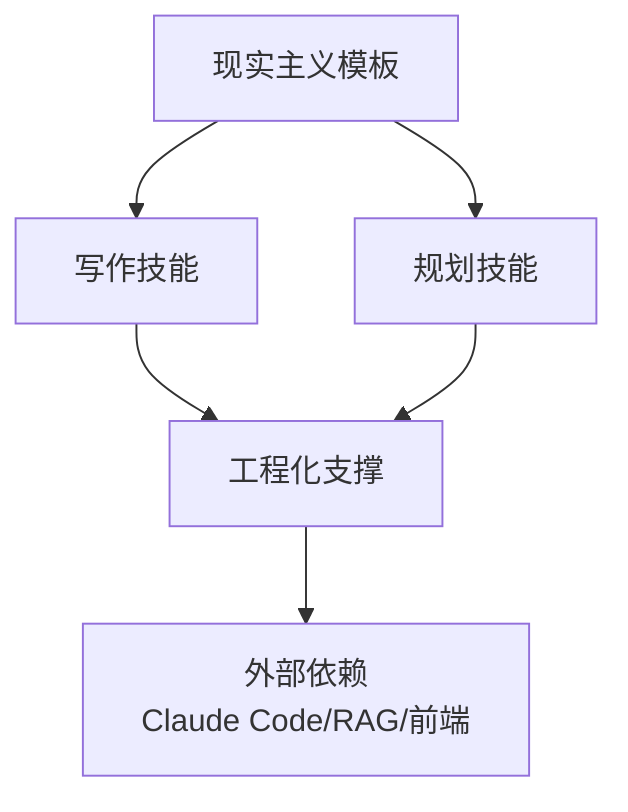

# 现实主义模板

<cite>
**本文引用的文件**
- [README.md](file://README.md)
- [genres.md](file://docs/genres.md)
- [character-depth.md](file://webnovel-writer/genres/realistic/character-depth.md)
- [reality-anchoring.md](file://webnovel-writer/genres/realistic/reality-anchoring.md)
- [social-issues.md](file://webnovel-writer/genres/realistic/social-issues.md)
- [dialogue-writing.md](file://webnovel-writer/skills/webnovel-write/references/writing/dialogue-writing.md)
- [desire-description.md](file://webnovel-writer/skills/webnovel-write/references/writing/desire-description.md)
- [chapter-planning.md](file://webnovel-writer/skills/webnovel-plan/references/outlining/chapter-planning.md)
- [SKILL.md（webnovel-learn）](file://webnovel-writer/skills/webnovel-learn/SKILL.md)
- [SKILL.md（webnovel-resume）](file://webnovel-writer/skills/webnovel-resume/SKILL.md)
- [SKILL.md（webnovel-dashboard）](file://webnovel-writer/skills/webnovel-dashboard/SKILL.md)
- [anti-trope-urban.md](file://webnovel-writer/skills/webnovel-init/references/creativity/anti-trope-urban.md)
- [creative-combination.md](file://webnovel-writer/skills/webnovel-init/references/creativity/creative-combination.md)
- [inspiration-collection.md](file://webnovel-writer/skills/webnovel-init/references/creativity/inspiration-collection.md)
</cite>

## 目录
1. [引言](#引言)
2. [项目结构](#项目结构)
3. [核心组件](#核心组件)
4. [架构总览](#架构总览)
5. [详细组件分析](#详细组件分析)
6. [依赖分析](#依赖分析)
7. [性能考虑](#性能考虑)
8. [故障排查指南](#故障排查指南)
9. [结论](#结论)
10. [附录](#附录)

## 引言
本文件面向现实主义题材创作，系统化梳理角色深度塑造、真实感锚定、社会议题融入与写作技巧，结合项目内置的模板与技能，帮助创作者在“真实性”与“艺术性”之间取得平衡，产出既有深度又有温度的作品。文档以“现实题材人物深度塑造”“现实题材真实感锚定”“现实题材社会议题处理”三大模板为核心，辅以对话写作、欲念描写、章节规划、学习与恢复、可视化看板等实用技能，形成从灵感到落地的完整创作路径。

## 项目结构
该项目为基于 Claude Code 的长篇网文创作系统，提供多题材模板与写作技能，支持长周期连载与可视化管理。现实主义模板位于 genres/realistic 目录，配套写作与规划技能位于 skills 子目录，文档导航位于 docs 目录。

**图表来源**
- [README.md:1-170](file://README.md#L1-L170)
- [genres.md:1-48](file://docs/genres.md#L1-L48)

**章节来源**
- [README.md:1-170](file://README.md#L1-L170)
- [genres.md:1-48](file://docs/genres.md#L1-L48)

## 核心组件
- 现实题材人物深度塑造：提供社会/心理/道德三维构建、人物弧光、关系网络与细节清单，确保角色立体、真实、独特。
- 现实题材真实感锚定：从细节真实、逻辑真实、情感真实三层架构入手，给出常见职业与社会现实锚点，以及避免失真的检查清单与平衡技巧。
- 现实题材社会议题处理：提供处理原则、具体议题指南、安全写作技巧、议题与故事融合方式与敏感度自检清单。
- 写作与规划技能：对话写作、欲念描写、章节规划、学习记录、任务恢复、可视化看板，支撑从灵感到落地的全流程。

**章节来源**
- [character-depth.md:1-235](file://webnovel-writer/genres/realistic/character-depth.md#L1-L235)
- [reality-anchoring.md:1-230](file://webnovel-writer/genres/realistic/reality-anchoring.md#L1-L230)
- [social-issues.md:1-233](file://webnovel-writer/genres/realistic/social-issues.md#L1-L233)
- [dialogue-writing.md:1-232](file://webnovel-writer/skills/webnovel-write/references/writing/dialogue-writing.md#L1-L232)
- [desire-description.md:1-312](file://webnovel-writer/skills/webnovel-write/references/writing/desire-description.md#L1-L312)
- [chapter-planning.md:1-296](file://webnovel-writer/skills/webnovel-plan/references/outlining/chapter-planning.md#L1-L296)
- [SKILL.md（webnovel-learn）:1-46](file://webnovel-writer/skills/webnovel-learn/SKILL.md#L1-L46)
- [SKILL.md（webnovel-resume）:1-203](file://webnovel-writer/skills/webnovel-resume/SKILL.md#L1-L203)
- [SKILL.md（webnovel-dashboard）:1-81](file://webnovel-writer/skills/webnovel-dashboard/SKILL.md#L1-L81)

## 架构总览
现实主义创作的系统化流程如下：从灵感收集与创意组合，到人物与世界的真实锚定，再到章节节奏与对话/欲念描写的落地，最终通过学习记录、任务恢复与可视化看板实现持续迭代与稳定产出。

**图表来源**
- [inspiration-collection.md:1-299](file://webnovel-writer/skills/webnovel-init/references/creativity/inspiration-collection.md#L1-L299)
- [creative-combination.md:1-511](file://webnovel-writer/skills/webnovel-init/references/creativity/creative-combination.md#L1-L511)
- [anti-trope-urban.md:1-170](file://webnovel-writer/skills/webnovel-init/references/creativity/anti-trope-urban.md#L1-L170)
- [character-depth.md:1-235](file://webnovel-writer/genres/realistic/character-depth.md#L1-L235)
- [reality-anchoring.md:1-230](file://webnovel-writer/genres/realistic/reality-anchoring.md#L1-L230)
- [social-issues.md:1-233](file://webnovel-writer/genres/realistic/social-issues.md#L1-L233)
- [dialogue-writing.md:1-232](file://webnovel-writer/skills/webnovel-write/references/writing/dialogue-writing.md#L1-L232)
- [desire-description.md:1-312](file://webnovel-writer/skills/webnovel-write/references/writing/desire-description.md#L1-L312)
- [chapter-planning.md:1-296](file://webnovel-writer/skills/webnovel-plan/references/outlining/chapter-planning.md#L1-L296)
- [SKILL.md（webnovel-learn）:1-46](file://webnovel-writer/skills/webnovel-learn/SKILL.md#L1-L46)
- [SKILL.md（webnovel-resume）:1-203](file://webnovel-writer/skills/webnovel-resume/SKILL.md#L1-L203)
- [SKILL.md（webnovel-dashboard）:1-81](file://webnovel-writer/skills/webnovel-dashboard/SKILL.md#L1-L81)

## 详细组件分析

### 组件A：人物深度塑造（character-depth.md）
- 三维度构建：社会维度（职业/经济/家庭/关系）、心理维度（欲望/恐惧/创伤/防御）、道德维度（价值排序/底线/灰色地带）。
- 人物弧光：正向弧光、负向弧光、平弧光，强调成长或堕落或坚持自我改变世界的路径。
- 关系网络：核心关系、关系动态、关系功能（镜子/催化剂/对照组/考验）。
- 细节清单：外在细节（外貌/穿着/小动作/说话方式）、生活细节（作息/饮食/休闲/消费）、内在细节（骄傲/后悔/害怕/渴望）。
- 检查清单：立体度/真实度/独特度三类检查，确保人物“像真人”。

**图表来源**
- [character-depth.md:7-235](file://webnovel-writer/genres/realistic/character-depth.md#L7-L235)

**章节来源**
- [character-depth.md:1-235](file://webnovel-writer/genres/realistic/character-depth.md#L1-L235)

### 组件B：真实感锚定（reality-anchoring.md）
- 三层架构：表层细节真实、中层逻辑真实、深层情感真实。
- 细节真实技巧：职业细节、生活细节、环境细节、时代细节。
- 逻辑真实技巧：因果链完整、动机合理、后果真实。
- 情感真实技巧：复杂情感、矛盾心理、情绪渐变。
- 常见职业真实感要点：医生、律师、程序员、教师、销售等。
- 社会现实锚点：经济压力、职场现实、家庭现实。
- 避免失真检查清单与真实感与戏剧性平衡技巧。

**图表来源**
- [reality-anchoring.md:7-230](file://webnovel-writer/genres/realistic/reality-anchoring.md#L7-L230)

**章节来源**
- [reality-anchoring.md:1-230](file://webnovel-writer/genres/realistic/reality-anchoring.md#L1-L230)

### 组件C：社会议题处理（social-issues.md）
- 常见议题：职场、家庭、社会、性别、教育、医疗等。
- 处理原则：呈现而非评判、个体视角切入、多元立场呈现、保留希望。
- 具体议题指南：职场996、家庭暴力、性别议题、贫富差距。
- 安全写作技巧：模糊化处理、虚构声明、平衡叙事、情感落点。
- 议题与故事融合：背景、冲突、成长三种融合方式。
- 敏感度自检清单与红线警示。

**图表来源**
- [social-issues.md:7-233](file://webnovel-writer/genres/realistic/social-issues.md#L7-L233)

**章节来源**
- [social-issues.md:1-233](file://webnovel-writer/genres/realistic/social-issues.md#L1-L233)

### 组件D：写作与规划技能（对话/欲念/章节）
- 对话写作：潜台词五层（情感/动机/关系/情节/主题）、类型库、语气设计、节奏控制、与动作/心理/环境结合。
- 欲念描写：五感基础、感官交织、层次递进、克制技巧、氛围营造、节奏把控、隐喻与留白、心理配合、场景应用。
- 章节规划：黄金结构（钩子/发展/高潮/结尾）、节奏设计（爽点/过渡/刀子）、字数控制、标题技巧、衔接方式、爽点密度、规划模板与自检清单。

**图表来源**
- [dialogue-writing.md:12-232](file://webnovel-writer/skills/webnovel-write/references/writing/dialogue-writing.md#L12-L232)
- [desire-description.md:10-312](file://webnovel-writer/skills/webnovel-write/references/writing/desire-description.md#L10-L312)
- [chapter-planning.md:7-296](file://webnovel-writer/skills/webnovel-plan/references/outlining/chapter-planning.md#L7-L296)

**章节来源**
- [dialogue-writing.md:1-232](file://webnovel-writer/skills/webnovel-write/references/writing/dialogue-writing.md#L1-L232)
- [desire-description.md:1-312](file://webnovel-writer/skills/webnovel-write/references/writing/desire-description.md#L1-L312)
- [chapter-planning.md:1-296](file://webnovel-writer/skills/webnovel-plan/references/outlining/chapter-planning.md#L1-L296)

### 组件E：创意与工程化支撑
- 灵感收集：分类体系、潜力评估、标签化、组合创新、创意地图、缺口分析、Top筛选。
- 创意组合：双元素与三元素组合、化学反应强度评估、主导与辅助关系、融合机制六大维度、开篇故事测试。
- 反套路库：规避常见套路，提供限制与非套路爽点，强调真实感与代价。
- 学习记录：从会话提取成功模式并写入项目记忆，便于复用与沉淀。
- 任务恢复：检测中断状态并提供安全恢复选项，避免智能续写半成品。
- 可视化看板：只读面板，实时查看项目状态、实体图谱、章节与大纲、追读力数据。

**图表来源**
- [inspiration-collection.md:1-299](file://webnovel-writer/skills/webnovel-init/references/creativity/inspiration-collection.md#L1-L299)
- [creative-combination.md:1-511](file://webnovel-writer/skills/webnovel-init/references/creativity/creative-combination.md#L1-L511)
- [anti-trope-urban.md:1-170](file://webnovel-writer/skills/webnovel-init/references/creativity/anti-trope-urban.md#L1-L170)
- [SKILL.md（webnovel-learn）:1-46](file://webnovel-writer/skills/webnovel-learn/SKILL.md#L1-L46)
- [SKILL.md（webnovel-resume）:1-203](file://webnovel-writer/skills/webnovel-resume/SKILL.md#L1-L203)
- [SKILL.md（webnovel-dashboard）:1-81](file://webnovel-writer/skills/webnovel-dashboard/SKILL.md#L1-L81)

**章节来源**
- [inspiration-collection.md:1-299](file://webnovel-writer/skills/webnovel-init/references/creativity/inspiration-collection.md#L1-L299)
- [creative-combination.md:1-511](file://webnovel-writer/skills/webnovel-init/references/creativity/creative-combination.md#L1-L511)
- [anti-trope-urban.md:1-170](file://webnovel-writer/skills/webnovel-init/references/creativity/anti-trope-urban.md#L1-L170)
- [SKILL.md（webnovel-learn）:1-46](file://webnovel-writer/skills/webnovel-learn/SKILL.md#L1-L46)
- [SKILL.md（webnovel-resume）:1-203](file://webnovel-writer/skills/webnovel-resume/SKILL.md#L1-L203)
- [SKILL.md（webnovel-dashboard）:1-81](file://webnovel-writer/skills/webnovel-dashboard/SKILL.md#L1-L81)

## 依赖分析
- 模板与技能耦合：人物塑造与真实感锚定为写作基础，对话与欲念描写提供情感与节奏支撑，章节规划保障结构与密度，创意与工程化支撑贯穿全流程。
- 外部依赖：系统通过 Claude Code 与 RAG 环境协作，提供上下文检索与辅助；可视化看板依赖前端构建产物与只读 API。
- 潜在风险：创意组合需避免逻辑冲突与风格割裂；任务恢复需严格检测与用户确认；敏感议题处理需平衡叙事与情感落点。

**图表来源**
- [character-depth.md:1-235](file://webnovel-writer/genres/realistic/character-depth.md#L1-L235)
- [reality-anchoring.md:1-230](file://webnovel-writer/genres/realistic/reality-anchoring.md#L1-L230)
- [social-issues.md:1-233](file://webnovel-writer/genres/realistic/social-issues.md#L1-L233)
- [dialogue-writing.md:1-232](file://webnovel-writer/skills/webnovel-write/references/writing/dialogue-writing.md#L1-L232)
- [desire-description.md:1-312](file://webnovel-writer/skills/webnovel-write/references/writing/desire-description.md#L1-L312)
- [chapter-planning.md:1-296](file://webnovel-writer/skills/webnovel-plan/references/outlining/chapter-planning.md#L1-L296)
- [SKILL.md（webnovel-dashboard）:1-81](file://webnovel-writer/skills/webnovel-dashboard/SKILL.md#L1-L81)

**章节来源**
- [README.md:1-170](file://README.md#L1-L170)
- [genres.md:1-48](file://docs/genres.md#L1-L48)

## 性能考虑
- 写作效率：通过对话与欲念描写的节奏控制、章节密度与钩子设计，维持读者粘性与更新频率。
- 工程稳定性：任务恢复与学习记录减少上下文丢失风险，可视化看板提供只读监控，避免误操作。
- 内容质量：真实感三层架构与敏感度自检清单降低内容风险，创意组合与反套路库提升差异化竞争力。

## 故障排查指南
- 任务中断恢复：使用任务恢复技能检测中断状态，提供删除重来或回滚选项，严格禁止智能续写半成品。
- 学习记录：通过学习记录技能提取成功模式并写入项目记忆，避免重复劳动。
- 可视化看板：启动只读面板，实时查看项目状态与实体关系，便于定位问题与调整节奏。
- 章节节奏异常：依据章节规划模板自检字数、开头钩子、冲突推进、爽点密度与结尾钩子，及时调整。

**章节来源**
- [SKILL.md（webnovel-resume）:1-203](file://webnovel-writer/skills/webnovel-resume/SKILL.md#L1-L203)
- [SKILL.md（webnovel-learn）:1-46](file://webnovel-writer/skills/webnovel-learn/SKILL.md#L1-L46)
- [SKILL.md（webnovel-dashboard）:1-81](file://webnovel-writer/skills/webnovel-dashboard/SKILL.md#L1-L81)
- [chapter-planning.md:247-296](file://webnovel-writer/skills/webnovel-plan/references/outlining/chapter-planning.md#L247-L296)

## 结论
现实主义创作的关键在于“真实”与“艺术”的平衡：以人物三维度与真实感三层架构为基础，以社会议题的呈现与处理为深度，以对话与欲念描写的节奏与氛围为手段，以章节规划与工程化支撑为保障，最终形成可长可久、有温度有力量的作品。借助本模板与技能体系，创作者可在复杂现实与读者期待之间找到稳定的创作路径。

## 附录
- 复合题材规则：支持主辅题材搭配，建议主辅比例 7:3，主线遵循主题材逻辑，副题材提供钩子/规则/爽点。
- 快速开始：安装插件、安装依赖、初始化项目、配置 RAG、使用写作/规划/学习/恢复/看板技能。

**章节来源**
- [genres.md:38-48](file://docs/genres.md#L38-L48)
- [README.md:21-93](file://README.md#L21-L93)