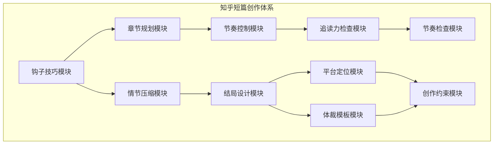
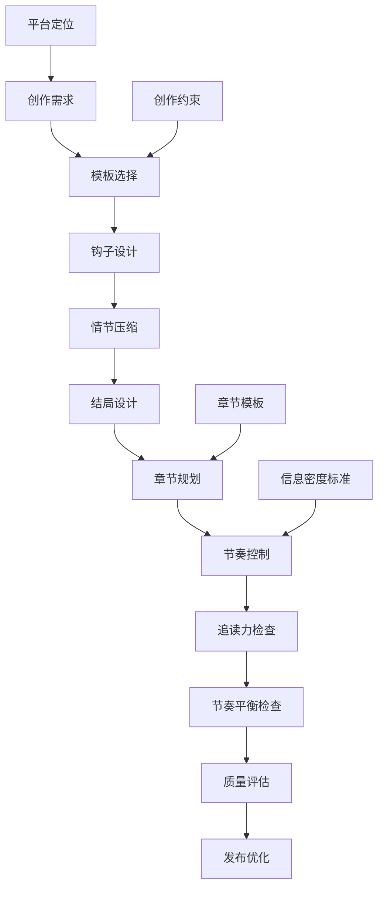
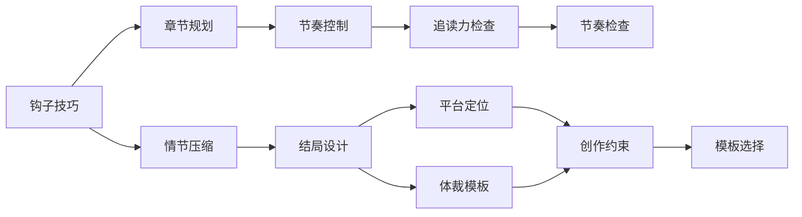

# 知乎短篇模板

<cite>
**本文档引用的文件**
- [hook-techniques.md](file://webnovel-writer/genres/zhihu-short/hook-techniques.md)
- [plot-compression.md](file://webnovel-writer/genres/zhihu-short/plot-compression.md)
- [ending-patterns.md](file://webnovel-writer/genres/zhihu-short/ending-patterns.md)
- [genre-templates.md](file://webnovel-writer/genres/zhihu-short/genre-templates.md)
- [知乎短篇.md](file://webnovel-writer/templates/genres/知乎短篇.md)
- [chapter-planning.md](file://webnovel-writer/skills/webnovel-plan/references/outlining/chapter-planning.md)
- [pacing-control.md](file://webnovel-writer/skills/webnovel-review/references/pacing-control.md)
- [reader-pull-checker.md](file://webnovel-writer/agents/reader-pull-checker.md)
- [pacing-checker.md](file://webnovel-writer/agents/pacing-checker.md)
- [market-positioning.md](file://webnovel-writer/skills/webnovel-init/references/creativity/market-positioning.md)
</cite>

## 目录
1. [简介](#简介)
2. [项目结构](#项目结构)
3. [核心组件](#核心组件)
4. [架构概览](#架构概览)
5. [详细组件分析](#详细组件分析)
6. [依赖关系分析](#依赖关系分析)
7. [性能考量](#性能考量)
8. [故障排除指南](#故障排除指南)
9. [结论](#结论)
10. [附录](#附录)

## 简介

本文件为知乎短篇题材模板的全面技术文档，基于WebNovel Writer项目的知乎短篇创作体系。该模板专注于3000-15000字的短篇小说创作，提供从开篇钩子到结局设计的完整创作流程，以及针对知乎平台特点的优化策略。

知乎短篇创作的核心理念是"短平快 + 强冲突 + 极致反转"，要求在前300字内确定生死线，通过精心设计的钩子技巧快速抓住读者注意力，运用情节压缩技术实现紧凑叙事，采用多样化的结局模式满足不同读者需求。

## 项目结构

该项目采用模块化设计，围绕知乎短篇创作形成了完整的知识体系：

**图表来源**
- [hook-techniques.md:1-152](file://webnovel-writer/genres/zhihu-short/hook-techniques.md#L1-L152)
- [plot-compression.md:1-208](file://webnovel-writer/genres/zhihu-short/plot-compression.md#L1-L208)
- [ending-patterns.md:1-218](file://webnovel-writer/genres/zhihu-short/ending-patterns.md#L1-L218)
- [genre-templates.md:1-225](file://webnovel-writer/genres/zhihu-short/genre-templates.md#L1-L225)

**章节来源**
- [hook-techniques.md:1-152](file://webnovel-writer/genres/zhihu-short/hook-techniques.md#L1-L152)
- [plot-compression.md:1-208](file://webnovel-writer/genres/zhihu-short/plot-compression.md#L1-L208)
- [ending-patterns.md:1-218](file://webnovel-writer/genres/zhihu-short/ending-patterns.md#L1-L218)
- [genre-templates.md:1-225](file://webnovel-writer/genres/zhihu-short/genre-templates.md#L1-L225)

## 核心组件

### 钩子技巧系统

钩子技巧是知乎短篇创作的生命线，要求在前300字内建立强烈的阅读动机。

**黄金300字法则**：
- 前50字：制造悬念或冲突
- 50-150字：建立人物处境  
- 150-300字：抛出核心矛盾

**十大钩子模板**：
1. 死亡开局 - 通过死亡视角制造强烈反差
2. 时间倒叙 - 用倒叙手法建立因果关系
3. 身份反转 - 突破读者预期的身份转换
4. 极端处境 - 在极端环境中展现人物性格
5. 对话开场 - 通过冲击性对话直接进入冲突
6. 重生/穿越 - 利用时空转换创造新可能性
7. 秘密揭露 - 揭示隐藏的真相
8. 数字冲击 - 用具体数字增强真实感
9. 仪式感场景 - 在重要场合制造戏剧性转折
10. 认知颠覆 - 推翻读者固有认知

**章节来源**
- [hook-techniques.md:9-20](file://webnovel-writer/genres/zhihu-short/hook-techniques.md#L9-L20)
- [hook-techniques.md:23-94](file://webnovel-writer/genres/zhihu-short/hook-techniques.md#L23-L94)

### 情节压缩技术

短篇小说的精髓在于删减的艺术，通过压缩技术实现信息密度最大化。

**压缩核心原则**：
- **减法思维**：每个情节都要问"是否必须删除"
- **压缩公式**：短篇 = 核心冲突 + 关键转折 + 情绪高潮
- **删除清单**：支线 + 过渡 + 重复 + 解释

**五大压缩技法**：
1. **时间跳跃法** - 将长篇铺垫压缩为简洁描述
2. **结果前置法** - 先给结果，用闪回补充原因
3. **对话代替叙述** - 用对话承载信息
4. **细节代替描写** - 用具体细节替代抽象描述
5. **留白暗示法** - 给读者思考空间

**章节来源**
- [plot-compression.md:7-19](file://webnovel-writer/genres/zhihu-short/plot-compression.md#L7-L19)
- [plot-compression.md:23-69](file://webnovel-writer/genres/zhihu-short/plot-compression.md#L23-L69)

### 结局模式设计

结局是决定作品口碑的关键环节，知乎平台要求结局具有强烈的情感冲击力。

**结局类型矩阵**：
| 类型 | 情绪 | 适用题材 | 读者反应 |
|------|------|---------|---------|
| 大反转HE | 惊喜 | 虐转甜、悬疑 | "没想到！" |
| 开放式 | 回味 | 文艺、悬疑 | "细思极恐" |
| 意料之中HE | 满足 | 甜文、爽文 | "太甜了！" |
| 虐心BE | 心痛 | 纯虐文 | "刀我！" |
| 反转BE | 震撼 | 悬疑、暗黑 | "卧槽！" |

**结局写作技巧**：
1. **情绪收尾法** - 用细节展示情感而非直接陈述
2. **呼应开篇法** - 与开头形成完美闭环
3. **金句收尾法** - 用精炼语言概括主题
4. **番外暗示法** - 为后续创作预留空间

**章节来源**
- [ending-patterns.md:7-16](file://webnovel-writer/genres/zhihu-short/ending-patterns.md#L7-L16)
- [ending-patterns.md:19-107](file://webnovel-writer/genres/zhihu-short/ending-patterns.md#L19-L107)

### 体裁模板系统

针对知乎平台热门题材提供标准化模板，确保创作效率和质量。

**经典体裁模板**：
1. **追妻火葬场** - 8000字模板，包含追妻名场面、虐心回忆、女主蜕变、真相揭露
2. **重生复仇** - 5000字模板，涵盖前世惨状、蝴蝶效应、打脸时刻、最终审判
3. **豪门真假千金** - 10000字模板，突出身份对比、被欺负、实力展示、真相揭露
4. **娱乐圈马甲** - 8000字模板，包含被嘲场景、马甲暗示、揭马甲高潮、打脸时刻
5. **契约婚姻** - 6000字模板，设计契约签订、破冰时刻、嫉妒桥段、真心暴露
6. **病娇偏执** - 5000字模板，关注病娇名场面、童年/过去、女主态度、关键选择
7. **先婚后爱** - 8000字模板，涵盖联姻原因、磨合、暧昧、确认

**章节来源**
- [genre-templates.md:7-31](file://webnovel-writer/genres/zhihu-short/genre-templates.md#L7-L31)
- [genre-templates.md:34-56](file://webnovel-writer/genres/zhihu-short/genre-templates.md#L34-L56)
- [genre-templates.md:60-84](file://webnovel-writer/genres/zhihu-short/genre-templates.md#L60-L84)

## 架构概览

整个知乎短篇创作系统采用"模板驱动 + 检查验证"的架构模式：

**图表来源**
- [chapter-planning.md:7-15](file://webnovel-writer/skills/webnovel-plan/references/outlining/chapter-planning.md#L7-L15)
- [pacing-control.md:12-34](file://webnovel-writer/skills/webnovel-review/references/pacing-control.md#L12-L34)
- [reader-pull-checker.md:66-105](file://webnovel-writer/agents/reader-pull-checker.md#L66-L105)

## 详细组件分析

### 钩子技巧深度解析

#### 钩子组合技

高级创作者可以运用钩子组合技术创造更强的冲击力：

**双重钩子示例**：
- 死亡 + 身份反转：在死亡背景下揭示身份真相
- 时间倒叙 + 秘密揭露：通过倒叙手法逐步揭示秘密

**三重钩子示例**：
- 极端处境 + 对话 + 反转：在极端环境中通过对话揭示反转

#### 钩子检验清单

| 检查项目 | 标准 | 重要性 |
|---------|------|--------|
| 前50字反常/悬念/冲突 | 必须具备 | 高 |
| 读者疑问产生 | "为什么"的问题 | 高 |
| 核心困境建立 | 明确人物目标 | 高 |
| 故事走向暗示 | 预示发展方向 | 中 |
| 继续阅读欲望 | 强烈吸引力 | 高 |

**章节来源**
- [hook-techniques.md:97-132](file://webnovel-writer/genres/zhihu-short/hook-techniques.md#L97-L132)

### 情节压缩技术详解

#### 压缩优先级矩阵

**必须保留**：
1. 核心冲突（故事存在的理由）
2. 主要转折（剧情推进的关键）
3. 情绪高潮（读者爽点/虐点）
4. 结局反转（故事的落点）

**优先删除**：
1. 次要人物的支线
2. 重复强调的信息
3. 过渡性场景
4. 背景解释说明
5. 心理活动的反复

**可以压缩**：
1. 时间跨度大的发展
2. 相似情节的重复
3. 环境氛围描写
4. 人物关系介绍

#### 信息传递技巧

**嵌入式背景**：在对话/行动中自然带出背景信息
**冰山式写作**：只写冰山一角，让读者脑补水下部分
**符号化表达**：用具体符号代替大段描写

**章节来源**
- [plot-compression.md:73-98](file://webnovel-writer/genres/zhihu-short/plot-compression.md#L73-L98)
- [plot-compression.md:145-175](file://webnovel-writer/genres/zhihu-short/plot-compression.md#L145-L175)

### 结局模式设计策略

#### 结局检查清单

**HE结局检查**：
- 是否解决了核心矛盾？
- 是否给了读者满足感？
- 是否有足够的甜度？
- 是否呼应了开篇？

**BE结局检查**：
- 悲剧是否有必然性？
- 是否给了读者情绪宣泄？
- 是否有回味的空间？
- 是否避免了"为虐而虐"？

**开放式结局检查**：
- 暗示是否足够清晰？
- 是否留下了讨论空间？
- 是否避免了"烂尾"感？

**章节来源**
- [ending-patterns.md:190-208](file://webnovel-writer/genres/zhihu-short/ending-patterns.md#L190-L208)

### 章节规划与节奏控制

#### 章节结构黄金比例

| 阶段 | 字数占比 | 内容重点 |
|------|----------|----------|
| 开篇钩子 | 5% | 抓住读者注意力 |
| 背景铺垫 | 15% | 快速带入情境 |
| 矛盾升级 | 40% | 核心内容展开 |
| 高潮反转 | 25% | 情感爆发时刻 |
| 结局收尾 | 15% | 余韵回味 |

#### 节奏加速技巧

**信息密度标准**：
- 每1000字至少推进1个实质性剧情点
- 实质性剧情点包括：新信息/线索/能力获得、人际关系变化、战力提升、剧情转折、伏笔埋下或回收

**快节奏 vs 慢节奏**：
- 短篇平台：每章至少1个小爽点，信息密度300-500字/点
- 传统小说：铺垫容忍度较高，节奏相对缓慢

**章节来源**
- [chapter-planning.md:17-23](file://webnovel-writer/skills/webnovel-plan/references/outlining/chapter-planning.md#L17-L23)
- [pacing-control.md:12-34](file://webnovel-writer/skills/webnovel-review/references/pacing-control.md#L12-L34)

### 追读力检查与质量控制

#### 钩子类型扩展

| 类型 | 标识 | 驱动力 | 强度等级 |
|------|------|--------|----------|
| 危机钩 | Crisis Hook | 危险逼近，读者担心 | strong/medium/weak |
| 悬念钩 | Mystery Hook | 信息缺口，读者好奇 | strong/medium/weak |
| 情绪钩 | Emotion Hook | 强情绪触发 | strong/medium/weak |
| 选择钩 | Choice Hook | 两难抉择 | strong/medium/weak |
| 渴望钩 | Desire Hook | 好事将至 | strong/medium/weak |

#### 微兑现检测

**微兑现类型**：
1. 信息兑现 - 揭示新信息/线索/真相
2. 关系兑现 - 关系推进/确认/变化
3. 能力兑现 - 能力提升/新技能展示
4. 资源兑现 - 获得物品/资源/财富
5. 认可兑现 - 获得认可/面子/地位
6. 情绪兑现 - 情绪释放/共鸣
7. 线索兑现 - 伏笔回收/推进

**章节来源**
- [reader-pull-checker.md:121-140](file://webnovel-writer/agents/reader-pull-checker.md#L121-L140)
- [reader-pull-checker.md:143-162](file://webnovel-writer/agents/reader-pull-checker.md#L143-L162)

## 依赖关系分析

**图表来源**
- [genre-templates.md:197-214](file://webnovel-writer/genres/zhihu-short/genre-templates.md#L197-L214)
- [pacing-checker.md:46-68](file://webnovel-writer/agents/pacing-checker.md#L46-L68)

### 组件耦合度分析

**高内聚低耦合**：
- 各模块功能明确，相互独立
- 通过统一的模板接口连接
- 检查验证模块独立运行

**潜在循环依赖**：
- 模板选择依赖平台定位
- 节奏控制依赖信息密度标准
- 追读力检查依赖钩子类型

**外部依赖**：
- 平台定位参考市场分析
- 创作约束来自平台规则
- 检查标准基于读者反馈

**章节来源**
- [market-positioning.md:100-154](file://webnovel-writer/skills/webnovel-init/references/creativity/market-positioning.md#L100-L154)

## 性能考量

### 创作效率优化

**模板复用率**：通过标准化模板减少重复创作时间
**检查自动化**：利用检查器自动识别质量问题
**迭代速度**：通过快速验证缩短创作周期

### 质量保证机制

**硬约束**：违反即必须修复，不可申诉
**软建议**：可覆盖但需承担债务
**评分体系**：85+通过，70-84警告，50-69条件通过

### 成本效益分析

**投入产出比**：模板化创作vs原创创作的成本对比
**维护成本**：检查器维护vs人工校对
**质量稳定性**：标准化vs个性化的影响

## 故障排除指南

### 常见问题诊断

**开篇失败**：
- 症状：读者弃读率高
- 原因：钩子强度不足或类型不当
- 解决：重新设计钩子或调整题材

**节奏问题**：
- 症状：信息密度不足或拖沓
- 原因：压缩技术运用不当
- 解决：应用压缩技法或调整节奏

**结局乏力**：
- 症状：读者评价一般
- 原因：结局模式选择不当
- 解决：重新设计结局或调整情感曲线

### 检查器使用指南

**硬约束违规**：
- 必须立即修复，不可跳过
- 违规类型包括：可读性底线、承诺违背、节奏灾难、冲突真空

**软建议处理**：
- 可通过Override Contract机制覆盖
- 需要提供合理的理由和补偿计划
- 会产生债务并累积利息

**章节来源**
- [reader-pull-checker.md:66-105](file://webnovel-writer/agents/reader-pull-checker.md#L66-L105)
- [pacing-checker.md:86-107](file://webnovel-writer/agents/pacing-checker.md#L86-L107)

## 结论

知乎短篇模板系统通过科学的创作方法论和严格的质量控制机制，为创作者提供了高效、稳定的创作路径。该系统的核心价值在于：

1. **标准化流程**：从钩子设计到结局收尾的完整流程
2. **质量保障**：多层次的检查验证机制
3. **平台适配**：针对知乎平台特点的优化策略
4. **效率提升**：模板化创作大幅提高生产效率

通过合理运用这些模板和检查机制，创作者可以在保证质量的前提下，快速产出符合平台要求的优质短篇作品。

## 附录

### 创作最佳实践

**模板选择指南**：
- 根据核心情绪选择合适模板
- 考虑目标字数范围
- 结合个人擅长题材

**内容填充技巧**：
- 套用标准化人设模板
- 设计关键场景和转折点
- 准备金句和经典台词

**优化改进方法**：
- 参考节奏控制标准
- 强化情感峰值设计
- 精打磨开篇和结局
- 优化信息密度

### 平台特性适配

**知乎平台特点**：
- 注重话题性和实用性
- 偏好情感共鸣和娱乐性
- 用户碎片化阅读习惯
- 强调内容质量和传播性

**创作策略调整**：
- 平衡话题性与深度
- 增强情感共鸣层次
- 优化阅读体验流畅性
- 提升内容传播效果

**章节来源**
- [market-positioning.md:127-154](file://webnovel-writer/skills/webnovel-init/references/creativity/market-positioning.md#L127-L154)
- [知乎短篇.md:101-135](file://webnovel-writer/templates/genres/知乎短篇.md#L101-L135)