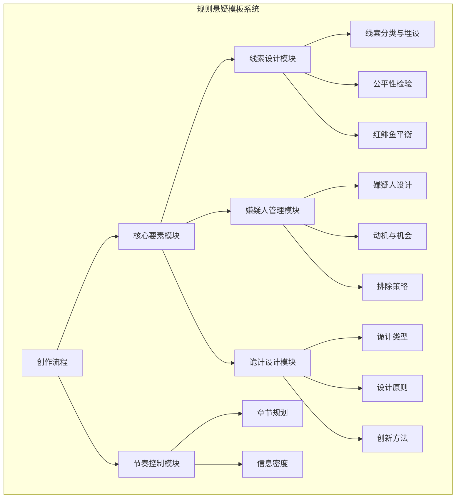
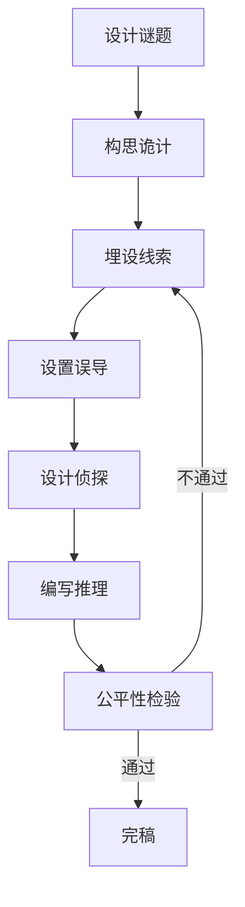
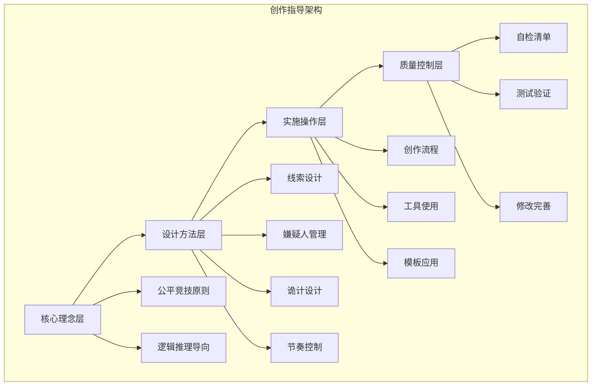
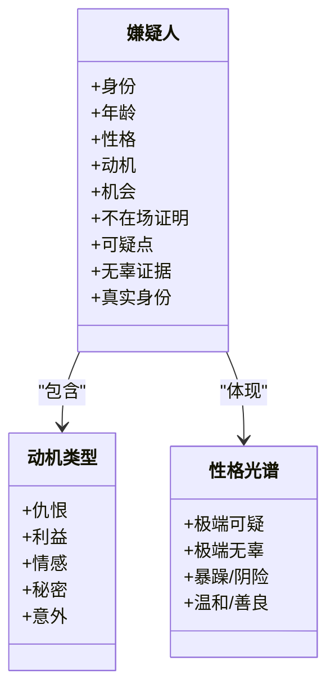
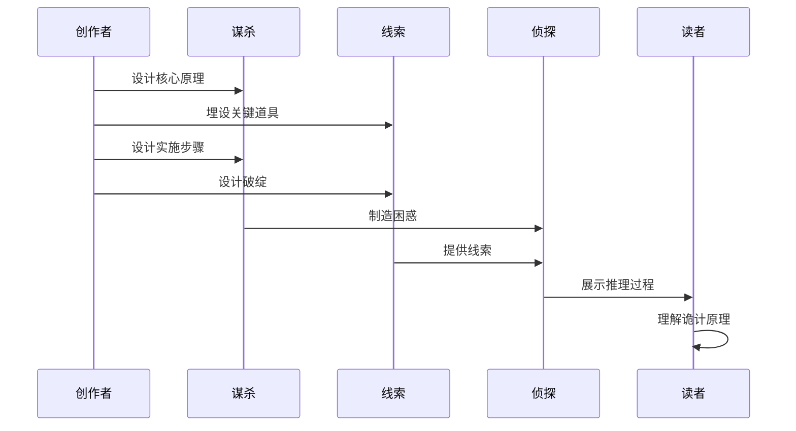
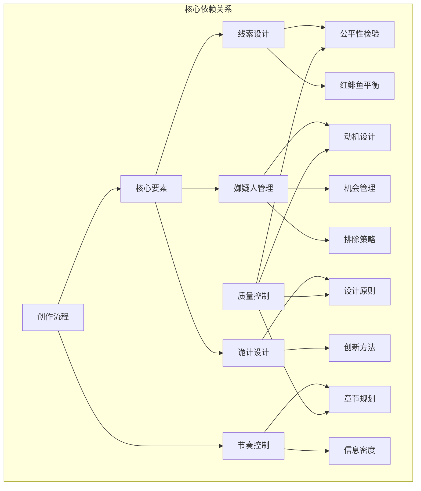

# 规则悬疑模板

<cite>
**本文档引用的文件**
- [clue-design.md](file://webnovel-writer/genres/rules-mystery/clue-design.md)
- [core-elements.md](file://webnovel-writer/genres/rules-mystery/core-elements.md)
- [suspect-management.md](file://webnovel-writer/genres/rules-mystery/suspect-management.md)
- [trick-design.md](file://webnovel-writer/genres/rules-mystery/trick-design.md)
- [规则怪谈.md](file://webnovel-writer/templates/genres/规则怪谈.md)
- [pacing-control.md](file://webnovel-writer/skills/webnovel-review/references/pacing-control.md)
- [chapter-planning.md](file://webnovel-writer/skills/webnovel-plan/references/outlining/chapter-planning.md)
- [writing_guidance_builder.py](file://webnovel-writer/scripts/data_modules/writing_guidance_builder.py)
- [genre-templates.md](file://webnovel-writer/genres/zhihu-short/genre-templates.md)
</cite>

## 目录
1. [简介](#简介)
2. [项目结构](#项目结构)
3. [核心组件](#核心组件)
4. [架构概览](#架构概览)
5. [详细组件分析](#详细组件分析)
6. [依赖分析](#依赖分析)
7. [性能考虑](#性能考虑)
8. [故障排除指南](#故障排除指南)
9. [结论](#结论)
10. [附录](#附录)

## 简介

规则悬疑模板是一个专为推理小说创作设计的系统化写作指导框架。该模板基于本格推理的核心原则，强调"公平竞技"和逻辑推理，为推理小说创作者提供了从线索设计到真相揭示的完整创作流程。

本模板的核心价值在于：
- **公平性原则**：确保读者与侦探拥有同等信息，真相必须可推导
- **逻辑严密性**：构建基于事实和推理的完整故事链
- **误导技巧**：通过红鲱鱼和反转增强故事张力
- **节奏控制**：平衡信息投放与紧张度调节

## 项目结构

该模板系统采用模块化设计，围绕规则悬疑这一核心主题构建了完整的创作指导体系：



**图表来源**
- [core-elements.md:229-239](file://webnovel-writer/genres/rules-mystery/core-elements.md#L229-L239)
- [clue-design.md:229-239](file://webnovel-writer/genres/rules-mystery/clue-design.md#L229-L239)

**章节来源**
- [core-elements.md:1-432](file://webnovel-writer/genres/rules-mystery/core-elements.md#L1-L432)
- [clue-design.md:1-525](file://webnovel-writer/genres/rules-mystery/clue-design.md#L1-L525)

## 核心组件

### 1. 公平线索设计系统

公平线索设计是规则悬疑的核心基石，要求线索必须同时满足可见性、可理解性和可推导性三个标准。

**三大标准详解**：
- **可见性**：线索必须在文中明确呈现，不能只存在于侦探脑中
- **可理解性**：线索的含义必须是读者能理解的，不能依赖专业知识
- **可推导性**：基于线索，读者应该能推导出（或接近）真相

**线索分类体系**：
- **指向性线索**：直接指向凶手或真相
- **排除性线索**：排除某些可能性，缩小范围
- **关联性线索**：连接两个看似无关的事件或人物
- **时间线索**：确定事件发生的时间顺序
- **反转线索**：推翻之前的推理，引发反转

**章节来源**
- [clue-design.md:9-22](file://webnovel-writer/genres/rules-mystery/clue-design.md#L9-L22)
- [clue-design.md:28-96](file://webnovel-writer/genres/rules-mystery/clue-design.md#L28-L96)

### 2. 本格推理核心要素

本格推理强调纯粹的逻辑推理和公平竞技，与社会派、冷硬派形成鲜明对比。

**四大支柱**：
- **公平性**：读者与侦探拥有相同的信息
- **逻辑性**：推理过程必须符合逻辑，不能靠直觉或巧合
- **可解性**：真相必须是读者**有可能**推理出来的
- **意外性**：真相既符合逻辑，又出人意料

**创作流程**：


**图表来源**
- [core-elements.md:229-239](file://webnovel-writer/genres/rules-mystery/core-elements.md#L229-L239)

**章节来源**
- [core-elements.md:39-121](file://webnovel-writer/genres/rules-mystery/core-elements.md#L39-L121)
- [core-elements.md:226-317](file://webnovel-writer/genres/rules-mystery/core-elements.md#L226-L317)

### 3. 嫌疑人管理系统

嫌疑人管理是控制推理难度和乐趣的关键技术，要求每个嫌疑人都要有动机、机会和性格。

**黄金数量法则**：
- 短篇（<5万字）：3-5人
- 中篇（5-15万字）：5-8人  
- 长篇（>15万字）：8-12人

**三要素模型**：
- **动机**：嫌疑人为什么要杀死被害者
- **机会**：嫌疑人是否有时间和条件实施犯罪
- **性格**：影响读者对其是否可疑的判断

**排除策略**：
- 逐一排除法
- 红鲱鱼误导法
- 最不可疑的人法

**章节来源**
- [suspect-management.md:22-42](file://webnovel-writer/genres/rules-mystery/suspect-management.md#L22-L42)
- [suspect-management.md:44-108](file://webnovel-writer/genres/rules-mystery/suspect-management.md#L44-L108)
- [suspect-management.md:155-209](file://webnovel-writer/genres/rules-mystery/suspect-management.md#L155-L209)

### 4. 诡计设计系统

好的诡计必须具备简单性、新颖性、合理性和公平性四个原则。

**诡计分类**：
- **密室诡计**：制造"密闭空间内杀人，凶手却消失"的不可能犯罪
- **不在场证明诡计**：让凶手在案发时看似不在现场
- **身份诡计**：隐藏凶手真实身份或制造混淆
- **凶器诡计**：隐藏或伪装凶器
- **心理诡计**：利用读者/侦探的思维定势误导推理

**设计原则**：
- **简单性**：核心原理必须简单，读者事后能理解
- **新颖性**：诡计要有创新，不能完全照搬经典
- **合理性**：诡计必须在现实中理论上可行
- **公平性**：读者能根据线索推理出诡计

**章节来源**
- [trick-design.md:21-100](file://webnovel-writer/genres/rules-mystery/trick-design.md#L21-L100)
- [trick-design.md:102-180](file://webnovel-writer/genres/rules-mystery/trick-design.md#L102-L180)
- [trick-design.md:268-325](file://webnovel-writer/genres/rules-mystery/trick-design.md#L268-L325)

## 架构概览

规则悬疑模板采用分层架构设计，从核心理念到具体实践形成了完整的创作指导体系：



**图表来源**
- [core-elements.md:3-11](file://webnovel-writer/genres/rules-mystery/core-elements.md#L3-L11)
- [clue-design.md:3-22](file://webnovel-writer/genres/rules-mystery/clue-design.md#L3-L22)

该架构确保了创作过程的系统性和完整性，为推理小说创作者提供了从概念到成品的全流程指导。

## 详细组件分析

### 线索设计组件深入分析

线索设计是规则悬疑的核心技术，需要遵循严格的埋设和呈现原则。

#### 线索埋设技巧矩阵

| 技巧类型 | 定义 | 关键要点 | 应用场景 |
|---------|------|---------|---------|
| 前置埋设 | 在案发前或侦探调查前提及关键物品或信息 | 自然不刻意，多次出现 | 密室杀人、毒杀案 |
| 伪装成背景 | 把关键线索藏在环境描写或日常对话中 | 读者第一次忽略，回看发现 | 密室密道、隐藏通道 |
| 多次提及 | 重要线索在文中出现2-3次，加深印象 | 每次角度不同，逐步揭示 | 时间线索、身份线索 |
| 对比呈现 | 通过对比，让读者注意到异常 | 矛盾信息突出 | 证言与证据对比 |
| 分散呈现 | 把完整线索拆成多个碎片，分散在不同章节 | 碎片单独不起眼，组合有意义 | 多重身份、复杂关系 |

#### 线索呈现的三层法

```mermaid
flowchart TD
A[线索呈现三层法] --> B[明线索]
A --> C[暗线索]
A --> D[隐线索]
B --> B1[明确告诉读者"这是线索"]
B --> B2[适合新手向作品]
B --> B3[直接推理效果]
C --> C1[不明确说明，但有经验读者能看出来]
C --> C2[给读者推理空间]
C --> C3[增加参与感]
D --> D1[极其隐蔽，只有回看时才能发现]
D --> D2[制造"恍然大悟"的惊喜感]
D --> D3[深度推理体验]
```

**图表来源**
- [clue-design.md:178-225](file://webnovel-writer/genres/rules-mystery/clue-design.md#L178-L225)

#### 公平性检验清单

公平性检验是确保线索设计质量的重要工具：

**检查维度**：
1. **线索呈现**：所有关键线索是否向读者呈现
2. **可理解性**：线索是否可理解（无需专业知识）
3. **足够性**：是否至少3条独立线索指向真相
4. **作者全知陷阱**：避免作者知道而默认读者也知道

**红鲱鱼平衡**：
- 真线索（指向真相）：60%
- 红鲱鱼（误导）：40%

**章节来源**
- [clue-design.md:229-340](file://webnovel-writer/genres/rules-mystery/clue-design.md#L229-L340)
- [clue-design.md:464-497](file://webnovel-writer/genres/rules-mystery/clue-design.md#L464-L497)

### 嫌疑人管理组件深入分析

嫌疑人管理是控制推理难度和读者体验的关键技术。

#### 嫌疑人设计模板



**图表来源**
- [suspect-management.md:113-138](file://webnovel-writer/genres/rules-mystery/suspect-management.md#L113-L138)
- [suspect-management.md:46-58](file://webnovel-writer/genres/rules-mystery/suspect-management.md#L46-L58)
- [suspect-management.md:88-105](file://webnovel-writer/genres/rules-mystery/suspect-management.md#L88-L105)

#### 嫌疑人排除策略

**逐一排除法流程**：
1. 列出所有嫌疑人
2. 侦探调查，发现部分人有完美不在场证明
3. 排除这些人
4. 剩余嫌疑人继续调查
5. 最终指向真凶

**红鲱鱼误导法**：
- 故意让某个无辜者看起来最可疑
- 误导读者的推理方向
- 增加故事的复杂性和趣味性

**最不可疑的人法**：
- 真凶往往是看起来最无辜的人
- 反套路设计，挑战读者预期
- 常见于经典作品如《暴风雪山庄》

**章节来源**
- [suspect-management.md:155-209](file://webnovel-writer/genres/rules-mystery/suspect-management.md#L155-L209)
- [suspect-management.md:331-392](file://webnovel-writer/genres/rules-mystery/suspect-management.md#L331-L392)

### 诡计设计组件深入分析

诡计设计是规则悬疑的核心创意元素，需要在巧妙性和可解性之间找到平衡。

#### 诡计设计流程



**图表来源**
- [trick-design.md:268-325](file://webnovel-writer/genres/rules-mystery/trick-design.md#L268-L325)

#### 经典诡计解析

**冰块密室**：
- **原理**：用冰块固定门栓，冰融化后门自动上锁
- **实施步骤**：1) 凶手杀人后用冰块顶住门栓；2) 凶手离开房间，从外面关门；3) 冰块融化，门栓自动落下
- **线索**：门下方水渍、房间温度略高、时间线疑点

**时间诡计**：
- **原理**：让死者看起来在凶手有不在场证明的时间死亡
- **常用方法**：调慢死者手表、提前杀人用冰块冷冻尸体、制造"死者还活着"的假象
- **线索**：尸体温度异常、手表时间矛盾、目击证言漏洞

**叙述性诡计**：
- **原理**：故事以第一人称叙述，但叙述者本身是凶手
- **实施技巧**：省略自己的犯罪行为、用暗示性语言误导、最后揭示身份
- **难度**：高，需要极高的叙事技巧

**章节来源**
- [trick-design.md:183-266](file://webnovel-writer/genres/rules-mystery/trick-design.md#L183-L266)
- [trick-design.md:268-325](file://webnovel-writer/genres/rules-mystery/trick-design.md#L268-L325)

### 节奏控制组件深入分析

节奏控制是确保读者持续关注和享受推理过程的关键技术。

#### 章节规划结构

**标准章节结构（3000字）**：
- **开头（300字）**：钩子，吸引读者继续看
- **发展（1500字）**：推进剧情，制造冲突  
- **高潮（1000字）**：爽点/反转/打脸
- **结尾（200字）**：悬念/钩子，引导订阅下一章

**章节类型分配**：
- **爽点章（70%）**：让读者爽，提升订阅
- **过渡章（20%）**：承上启下，铺垫伏笔
- **刀子章（10%）**：制造虐点，引发情绪波动

#### 信息密度标准

**核心指标**：每1000字至少推进1个实质性剧情点

**实质性剧情点定义**：
- 主角获得新信息/线索/能力
- 人际关系变化（好感度±10、仇恨度±10）
- 战力提升/突破/学会新招式
- 剧情转折（新冲突/新目标/新危机）
- 伏笔埋下或回收

**章节来源**
- [chapter-planning.md:7-105](file://webnovel-writer/skills/webnovel-plan/references/outlining/chapter-planning.md#L7-L105)
- [pacing-control.md:12-34](file://webnovel-writer/skills/webnovel-review/references/pacing-control.md#L12-L34)

## 依赖分析

规则悬疑模板系统内部存在紧密的依赖关系，形成了完整的创作指导链条：



**图表来源**
- [core-elements.md:226-317](file://webnovel-writer/genres/rules-mystery/core-elements.md#L226-L317)
- [clue-design.md:229-340](file://webnovel-writer/genres/rules-mystery/clue-design.md#L229-L340)
- [suspect-management.md:155-209](file://webnovel-writer/genres/rules-mystery/suspect-management.md#L155-L209)
- [trick-design.md:268-325](file://webnovel-writer/genres/rules-mystery/trick-design.md#L268-L325)

**章节来源**
- [writing_guidance_builder.py:14-78](file://webnovel-writer/scripts/data_modules/writing_guidance_builder.py#L14-L78)
- [chapter-planning.md:197-296](file://webnovel-writer/skills/webnovel-plan/references/outlining/chapter-planning.md#L197-L296)

## 性能考虑

在规则悬疑创作中，性能主要体现在创作效率和质量控制两个方面：

### 创作效率优化

**模板化工作流**：
- 使用标准化的创作模板减少重复劳动
- 建立检查清单确保关键要素不遗漏
- 制定工具表格提高设计效率

**质量控制机制**：
- 多轮自检确保逻辑严密性
- 测试读者验证公平性
- 同行评审发现潜在问题

### 技术实现要点

**数据管理**：
- 建立线索登记表跟踪关键信息
- 制作嫌疑人追踪表管理复杂关系
- 设计诡计检查表确保可解性

**协作优化**：
- 明确各组件职责分工
- 建立反馈循环机制
- 标准化输出格式

## 故障排除指南

### 常见问题及解决方案

**问题1：线索设计过于明显**
- **症状**：读者轻易猜到凶手
- **原因**：动机设计过于直接，缺乏隐蔽性
- **解决方案**：增加动机层次，设计假动机，使用红鲱鱼

**问题2：线索设计过于隐蔽**
- **症状**：读者无法推理出真相
- **原因**：线索埋设不当，缺乏必要的提示
- **解决方案**：采用三层线索法，增加明线索比例

**问题3：诡计设计不合理**
- **症状**：读者认为诡计过于复杂或不合理
- **原因**：违背物理定律或逻辑常理
- **解决方案**：遵循简单性原则，确保物理可行性

**问题4：节奏控制不当**
- **症状**：读者失去兴趣或感到拖沓
- **原因**：信息密度不达标或章节结构不合理
- **解决方案**：遵循信息密度标准，优化章节结构

**章节来源**
- [clue-design.md:415-462](file://webnovel-writer/genres/rules-mystery/clue-design.md#L415-L462)
- [trick-design.md:327-397](file://webnovel-writer/genres/rules-mystery/trick-design.md#L327-L397)
- [pacing-control.md:123-130](file://webnovel-writer/skills/webnovel-review/references/pacing-control.md#L123-L130)

## 结论

规则悬疑模板为推理小说创作提供了一个系统化、可操作的指导框架。通过将复杂的创作过程分解为核心要素、线索设计、嫌疑人管理和诡计设计四大模块，该模板确保了创作的专业性和完整性。

**核心价值总结**：
1. **理论基础扎实**：基于本格推理的经典原则，确保作品的逻辑性和可解性
2. **实践性强**：提供具体的工具和方法，便于创作者直接应用
3. **系统完整**：从概念设计到成品质量控制形成完整流程
4. **可扩展性好**：模块化设计允许根据需要调整和扩展

**创作建议**：
- 严格遵循公平性原则，确保读者与侦探信息对等
- 注重逻辑严密性，避免任何可能的漏洞
- 合理运用误导技巧，增加故事的复杂性和趣味性
- 精心控制节奏，保持读者的持续关注和参与感

通过遵循本模板的指导原则和方法，推理小说创作者可以构建出既符合本格推理精神，又能满足现代读者需求的优质作品。

## 附录

### 经典案例分析

**《东方快车谋杀案》**：
- **线索设计**：12个嫌疑人都有完美不在场证明，制造"所有人都是凶手"的意外性
- **嫌疑人管理**：12人嫌疑人，每人有合理动机，通过排除法逐步缩小范围
- **诡计设计**：集体作案的密室诡计，利用乘客身份的多重性

**《无人生还》**：
- **线索设计**：童谣暗示杀人顺序，逐步揭示死亡规律
- **嫌疑人管理**：10人嫌疑人，通过逐一排除法制造紧张感
- **诡计设计**：法官假死的叙述性诡计，挑战读者的推理习惯

**《暴风雪山庄》**：
- **线索设计**：封闭空间内的多重线索，营造密室氛围
- **嫌疑人管理**：7人嫌疑人，平衡推理难度和可解性
- **诡计设计**：被害者伪装成凶手的心理诡计

### 创作工具箱

**线索设计工具**：
- 线索登记表
- 公平性检查清单
- 测试读者验证法

**嫌疑人管理工具**：
- 嫌疑人追踪表
- 时间线对照表
- 嫌疑度评分表

**诡计设计工具**：
- 诡计设计模板
- 可行性检验表
- 创新方法库

**节奏控制工具**：
- 章节规划表
- 信息密度计算器
- 节奏分析工具