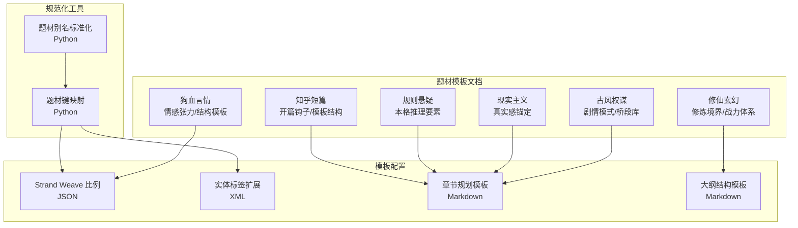
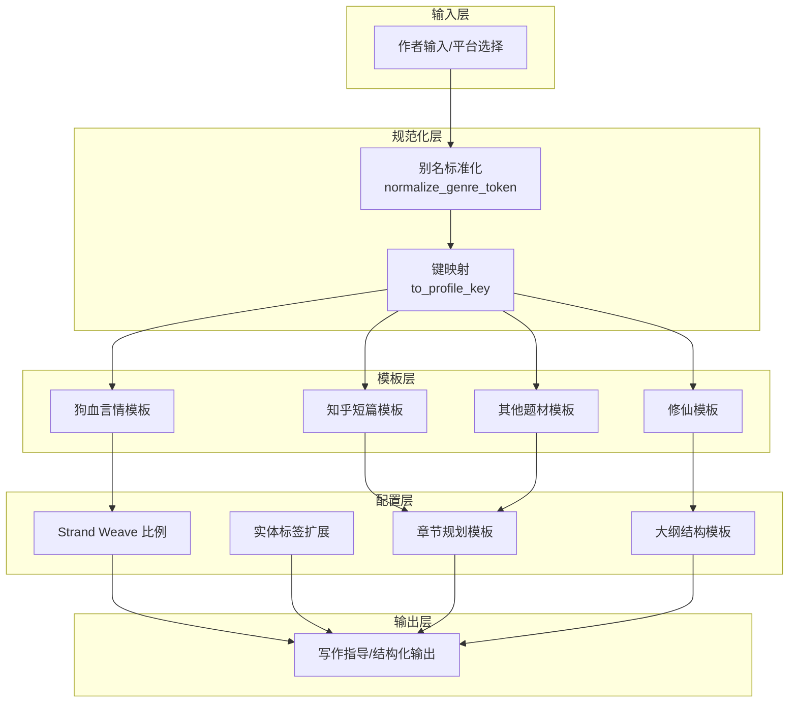
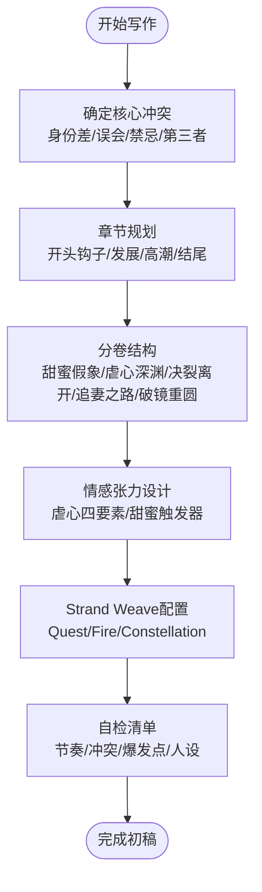
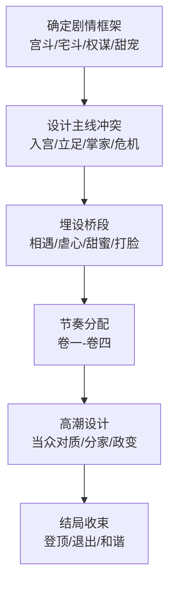
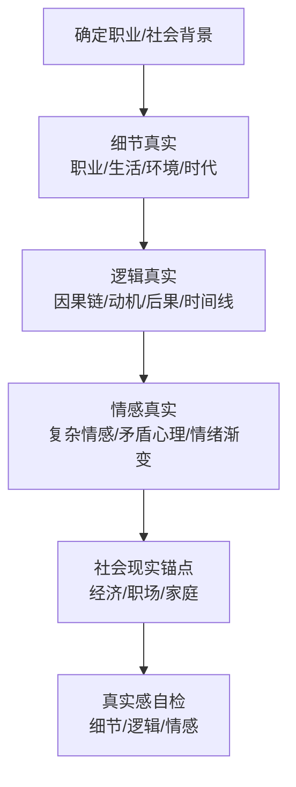
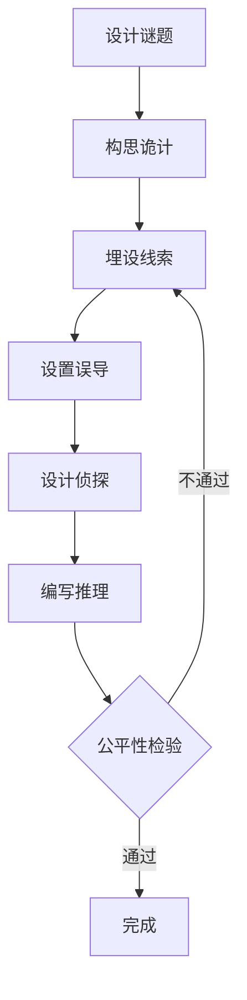
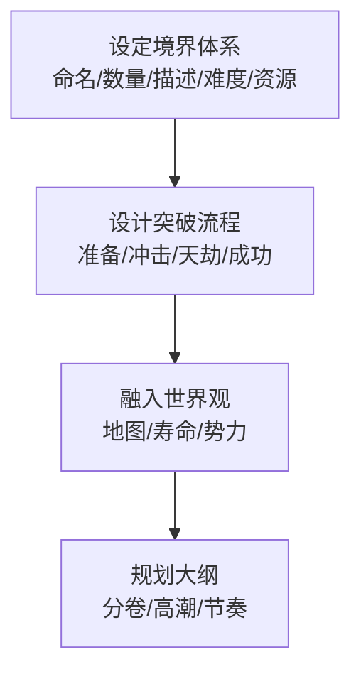
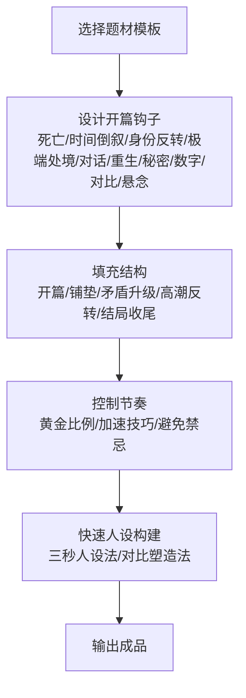

# 题材模板概览

<cite>
**本文档引用的文件**
- [genres.md](file://docs/genres.md)
- [golden-finger-templates.md](file://webnovel-writer/templates/golden-finger-templates.md)
- [dog-blood-romance/emotional-tension.md](file://webnovel-writer/genres/dog-blood-romance/emotional-tension.md)
- [period-drama/plot-patterns.md](file://webnovel-writer/genres/period-drama/plot-patterns.md)
- [realistic/reality-anchoring.md](file://webnovel-writer/genres/realistic/reality-anchoring.md)
- [rules-mystery/core-elements.md](file://webnovel-writer/genres/rules-mystery/core-elements.md)
- [xuanhuan/cultivation-levels.md](file://webnovel-writer/genres/xuanhuan/cultivation-levels.md)
- [zhihu-short/genre-templates.md](file://webnovel-writer/genres/zhihu-short/genre-templates.md)
- [templates/genres/狗血言情.md](file://webnovel-writer/templates/genres/狗血言情.md)
- [templates/genres/修仙.md](file://webnovel-writer/templates/genres/修仙.md)
- [templates/genres/知乎短篇.md](file://webnovel-writer/templates/genres/知乎短篇.md)
- [scripts/data_modules/genre_aliases.py](file://webnovel-writer/scripts/data_modules/genre_aliases.py)
- [skills/webnovel-plan/references/outlining/chapter-planning.md](file://webnovel-writer/skills/webnovel-plan/references/outlining/chapter-planning.md)
- [skills/webnovel-plan/references/outlining/outline-structure.md](file://webnovel-writer/skills/webnovel-plan/references/outlining/outline-structure.md)
</cite>

## 目录
1. [简介](#简介)
2. [项目结构](#项目结构)
3. [核心组件](#核心组件)
4. [架构总览](#架构总览)
5. [详细组件分析](#详细组件分析)
6. [依赖分析](#依赖分析)
7. [性能考虑](#性能考虑)
8. [故障排查指南](#故障排查指南)
9. [结论](#结论)
10. [附录](#附录)

## 简介
本文件面向Webnovel Writer的题材模板系统，提供对6种网络小说题材的整体架构与设计理念的系统化说明，涵盖狗血言情、古风权谋、现实主义、规则悬疑、修仙玄幻、知乎短篇。文档不仅解释每种题材的核心特征、适用场景与创作价值，还阐述模板系统的设计理念、技术实现与扩展机制，提供题材选择指南、使用流程、配置方法与最佳实践，并为开发者提供模板架构的技术细节与定制指南。

## 项目结构
题材模板系统围绕“模板文件 + 配置映射 + 规范化工具”的结构组织，核心由以下部分构成：
- 文档化题材模板：各题材的写作规范、结构模板、节奏控制与技巧说明
- 模板化配置：JSON/XML实体标签、Strand Weave比例、章节规划模板
- 规范化与映射：输入别名标准化、题材到配置键的映射
- 写作流程规范：章节规划、大纲结构、节奏控制与自检清单

**图表来源**
- [dog-blood-romance/emotional-tension.md:1-579](file://webnovel-writer/genres/dog-blood-romance/emotional-tension.md#L1-L579)
- [period-drama/plot-patterns.md:1-277](file://webnovel-writer/genres/period-drama/plot-patterns.md#L1-L277)
- [realistic/reality-anchoring.md:1-230](file://webnovel-writer/genres/realistic/reality-anchoring.md#L1-L230)
- [rules-mystery/core-elements.md:1-432](file://webnovel-writer/genres/rules-mystery/core-elements.md#L1-L432)
- [xuanhuan/cultivation-levels.md:1-477](file://webnovel-writer/genres/xuanhuan/cultivation-levels.md#L1-L477)
- [zhihu-short/genre-templates.md:1-225](file://webnovel-writer/genres/zhihu-short/genre-templates.md#L1-L225)
- [templates/genres/狗血言情.md:1-192](file://webnovel-writer/templates/genres/狗血言情.md#L1-L192)
- [templates/genres/修仙.md:1-108](file://webnovel-writer/templates/genres/修仙.md#L1-L108)
- [templates/genres/知乎短篇.md:1-244](file://webnovel-writer/templates/genres/知乎短篇.md#L1-L244)
- [scripts/data_modules/genre_aliases.py:1-67](file://webnovel-writer/scripts/data_modules/genre_aliases.py#L1-L67)
- [skills/webnovel-plan/references/outlining/chapter-planning.md:1-296](file://webnovel-writer/skills/webnovel-plan/references/outlining/chapter-planning.md#L1-L296)
- [skills/webnovel-plan/references/outlining/outline-structure.md:1-214](file://webnovel-writer/skills/webnovel-plan/references/outlining/outline-structure.md#L1-L214)

**章节来源**
- [genres.md:1-48](file://docs/genres.md#L1-L48)
- [scripts/data_modules/genre_aliases.py:1-67](file://webnovel-writer/scripts/data_modules/genre_aliases.py#L1-L67)

## 核心组件
- 题材模板文档：提供各题材的写作规范、结构模板、节奏控制与技巧说明
- 模板化配置：包含Strand Weave比例、实体标签扩展、章节规划模板、大纲结构模板
- 规范化与映射：输入别名标准化、题材到配置键的映射
- 写作流程规范：章节规划、大纲结构、节奏控制与自检清单

**章节来源**
- [templates/genres/狗血言情.md:1-192](file://webnovel-writer/templates/genres/狗血言情.md#L1-L192)
- [templates/genres/修仙.md:1-108](file://webnovel-writer/templates/genres/修仙.md#L1-L108)
- [templates/genres/知乎短篇.md:1-244](file://webnovel-writer/templates/genres/知乎短篇.md#L1-L244)
- [scripts/data_modules/genre_aliases.py:1-67](file://webnovel-writer/scripts/data_modules/genre_aliases.py#L1-L67)
- [skills/webnovel-plan/references/outlining/chapter-planning.md:1-296](file://webnovel-writer/skills/webnovel-plan/references/outlining/chapter-planning.md#L1-L296)
- [skills/webnovel-plan/references/outlining/outline-structure.md:1-214](file://webnovel-writer/skills/webnovel-plan/references/outlining/outline-structure.md#L1-L214)

## 架构总览
题材模板系统采用“文档驱动 + 配置驱动 + 规范化工具”的架构，确保：
- 文档化：各题材的写作规范与模板以Markdown形式沉淀，便于查阅与协作
- 配置化：通过JSON/XML配置实现主题材的结构化与可扩展
- 规范化：通过别名标准化与键映射，保证输入多样性与配置一致性

**图表来源**
- [scripts/data_modules/genre_aliases.py:53-66](file://webnovel-writer/scripts/data_modules/genre_aliases.py#L53-L66)
- [templates/genres/狗血言情.md:161-176](file://webnovel-writer/templates/genres/狗血言情.md#L161-L176)
- [templates/genres/修仙.md:1-108](file://webnovel-writer/templates/genres/修仙.md#L1-L108)
- [templates/genres/知乎短篇.md:1-244](file://webnovel-writer/templates/genres/知乎短篇.md#L1-L244)
- [skills/webnovel-plan/references/outlining/chapter-planning.md:1-296](file://webnovel-writer/skills/webnovel-plan/references/outlining/chapter-planning.md#L1-L296)
- [skills/webnovel-plan/references/outlining/outline-structure.md:1-214](file://webnovel-writer/skills/webnovel-plan/references/outlining/outline-structure.md#L1-L214)

## 详细组件分析

### 狗血言情：情感张力与结构模板
- 核心特征：情感冲突、虐恋情深、追妻火葬场；通过身份差、误会、禁忌、第三者等张力源制造甜虐交替
- 适用场景：言情类长篇、短篇情感文、追妻火葬场、重生复仇等
- 创作价值：高粘性、强情绪共鸣、读者追文动力强
- 结构模板：提供“卷一-卷五”阶段划分与章节节奏控制，强调甜虐比例与追妻阶段长度
- 情感张力设计：提供张力强度分级、节奏控制公式、对话技巧与自检清单
- 配置方法：Strand Weave比例中“Fire线”占比≥50%，甜虐比例按定位调整

**图表来源**
- [dog-blood-romance/emotional-tension.md:165-277](file://webnovel-writer/genres/dog-blood-romance/emotional-tension.md#L165-L277)
- [templates/genres/狗血言情.md:72-102](file://webnovel-writer/templates/genres/狗血言情.md#L72-L102)
- [templates/genres/狗血言情.md:161-176](file://webnovel-writer/templates/genres/狗血言情.md#L161-L176)

**章节来源**
- [dog-blood-romance/emotional-tension.md:1-579](file://webnovel-writer/genres/dog-blood-romance/emotional-tension.md#L1-L579)
- [templates/genres/狗血言情.md:1-192](file://webnovel-writer/templates/genres/狗血言情.md#L1-L192)

### 古风权谋：剧情模式与桥段库
- 核心特征：宫斗、宅斗、权谋、甜宠等经典框架；强调人物关系、家族势力与政治博弈
- 适用场景：古言长篇、宫斗文、宅斗文、权谋文
- 创作价值：复杂人物关系、权谋智斗、家族兴衰
- 剧情模式：提供宫斗、宅斗、权谋、甜宠的详细框架与桥段库
- 节奏控制：按卷划分节奏，强调高潮与伏笔回收
- 避免问题：金手指过多、反派智商不在线、节奏拖沓、为虐而虐、结局仓促

**图表来源**
- [period-drama/plot-patterns.md:7-66](file://webnovel-writer/genres/period-drama/plot-patterns.md#L7-L66)
- [period-drama/plot-patterns.md:162-195](file://webnovel-writer/genres/period-drama/plot-patterns.md#L162-L195)

**章节来源**
- [period-drama/plot-patterns.md:1-277](file://webnovel-writer/genres/period-drama/plot-patterns.md#L1-L277)

### 现实主义：真实感锚定与社会现实
- 核心特征：真实感三层架构（细节真实/逻辑真实/情感真实）
- 适用场景：职场、家庭、社会议题类现实题材
- 创作价值：读者代入感强、社会共鸣度高
- 技巧要点：职业细节、生活细节、环境细节、时代细节；因果链完整、动机合理、后果真实
- 社会锚点：经济压力、职场现实、家庭现实；避免失真检查清单

**图表来源**
- [realistic/reality-anchoring.md:7-111](file://webnovel-writer/genres/realistic/reality-anchoring.md#L7-L111)
- [realistic/reality-anchoring.md:161-189](file://webnovel-writer/genres/realistic/reality-anchoring.md#L161-L189)

**章节来源**
- [realistic/reality-anchoring.md:1-230](file://webnovel-writer/genres/realistic/reality-anchoring.md#L1-L230)

### 规则悬疑：本格推理核心要素
- 核心特征：公平竞技、线索公平、逻辑推理、可解性与意外性
- 适用场景：本格推理、密室/诡计、公平竞技类悬疑
- 创作价值：智力游戏体验、读者推理参与感
- 核心要素：谜题、线索、红鲱鱼、侦探、真相揭示；创作流程与自检清单
- 常见陷阱：信息不对等、逻辑跳跃、过度依赖巧合、真相过于复杂

**图表来源**
- [rules-mystery/core-elements.md:226-240](file://webnovel-writer/genres/rules-mystery/core-elements.md#L226-L240)

**章节来源**
- [rules-mystery/core-elements.md:1-432](file://webnovel-writer/genres/rules-mystery/core-elements.md#L1-L432)

### 修仙玄幻：修炼境界与战力体系
- 核心特征：修炼境界、突破难度、资源需求、战力倍增
- 适用场景：修仙/玄幻长篇、系统流、无敌流、家族流
- 创作价值：成长曲线清晰、升级爽点强、世界观宏大
- 境界设定：命名、数量、描述、突破难度、资源需求；与战力、地图、寿命、势力融合
- 大纲结构：按卷划分（宗门风云/血色试炼/海外/界域战争）

**图表来源**
- [xuanhuan/cultivation-levels.md:7-66](file://webnovel-writer/genres/xuanhuan/cultivation-levels.md#L7-L66)
- [xuanhuan/cultivation-levels.md:208-242](file://webnovel-writer/genres/xuanhuan/cultivation-levels.md#L208-L242)

**章节来源**
- [xuanhuan/cultivation-levels.md:1-477](file://webnovel-writer/genres/xuanhuan/cultivation-levels.md#L1-L477)
- [templates/genres/修仙.md:1-108](file://webnovel-writer/templates/genres/修仙.md#L1-L108)

### 知乎短篇：开篇钩子与模板结构
- 核心特征：短平快、强冲突、极致反转；黄金300字法则
- 适用场景：知乎/微信短篇、微短篇、标准短篇、长短篇
- 创作价值：快速抓人、情绪爆发、高完读率
- 模板结构：追妻火葬场、重生复仇、豪门打脸、娱乐圈马甲、契约婚姻、病娇偏执、先婚后爱等
- 节奏控制：字数分配黄金比例、节奏加速技巧、禁忌避免

**图表来源**
- [zhihu-short/genre-templates.md:101-135](file://webnovel-writer/genres/zhihu-short/genre-templates.md#L101-L135)
- [zhihu-short/genre-templates.md:170-192](file://webnovel-writer/genres/zhihu-short/genre-templates.md#L170-L192)

**章节来源**
- [zhihu-short/genre-templates.md:1-225](file://webnovel-writer/genres/zhihu-short/genre-templates.md#L1-L225)
- [templates/genres/知乎短篇.md:1-244](file://webnovel-writer/templates/genres/知乎短篇.md#L1-L244)

## 依赖分析
- 输入别名标准化与键映射：通过别名标准化与键映射，将多样化的输入统一到配置键，确保模板选择的一致性
- 模板依赖：各题材模板依赖章节规划与大纲结构规范，确保写作流程的连贯性
- 配置依赖：Strand Weave比例与实体标签扩展依赖模板选择，形成结构化输出

**图表来源**
- [scripts/data_modules/genre_aliases.py:53-66](file://webnovel-writer/scripts/data_modules/genre_aliases.py#L53-L66)
- [templates/genres/狗血言情.md:161-176](file://webnovel-writer/templates/genres/狗血言情.md#L161-L176)
- [templates/genres/修仙.md:1-108](file://webnovel-writer/templates/genres/修仙.md#L1-L108)
- [templates/genres/知乎短篇.md:1-244](file://webnovel-writer/templates/genres/知乎短篇.md#L1-L244)

**章节来源**
- [scripts/data_modules/genre_aliases.py:1-67](file://webnovel-writer/scripts/data_modules/genre_aliases.py#L1-L67)

## 性能考虑
- 模板检索效率：通过键映射减少歧义，提升模板选择效率
- 写作流程优化：章节规划与大纲结构模板降低写作成本，提升产出稳定性
- 自检与迭代：自检清单与常见问题解决机制减少返工，提升整体效率

## 故障排查指南
- 题材选择错误：检查别名标准化与键映射，确保输入与配置一致
- 模板不适用：核对模板与题材匹配度，必要时调整结构或选择复合题材
- 写作节奏问题：使用章节规划与大纲结构模板，调整节奏与高潮分布
- 真实感不足：参考现实主义真实感锚定技巧，加强细节、逻辑与情感的真实性

**章节来源**
- [scripts/data_modules/genre_aliases.py:1-67](file://webnovel-writer/scripts/data_modules/genre_aliases.py#L1-L67)
- [skills/webnovel-plan/references/outlining/chapter-planning.md:260-282](file://webnovel-writer/skills/webnovel-plan/references/outlining/chapter-planning.md#L260-L282)
- [realistic/reality-anchoring.md:192-211](file://webnovel-writer/genres/realistic/reality-anchoring.md#L192-L211)

## 结论
Webnovel Writer的题材模板系统以“文档驱动 + 配置驱动 + 规范化工具”为核心，覆盖6种主流网络小说题材，提供从结构模板、节奏控制到实体标签扩展的完整创作支持。通过别名标准化与键映射，系统确保输入多样性与配置一致性；通过章节规划与大纲结构模板，系统保障写作流程的稳定与高效。开发者可基于现有模板快速扩展新题材，实现模板架构的可持续演进。

## 附录
- 题材选择指南：根据作品类型与目标受众选择合适模板，参考各题材适用场景与创作价值
- 使用流程：输入别名 → 标准化 → 键映射 → 选择模板 → 应用配置 → 写作执行 → 自检迭代
- 配置方法：Strand Weave比例、实体标签扩展、章节规划模板、大纲结构模板
- 最佳实践：遵循黄金300字法则、甜虐交替、节奏控制、真实感锚定、公平竞技原则
- 开发者定制：基于现有模板扩展新题材，遵循命名规范、结构模板与自检清单