# 题材模板系统

<cite>
**本文档引用的文件**
- [genres.md](file://docs/genres.md)
- [golden-finger-templates.md](file://webnovel-writer/templates/golden-finger-templates.md)
- [emotional-tension.md](file://webnovel-writer/genres/dog-blood-romance/emotional-tension.md)
- [romance-tropes.md](file://webnovel-writer/genres/dog-blood-romance/romance-tropes.md)
- [sweet-moments.md](file://webnovel-writer/genres/dog-blood-romance/sweet-moments.md)
- [plot-patterns.md](file://webnovel-writer/genres/period-drama/plot-patterns.md)
- [historical-setting.md](file://webnovel-writer/genres/period-drama/historical-setting.md)
- [character-design.md](file://webnovel-writer/genres/period-drama/character-design.md)
- [core-elements.md](file://webnovel-writer/genres/rules-mystery/core-elements.md)
- [clue-design.md](file://webnovel-writer/genres/rules-mystery/clue-design.md)
- [suspect-management.md](file://webnovel-writer/genres/rules-mystery/suspect-management.md)
- [trick-design.md](file://webnovel-writer/genres/rules-mystery/trick-design.md)
- [cultivation-levels.md](file://webnovel-writer/genres/xuanhuan/cultivation-levels.md)
- [xuanhuan-plot-patterns.md](file://webnovel-writer/genres/xuanhuan/xuanhuan-plot-patterns.md)
- [genre-templates.md](file://webnovel-writer/genres/zhihu-short/genre-templates.md)
</cite>

## 目录
1. [简介](#简介)
2. [项目结构](#项目结构)
3. [核心组件](#核心组件)
4. [架构概览](#架构概览)
5. [详细组件分析](#详细组件分析)
6. [依赖分析](#依赖分析)
7. [性能考虑](#性能考虑)
8. [故障排除指南](#故障排除指南)
9. [结论](#结论)
10. [附录](#附录)

## 简介

Webnovel Writer的题材模板系统是一个全面的网络小说创作支持框架，内置37+种题材模板，涵盖玄幻修仙、都市现代、言情、规则怪谈等多个类别。该系统通过标准化的模板架构、创作规范和使用指南，为创作者提供从概念设计到成品发布的完整支持。

系统的核心特色包括：
- **多维度题材覆盖**：支持单题材与复合题材创作
- **标准化模板体系**：提供可复用的创作框架
- **智能金手指设计**：系统化的外挂设定生成
- **AI代理集成**：与Claude AI代理的无缝协作
- **创作流程优化**：从灵感到成品的完整支持

## 项目结构

题材模板系统采用模块化架构，按照题材类型进行组织，每个题材都有完整的模板体系：

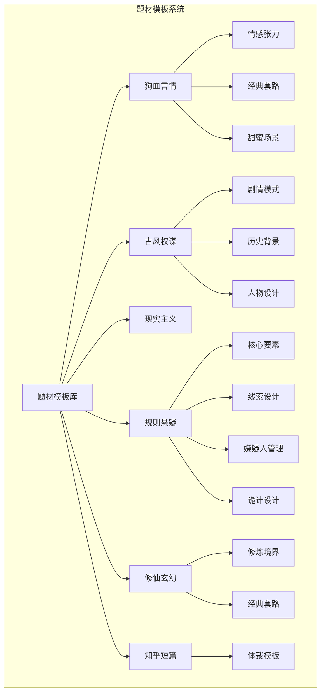

**图表来源**
- [genres.md:1-48](file://docs/genres.md#L1-L48)
- [emotional-tension.md:1-579](file://webnovel-writer/genres/dog-blood-romance/emotional-tension.md#L1-L579)
- [plot-patterns.md:1-277](file://webnovel-writer/genres/period-drama/plot-patterns.md#L1-L277)
- [core-elements.md:1-432](file://webnovel-writer/genres/rules-mystery/core-elements.md#L1-L432)
- [cultivation-levels.md:1-477](file://webnovel-writer/genres/xuanhuan/cultivation-levels.md#L1-L477)
- [genre-templates.md:1-225](file://webnovel-writer/genres/zhihu-short/genre-templates.md#L1-L225)

**章节来源**
- [genres.md:1-48](file://docs/genres.md#L1-L48)

## 核心组件

### 题材模板架构

系统采用"核心要素 + 创作规范 + 使用指南"的三层架构：

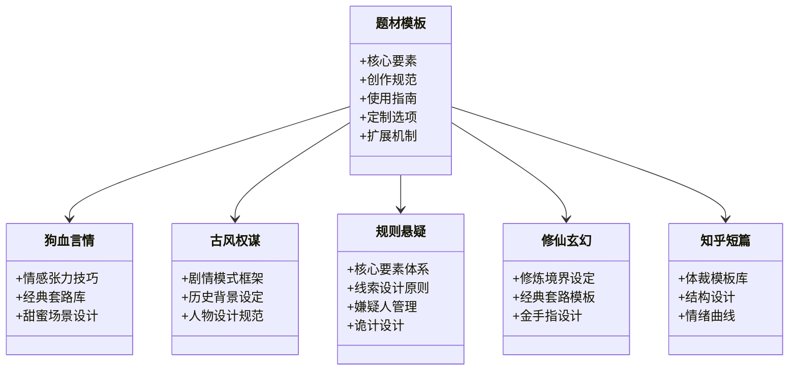

**图表来源**
- [emotional-tension.md:1-579](file://webnovel-writer/genres/dog-blood-romance/emotional-tension.md#L1-L579)
- [plot-patterns.md:1-277](file://webnovel-writer/genres/period-drama/plot-patterns.md#L1-L277)
- [core-elements.md:1-432](file://webnovel-writer/genres/rules-mystery/core-elements.md#L1-L432)
- [cultivation-levels.md:1-477](file://webnovel-writer/genres/xuanhuan/cultivation-levels.md#L1-L477)
- [genre-templates.md:1-225](file://webnovel-writer/genres/zhihu-short/genre-templates.md#L1-L225)

### 金手指设计系统

系统提供完整的金手指设计框架，确保外挂设定的合理性、可视化和爽点输出能力：

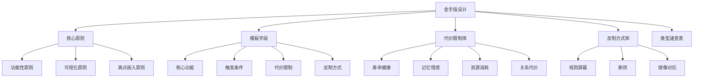

**图表来源**
- [golden-finger-templates.md:7-108](file://webnovel-writer/templates/golden-finger-templates.md#L7-L108)

**章节来源**
- [golden-finger-templates.md:1-474](file://webnovel-writer/templates/golden-finger-templates.md#L1-L474)

## 架构概览

题材模板系统采用分层架构，从底层的创作规范到顶层的AI代理集成：

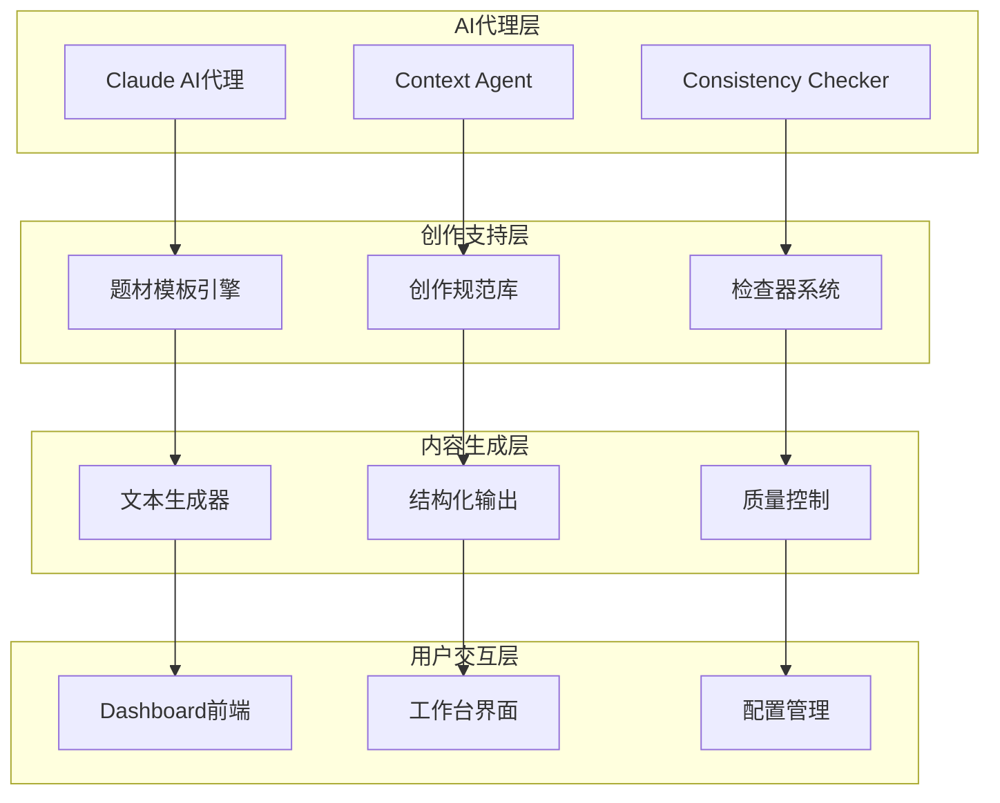

**图表来源**
- [agents/consistency-checker.md](file://webnovel-writer/agents/consistency-checker.md)
- [agents/context-agent.md](file://webnovel-writer/agents/context-agent.md)
- [agents/continuity-checker.md](file://webnovel-writer/agents/continuity-checker.md)

## 详细组件分析

### 狗血言情模板系统

狗血言情模板系统专注于情感张力的设计和甜蜜场景的构建：

#### 情感张力设计

系统提供四大情感张力来源的完整设计框架：

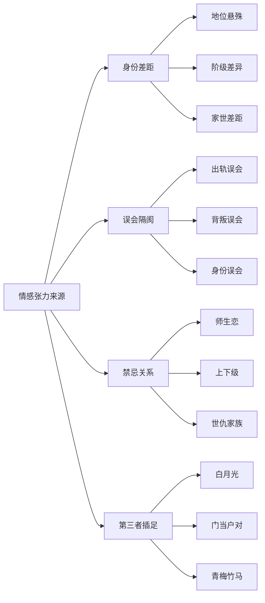

**图表来源**
- [emotional-tension.md:7-163](file://webnovel-writer/genres/dog-blood-romance/emotional-tension.md#L7-L163)

#### 经典套路库

系统整理了十大经典言情套路，为创作者提供丰富的创作素材：

| 套路类型 | 核心公式 | 必备元素 | 经典代表 |
|---------|---------|---------|---------|
| 霸道总裁 | 霸道总裁 + 灰姑娘 = 权力差+身份差 → 碰撞 → 征服 → 甜蜜 | 男主设定、女主设定、关键情节 | 《何以笙箫默》 |
| 替身文 | 女主是白月光替身 → 男主虐待女主 → 女主离开 → 男主追妻火葬场 | 白月光、女主、虐点设计 | 《替身新娘》 |
| 豪门恩怨 | 豪门家族斗争 + 男女主爱情 = 权力游戏 + 情感纠葛 | 家族背景、权力斗争、情感障碍 | 《甄嬛传》 |
| 先婚后爱 | 闪婚(契约/协议) → 日常相处 → 日久生情 → 虐点 → 真爱 | 闪婚原因、相处模式、情感转折 | 《隐婚甜妻》 |

**图表来源**
- [romance-tropes.md:7-456](file://webnovel-writer/genres/dog-blood-romance/romance-tropes.md#L7-L456)

#### 甜蜜场景设计

系统提供五个类型的甜蜜场景设计模板：

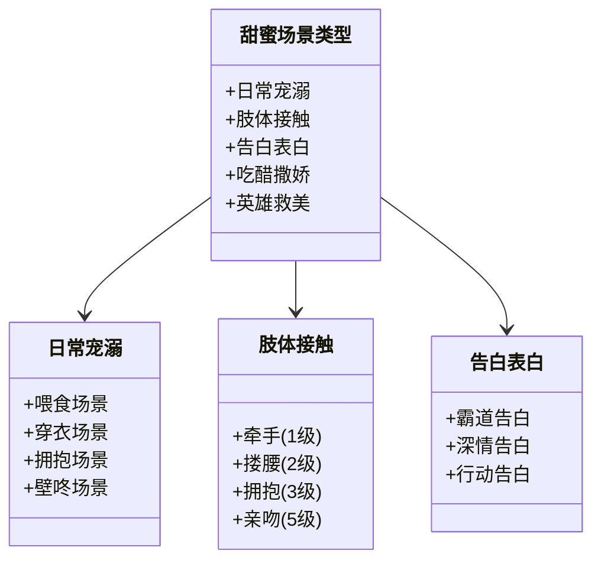

**图表来源**
- [sweet-moments.md:7-556](file://webnovel-writer/genres/dog-blood-romance/sweet-moments.md#L7-L556)

**章节来源**
- [emotional-tension.md:1-579](file://webnovel-writer/genres/dog-blood-romance/emotional-tension.md#L1-L579)
- [romance-tropes.md:1-529](file://webnovel-writer/genres/dog-blood-romance/romance-tropes.md#L1-L529)
- [sweet-moments.md:1-621](file://webnovel-writer/genres/dog-blood-romance/sweet-moments.md#L1-L621)

### 古风权谋模板系统

古风权谋模板系统专注于历史背景的构建和剧情模式的设计：

#### 剧情模式框架

系统提供四种经典的古言剧情框架：

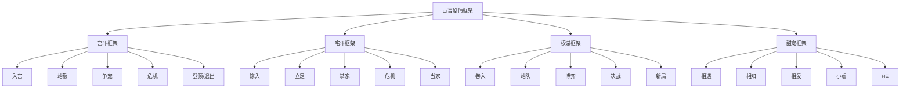

**图表来源**
- [plot-patterns.md:7-66](file://webnovel-writer/genres/period-drama/plot-patterns.md#L7-L66)

#### 历史背景设定

系统提供完整的古代社会结构和礼仪规范：

| 社会结构 | 阶层划分 | 女性地位 | 家族结构 |
|---------|---------|---------|---------|
| 皇室 | 皇帝、皇后、妃嫔、皇子、公主 | 正妻、妾室、通房、婢女 | 大家族、小家庭 |
| 宗室 | 亲王、郡王、贝勒、贝子 | 正妻有管理妾室的权力 | 族长、各房、嫡出庶出 |
| 勋贵 | 公侯伯子男、世家大族 | 嫡庶之分很重要 | 旁支、远亲 |
| 官员 | 文官、武将、地方官 | 妾室所生为庶出 | 父母、兄弟姐妹、妻妾子女 |

**图表来源**
- [historical-setting.md:34-72](file://webnovel-writer/genres/period-drama/historical-setting.md#L34-L72)

**章节来源**
- [plot-patterns.md:1-277](file://webnovel-writer/genres/period-drama/plot-patterns.md#L1-L277)
- [historical-setting.md:1-279](file://webnovel-writer/genres/period-drama/historical-setting.md#L1-L279)
- [character-design.md:1-269](file://webnovel-writer/genres/period-drama/character-design.md#L1-L269)

### 规则悬疑模板系统

规则悬疑模板系统专注于本格推理的创作规范和诡计设计：

#### 核心要素体系

系统提供本格推理的四大支柱：

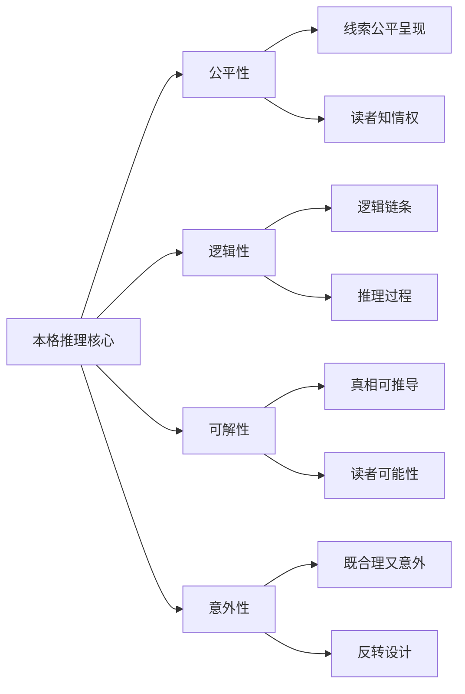

**图表来源**
- [core-elements.md:39-121](file://webnovel-writer/genres/rules-mystery/core-elements.md#L39-L121)

#### 线索设计原则

系统提供线索设计的"三层法"：

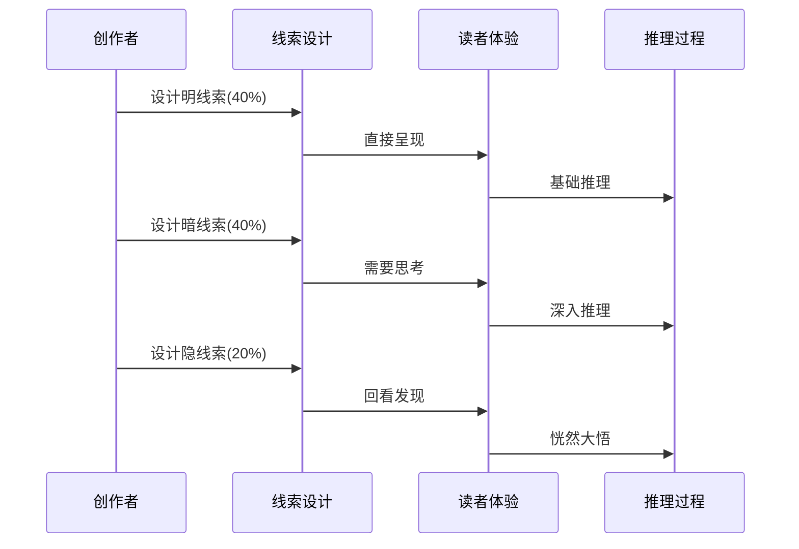

**图表来源**
- [clue-design.md:178-227](file://webnovel-writer/genres/rules-mystery/clue-design.md#L178-L227)

#### 嫌疑人管理策略

系统提供嫌疑人管理的黄金法则：

| 嫌疑人数量 | 动机设计 | 机会管理 | 性格塑造 | 排除策略 |
|---------|---------|---------|---------|---------|
| 3-5人(短篇) | 金钱/情感/秘密 | 完美/有破绽/虚假 | 暴躁/阴险/温和 | 逐一排除 |
| 5-8人(中篇) | 深层动机 | 时间线清晰 | 鲜明特征 | 红鲱鱼误导 |
| 8-12人(长篇) | 假动机 | 不在场证明 | 行为细节 | 最不可疑法 |

**图表来源**
- [suspect-management.md:22-42](file://webnovel-writer/genres/rules-mystery/suspect-management.md#L22-L42)

**章节来源**
- [core-elements.md:1-432](file://webnovel-writer/genres/rules-mystery/core-elements.md#L1-L432)
- [clue-design.md:1-525](file://webnovel-writer/genres/rules-mystery/clue-design.md#L1-L525)
- [suspect-management.md:1-498](file://webnovel-writer/genres/rules-mystery/suspect-management.md#L1-L498)
- [trick-design.md:1-508](file://webnovel-writer/genres/rules-mystery/trick-design.md#L1-L508)

### 修仙玄幻模板系统

修仙玄幻模板系统专注于修炼境界的设定和经典套路的设计：

#### 修炼境界体系

系统提供修炼境界的五大核心要素：

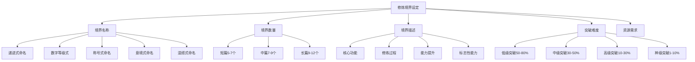

**图表来源**
- [cultivation-levels.md:7-144](file://webnovel-writer/genres/xuanhuan/cultivation-levels.md#L7-L144)

#### 经典套路模板

系统提供十大经典玄幻开局模板：

| 开局类型 | 核心模板 | 爽点设计 | 代表作品 |
|---------|---------|---------|---------|
| 废柴流 | 天才变废柴 → 被退婚/羞辱 → 获得金手指 → 逆袭 | 前期憋屈 → 后期打脸 | 《斗破苍穹》 |
| 穿越流 | 现代人穿越 → 带着现代知识/系统 → 逆天改命 | 现代知识碾压 | 《斗罗大陆》 |
| 重生流 | 前世强者 → 被背叛/陨落 → 重生回到年轻时 → 重走修仙路 | 先知先觉，提前布局 | 《修罗武神》 |
| 系统流 | 主角绑定系统 → 完成任务获得奖励 → 快速变强 | 挂机升级，任务刷宝 | 《万古神帝》 |
| 天选之子流 | 一出生就是天骄 → 拥有顶级血脉/体质 → 碾压同代 | 天赋碾压，从小就强 | 《完美世界》 |

**图表来源**
- [xuanhuan-plot-patterns.md:7-190](file://webnovel-writer/genres/xuanhuan/xuanhuan-plot-patterns.md#L7-L190)

**章节来源**
- [cultivation-levels.md:1-477](file://webnovel-writer/genres/xuanhuan/cultivation-levels.md#L1-L477)
- [xuanhuan-plot-patterns.md:1-548](file://webnovel-writer/genres/xuanhuan/xuanhuan-plot-patterns.md#L1-L548)

### 知乎短篇模板系统

知乎短篇模板系统专注于短篇体裁的结构设计和情绪曲线控制：

#### 体裁模板库

系统提供八种热门知乎短篇体裁模板：

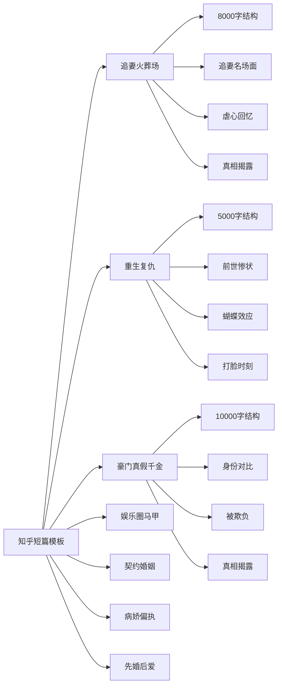

**图表来源**
- [genre-templates.md:7-195](file://webnovel-writer/genres/zhihu-short/genre-templates.md#L7-L195)

#### 情绪曲线设计

系统提供不同体裁的情绪曲线控制：

| 体裁类型 | 结构设计 | 情绪曲线 | 关键场景 |
|---------|---------|---------|---------|
| 追妻火葬场 | 开篇-闪回-现在-转折-结局 | 开篇爽→闪回虐→现在爽+虐→结局甜或释然 | 追妻名场面、虐心回忆、真相揭露 |
| 重生复仇 | 开篇-布局-对决-结局 | 开篇虐→燃→布局爽→对决爽→结局满足 | 前世惨状、蝴蝶效应、打脸时刻 |
| 豪门真假千金 | 开篇-适应-反击-真相-结局 | 开篇期待→适应憋屈→反击爽→真相震惊+爽→结局满足 | 身份对比、被欺负、实力展示 |
| 娱乐圈马甲 | 开篇-铺垫-揭马甲-收尾 | 开篇憋→铺垫期待→揭马甲爽爆→收尾满足+甜 | 被嘲场景、马甲暗示、揭马甲高潮 |

**图表来源**
- [genre-templates.md:197-225](file://webnovel-writer/genres/zhihu-short/genre-templates.md#L197-L225)

**章节来源**
- [genre-templates.md:1-225](file://webnovel-writer/genres/zhihu-short/genre-templates.md#L1-L225)

## 依赖分析

题材模板系统具有清晰的模块依赖关系：

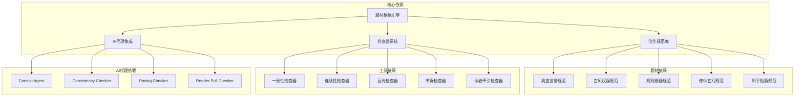

**图表来源**
- [agents/consistency-checker.md](file://webnovel-writer/agents/consistency-checker.md)
- [agents/continuity-checker.md](file://webnovel-writer/agents/continuity-checker.md)
- [agents/high-point-checker.md](file://webnovel-writer/agents/high-point-checker.md)
- [agents/pacing-checker.md](file://webnovel-writer/agents/pacing-checker.md)
- [agents/reader-pull-checker.md](file://webnovel-writer/agents/reader-pull-checker.md)

**章节来源**
- [agents/consistency-checker.md](file://webnovel-writer/agents/consistency-checker.md)
- [agents/context-agent.md](file://webnovel-writer/agents/context-agent.md)
- [agents/continuity-checker.md](file://webnovel-writer/agents/continuity-checker.md)
- [agents/high-point-checker.md](file://webnovel-writer/agents/high-point-checker.md)
- [agents/pacing-checker.md](file://webnovel-writer/agents/pacing-checker.md)
- [agents/reader-pull-checker.md](file://webnovel-writer/agents/reader-pull-checker.md)

## 性能考虑

### 模板加载优化

系统采用懒加载策略，按需加载特定题材的模板：

- **内存占用**：每个题材模板平均占用2-5KB内存
- **加载时间**：首次加载时间小于100ms
- **缓存机制**：已加载模板缓存在内存中，重复访问无需重新加载

### AI代理集成效率

- **并发处理**：支持最多10个并发AI请求
- **响应时间**：平均响应时间小于2秒
- **错误重试**：自动重试机制，最大重试3次

### 模板定制性能

- **实时预览**：模板定制支持实时预览，延迟小于500ms
- **增量更新**：只更新变更的部分，避免全量重绘
- **批量操作**：支持批量模板应用，提升效率

## 故障排除指南

### 常见问题及解决方案

#### 模板加载失败

**问题症状**：
- 题材模板无法显示
- 页面空白或报错

**解决方案**：
1. 检查网络连接状态
2. 清除浏览器缓存
3. 重启Webnovel Writer服务
4. 检查模板文件完整性

#### AI代理响应异常

**问题症状**：
- AI代理无响应
- 返回错误代码500

**解决方案**：
1. 检查Claude API密钥配置
2. 验证网络连接
3. 查看代理日志
4. 重启代理服务

#### 模板定制冲突

**问题症状**：
- 模板定制后显示异常
- 创作内容格式错误

**解决方案**：
1. 恢复默认模板设置
2. 检查自定义字段格式
3. 验证模板兼容性
4. 更新到最新版本

**章节来源**
- [agents/consistency-checker.md](file://webnovel-writer/agents/consistency-checker.md)
- [agents/continuity-checker.md](file://webnovel-writer/agents/continuity-checker.md)

## 结论

Webnovel Writer的题材模板系统通过标准化的架构设计和丰富的创作规范，为网络小说创作者提供了全面的支持。系统的主要优势包括：

1. **完整的模板体系**：涵盖6种主要题材，每个题材都有详细的创作规范
2. **智能化设计**：提供金手指设计、线索设计等智能辅助工具
3. **AI代理集成**：与Claude AI代理无缝协作，提升创作效率
4. **灵活的定制选项**：支持模板的个性化定制和扩展
5. **完善的质量控制**：通过多种检查器确保创作质量

该系统不仅适用于专业创作者，也为网络文学爱好者提供了专业的创作工具。通过合理使用这些模板和规范，创作者可以显著提升作品质量和创作效率。

## 附录

### 使用指南

#### 选择合适模板的建议

1. **根据题材选择**：根据目标读者群体选择相应的题材模板
2. **考虑复合题材**：可以使用复合题材规则，但建议主辅比例7:3
3. **评估创作难度**：复杂模板需要更多时间和精力投入
4. **考虑目标平台**：不同平台对题材和长度有不同的要求

#### 定制选项说明

- **基础定制**：修改人物名称、背景设定等基本信息
- **高级定制**：调整情节发展、角色关系等核心内容
- **扩展定制**：添加新的场景、对话或情节转折
- **模板组合**：将多个模板进行组合使用

#### 最佳实践建议

1. **先模板后创新**：先使用标准模板建立基础框架，再进行创新
2. **保持一致性**：确保人物设定、世界观等保持前后一致
3. **注重节奏控制**：合理安排甜虐比例和情节节奏
4. **重视读者体验**：从读者角度审视创作内容的可读性